# 제9장 세부도화 및 속성 구조화

> Source PDF: `docs/정밀도로지도_구축_매뉴얼(2025.12).pdf`
> Extracted range: PDF pages 111-280 / printed pages 103-272
> Formatting note: generated with PyMuPDF4LLM to preserve Markdown tables; complex merged-cell tables are patched as fixed-width text blocks.
> Image assets: chapter images are embedded inline and stored in `docs/assets/ngii_2025_ch9_images/`.

## 9.1. 세부도화 및 속성 구조화 기준의 참조

- 정밀도로지도 ‘세부도화 및 속성 구조화 기준’은 「정밀도로지도 구축 및 갱신 등에 관한 규정 (국토지리정보원 고시 제2023-4338호)」 제2장제6절제23조 및 제24조에서 정하고 있다.

- 본 장에서 설명하는 ‘구축 항목’, ‘세부도화 및 속성 구조화 기준 및 방법’은 ‘데이터모델 2024’를 기준으로 한다.

   - ※ 데이터모델 버전별 ‘구축 항목, 세부도화 및 속성 구조화 기준’을 작성한 매뉴얼은 [표 9.1]을 참고한다.

#### [표 9.1] 데이터모델 버전별 ‘구축 항목, 세부도화 및 속성 구조화 기준’ 참고 매뉴얼

|데이터모델|참고 매뉴얼|
|---|---|
|데이터모델 2019|‘정밀도로지도 제작 매뉴얼 (2020.12)’ 참고|
|데이터모델 2020|‘정밀도로지도 구축 매뉴얼 (2023.07)’ 참고|

## 9.2. 정밀도로지도 구축(세부도화) 항목

### 9.2.1. 정밀도로지도 구축 항목

- 정밀도로지도 ‘데이터모델 2024’의 ‘구축 항목’ 및 ‘기하구조(도형유형)’은 [표 9.2]와 같으며, 구축 항목의 ‘정의’ 및 ‘대상유형’은 [표 9-3]과 같다.

   - 기준 : 정밀도로지도 데이터모델 기관표준(국토지리정보원 고시 제OOOO-O호)

   - ※ 참고 : ISO 20524-1/2(2020), 자율주행 기술/활용/표준 분야 실증(2024), 데이터모델 2019~2020

   - 구축 항목 : 도로, 도로 ․ 교통안전 표시 및 시설 14종 데이터(레이어)

   - ※ ‘기하구조(도형유형)’, ‘도형묘사’, ‘속성형식/분류’ 등은 각 항목별 ‘세부도화 및 속성 구조화 방법’ 참고

#### [표 9.2] 정밀도로지도 구축 항목(데이터모델 2024)

|구분|레이어명|명칭|기하구조|
|---|---|---|---|
|Network<br>(네트워크)|NT1_NODE|주행경로노드|점형(PointZ)|
||NT2_LINK|주행경로링크|선형(PolylineZ)|
|RoadStructural<br>Component<br>(차도 구조 구성요소)|RS1_ROADBORDER|차도경계|선형(PolylineZ)|
||RS2_ROADSTRUCTURE|구간|면형(PolygonZ)|
||RS3_SUBSIDIARYSECTION|부속구역|면형(PolygonZ)|
|Pathway<br>(보도/자전거도로)|PW1_PATHWAY|보도/자전거도로|면형(PolygonZ)|
|Roadmarking<br>(노면표시)|RM1_LANELINE|차선|선형(PolylineZ)|
||RM2_ROADMARKING|노면표시|면형(PolygonZ)|
||RM3_PARKINGLOT|주차구역(면)|면형(PolygonZ)|
|SafetyFixture<br>(안전시설)|SF1_BARRIER|차량방호안전시설|선형(PolylineZ)|
||SF2_TRAFFICSIGN|교통안전표지|점형(PointZ)|
||SF3_TRAFFICLIGHT|교통 및 보행 신호기|점형(PointZ)|
||SF4_SUPPROTPOST|지주|점형(PointZ)|
||SF5_SPEEDBUMP|과속방지턱|면형(PolygonZ)|

#### [표 9.3] 정밀도로지도 구축 항목의 정의 및 대상유형(데이터 모델 2024)

|레이어명|정의 및 대상유형|
|---|---|
|NT1_NODE<br>(주행경로노드)|∘정의<br>- 주행환경 변화지점<br>- 진행방향 도로에서 ‘주행환경 변화1)’가 발생하는 지점에 생성하는 가상의<br>점을 의미<br> 1)‘도로 형상 변화’ 또는 ‘주행환경 변화’로 주행경로링크(LINK)의 속성 변화 발생<br>∘대상유형<br>- 교차로, 차로변화, 속도변화, 구간, 교통통제시설, 경계<br>- 세부 대상 유형은 ‘HDM_NodeType(노드 유형)’ 코드 리스트 참고|
|NT2_LINK<br>(주행경로링크)|∘정의<br>- 차로의 중심을 연결한 가상의 주행경로<br>- 노드와 노드 사이의 주행경로를 연결한 가상의 선을 의미. 노드와 노드<br>사이의 주행경로링크(LINK)는 동일한 조건을 가지고 있음<br>∘대상유형<br>- ‘도로 유형’에 따라 ‘일반도로, 생활(이면)도로, 구간, 보호구역<br>※ 세부 대상유형은 ‘HDM_RoadType(도로 유형)’ 코드 리스트 참고<br>- ‘차로 유형’에 따라 교차로, 전용차로, 일반차로<br>※ 세부 대상유형은 ‘HDM_LinkType(차로 유형)’ 코드 리스트 참고|
|RS1_ROADBORDER<br>(차도경계)|∘정의<br>- 차도 경계<br>- 차도 주행을 할 수 있는 도로(차도)의 경계를 의미<br>(연석 또는 도로 포장면 끝 등)<br>∘대상유형<br>- 연석, 도로 포장면(연석이 없는 도로)|
|RS2_ROADSTRUCTURE<br>(구간)|∘정의<br>- ‘종류’에 따라 자동차 주행구간 중 교량, 터널, 지하․고가 차도와 같이 도로,<br>수계 및 산림 등의 상부/하부를 주행하는 도로 구간을 의미<br>- ‘특성’에 따라 교통약자(어린이, 노인, 주민)의 안전한 통행 목적으로 지정한<br>보호구역 및 톨게이트 구간을 의미<br>∘대상유형<br>- 교량, 터널, 지하․고가 차도, 보호구역, 톨게이트<br>※ 세부 대상유형은 ‘HDM_RoadType(도로 유형)’ 코드 리스트 참고|
|RS3_SUBSIDIARYSECTION<br>(부속구역)|∘정의<br>- 자동차 주행구간과 분리된 휴게소, 졸음쉼터를 의미<br>∘대상유형<br>- 휴게소, 졸음쉼터<br>※ 국가, 지방자치단체, 도로운영사 등에서 설치/관리하는 휴게시설만 대상|
|PW1_PATHWAY<br>(보도/자전거도로)|∘정의<br>- 보도, 자전거도로 구간을 의미<br>∘대상유형<br>- 보도, 자전거도로<br>※ 세부 대상유형은 ‘HDM_PathwayType(길 유형)’ 코드 리스트 참고|
|RM1_LANELINE<br>(차선)|∘정의<br>- 차도 내 노면선표시<br>- 자동차의 주행을 돕거나 제한하기 위하여 도로 노면에 일정한 방향과 간격<br>으로 그은 선(차선)을 의미<br>∘대상유형<br>- ‘종류’에 따라 중앙선, 주행선, 특수차선, 길가장자리구역선, 정지선, 교차로<br>좌회전 유도선<br>※ 세부 대상유형은 ‘LaneLineKind(차선 역할 유형)’ 코드 리스트 참고<br>- ’색상‘에 따라 황색, 백색, 청색 및 ’선 형태‘에 따라 점선, 실선, 겹선, 혼선<br>※ 세부 대상유형은 ‘LaneLineType(차선 표시 유형)’ 코드 리스트 참고|
|RM2_ROADMARKING<br>(노면표시)|∘정의<br>- 차도 내 노면표시<br>- 자동차/보행자의 주행/보행 지원을 위하여 도로 노면에 표시한 ‘화살표’, ‘도형’,<br>‘구역(버스․택시 정차구획, 정차금지대)’ 및 ‘횡단보도(보행, 자전거)’를 의미<br>∘대상유형<br>- ‘화살표’는 직진, 좌회전, 우회전, 좌우회전, 전방향, 직진 및 좌회전 등<br>- ‘도형’은 양보, 횡단보도 예고<br>- ‘구역’은 버스․택시 정차구획, 정차금지대<br>- ‘횡단보도’는 횡단보도, 고원식 횡단보도, 자전거 횡단보도<br>※ 세부 대상유형은 ‘HDM_RoadMarkingType(노면표시 유형)’과 ‘HDM_Mark<br>Kind(노면표시 세부유형)’ 코드 리스트 참고|
|RM3_PARKINGLOT<br>(주차구역(면))|∘정의<br>- 주차면 단위 구역<br>- 부속구역 내에 설치된 주차구역 및 차도(노상)에 존재하는 주차구역을 의미<br>∘대상유형<br>- 일반차량, 우선주차, 대형차량, 장애인, 친환경차(충전, 미충전)<br>※ 세부 대상유형은 ‘HDM_ParkingLoType(주차구역 유형)’ 코드 리스트 참고|
|SF1_BARRIER<br>(챠랑방호안전시설)|∘정의<br>- 차량 및 보행자 보호를 위한 방호안전시설<br>- 주행 중 차량이 길 밖 또는 대상차로 이탈을 방지하거나, 차량이 구조물과<br>직접 충돌하는 것을 방지하여 차량 및 탑승자, 차량, 보행자 또는 도로변의<br>주요 시설을 안전하게 보호하는 시설을 의미<br>∘대상유형<br>- 방호울타리(방호벽, 가드레일 등), 벽, 기타 시설(충격흡수시설, 중앙분리대<br>개구부)<br>※ 세부 대상유형은 ‘HDM_BarrierType(방호안전시설 유형)’ 코드 리스트 참고|
|SF2_TRAFFICSIGN<br>(교통안전표지)|∘정의<br>- 교통안전표지<br>- 진행방향 도로 상공 및 가장자리 등에 표지판 형태로 설치한 표지를 의미<br>∘대상유형<br>- 주의표지, 규제표지, 지시표지, 보조표지<br>※ 세부 대상유형은 ‘HDM_TrafficSignType(교통안전표지 유형)’ 코드 리스트<br>참고|
|SF3_TRAFFICLIGHT<br>(교통 및 보행 신호기)|∘정의<br>- 교통 및 보행 신호기<br>- 통행 차량이나 사람에게 정지․우회․진행․주의를 지시하는 장치를 의미<br>∘대상유형<br>- ‘종류’에 따라 차량 전용, 자전거 전용, 보행자 전용<br>- ‘형태/유형’에 따라 지시, 주의, 보조<br>※ 세부 대상유형은 ‘HDM_TrafficLightType(신호기 유형)’ 코드 리스트 참고|
|SF4_SUPPROTPOST<br>(지주)|∘정의<br>- 교통안전표지, 교통 및 보행 신호기의 지지를 위한 기둥을 의미<br>∘대상유형<br>- 교통안전표지 지주, 교통 및 보행신호기 지주<br>※ 세부 대상유형은 ‘SupportPostType(지주 유형)’ 코드 리스트 참고|
|SF5_SPEEDBUMP<br>(과속방지턱)|∘정의<br>- 과속방지턱<br>- 자동차의 주행 속도를 낮추기 위하여 차도 노면에 설치하는 턱<br>∘대상유형<br>- 설치식, 조립식, 가상식|

### 9.2.2. 정밀도로지도 성과 저장형식

- 정밀도로지도 성과는 구축 항목의 집합을 의미하며, 구축 항목별로 [표 9.4]와 같이 저장한다. 정밀도로지도 성과 저장을 위한 세부 형식 기준은 다음과 같다.

   - 저장 구조 : 노선별 구간(Section) 단위

   - 파일 형식 : Shapefile(SHP) 형식

   - ※ SHP세트(*.shp, *.shx, *.dbf, *.prj, *.cpg)

   - ※ ‘도형유형(Shape Type)’은 각 항목별 ‘세부도화 및 속성 구조화 방법’ 참고

   - 위치 기준 : 구축 항목별로 [표 2.1]의 위치 기준별 성과 구축

   - ※ ‘정표고’ 변환은 국토지리정보원에서 고시한 최신 합성지오이드모델 이용

   - 의무 조건 : 구축 항목이 존재하지 않을 경우, ‘필수’ 외 ‘조건’은 제작하지 않음

   - ※ 단, 존재하는 구축 항목은 반드시 제작하여야 함

#### [표 9.4] 정밀도로지도 성과 저장형식

```text
             파일 경로                                             파일 형식

구축구간            정밀도로지도                              파일명                   확장자      의무
                                                                                         비고
(Section)     (HDM_RoadMap)                       (Filename)              (Ext.)   조건


<노선명>

                                   NT1_NODE                                        필수

                                   NT2_LINK                                        필수
SEC<ID>_
            HDMap_UTM52N_타원체고                                            SHP세트          단일 파일
<구간명>                              RS1_ROADBORDER                                  필수

                                   RS2_ROADSTRUCTURE                               조건


                                 RS3_SUBSIDIARYSECTION                       조건

                                 PW1_PATHWAY                                 조건

                                 RM1_LANELINE                                조건

                                 RM2_ROADMARKING                             조건

                                 RM3_PARKINGLOT                              조건

                                 SF1_BARRIER                                 조건

                                 SF2_TRAFFICSIGN                             조건

                                 SF3_TRAFFICLIGHT                            조건

                                 SF4_SUPPROTPOST                             조건

                                 SF5_SPEEDBUMP                               조건

      HDMap_UTMK_정표고                                  상동                상동   상동   상동

      HDMap_UTMK_타원체고                                 상동                상동   상동   상동


      <노선명>\SEC<ID>_<구간명>\HDMap_UTM52N_타원체고\NT1_NODE.shp/shx/dbf/prj/cpg
      <노선명>\SEC<ID>_<구간명>\HDMap_UTM52N_타원체고\NT2_LINK.shp/shx/dbf/prj/cpg
                                                      :
      <노선명>\SEC<ID>_<구간명>\HDMap_UTM52N_타원체고\SF5_SPEEDBUMP.shp/shx/dbf/prj/cpg

      <노선명>\SEC<ID>_<구간명>\HDMap_UTMK_정표고\NT1_NODE.shp/shx/dbf/prj/cpg
      <노선명>\SEC<ID>_<구간명>\HDMap_UTMK_정표고\NT2_LINK.shp/shx/dbf/prj/cpg
                                                      :
      <노선명>\SEC<ID>_<구간명>\HDMap_UTMK_정표고\SF5_SPEEDBUMP.shp/shx/dbf/prj/cpg
 적용
      <노선명>\SEC<ID>_<구간명>\HDMap_UTMK_타원체고\NT1_NODE.shp/shx/dbf/prj/cpg
 규칙
      <노선명>\SEC<ID>_<구간명>\HDMap_UTMK_타원체고\NT2_LINK.shp/shx/dbf/prj/cpg
                                                      :
      <노선명>\SEC<ID>_<구간명>\HDMap_UTMK_타원체고\SF5_SPEEDBUMP.shp/shx/dbf/prj/cpg

      ◦ <정밀도로지도 폴더>
       - HDMap_UTM52N_타원체고: UTM 평면직각좌표계, 타원체고
       - HDMap_UTMK_정표고: UTM-K 단일 평면직각좌표계, 정표고
       - HDMap_UTMK_타원체고: UTM-K 단일 평면직각좌표계, 타원체고

      ◦ <확장자명>: SHP세트(*.shp, *.shx, *.dbf, *.prj, *.cpg)
```

## 9.3. 세부도화 및 속성 구조화 기준

### 9.3.1. 세부도화 기준

- 「정밀도로지도 구축 및 갱신 등에 관한 규정(국토지리정보원 고시 제2023-4338호)」제23조에 따라 구축 항목(레이어)에 대하여 기하구조(점형, 선형, 면형)에 맞게 도화한다.

- 점군 데이터를 이용하여 세부도화 한다.

   - ※ 속성 항목의 명확한 식별(색상, 글자, 숫자 등)을 위하여 ‘사진 데이터’를 보조자료로 이용한다.

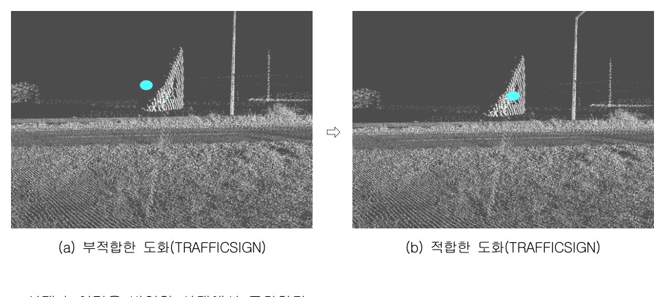

- 실제 높이값을 반영한 상태에서 도화한다.

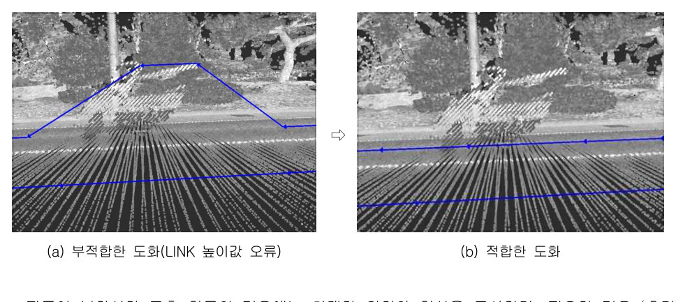

- 판독이 불확실한 구축 항목의 경우에는 최대한 위치와 형상을 묘사하며, 필요한 경우 ‘추가 측량’을 통해 보완한다.

- 구축 항목(레이어) 간 ‘상호 연계(속성, 위치)’ 또는 ‘결합’이 필요한 구축 항목(레이어)의 경우, ‘조건’에 따라 상호 연계(속성, 위치) 또는 결합할 수 있도록 도화한다.

   - 주행경로노드(NODE)와 주행경로링크(LINK)는 서로 결합(수평/수직)되어야 한다.

- 차도경계(ROADBORDER), 차선(LANELINE) 및 차량안전방호시설(BARRIER)은 주행경로링크 (LINK)와 동일한 위치에서 분절될 수 있도록 도화한다.

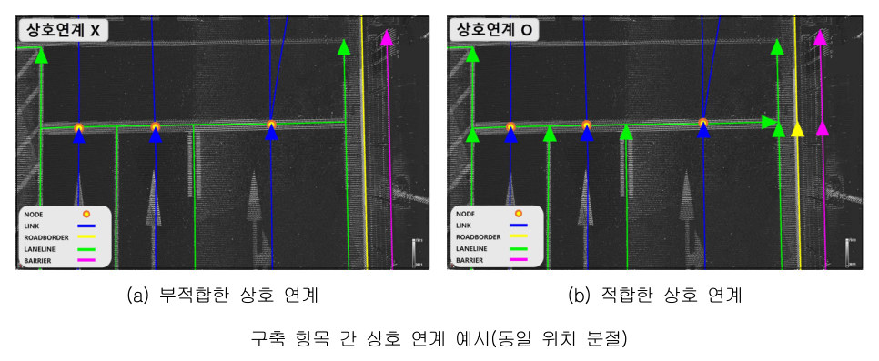

구축 항목 간 상호 연계 예시(동일 위치 분절)

- ‘구축 대상 노선 간 원활한 인접’ 또는 ‘미구축 노선과의 향후 인접’을 위하여 노드 유형 (NodeType)에서 정의된 ‘주행환경 변화’가 발생한 지점까지 도화한다.

   - ※ ‘주행환경 변화’란, ‘도로 형상 변화’ 또는 ‘주행환경 변화’로 주행경로링크(LINK)의 속성 변화가 발생하는 것을 의미한다.

   - 인접하는 도로(미구축)가 ‘평면/회전/입체 교차로’에서 만날 때, 구축 도로 기준 ‘평면/회전 교차로 진출 종점’, ‘입체교차로 합류 지점’까지 도화한다.

   - ※ 교통섬이 없는 평면교차로에서 최소 구축 범위의 주행경로노드(NODE) 노드 유형(NodeType)은 ‘평면교차로 시점/종점(코드값 100)’이다.

   - ※ 교통섬이 있는 평면교차로에서 최소 구축 범위의 주행경로노드(NODE) 노드 유형(NodeType)은 ‘도로 및 차로 분기/합류지점(코드값 200)’이다.

   - 인접하는 도로(미구축)가 ‘교량, 터널, 지하/고가 차도’에서 만날 때, 구축 도로 기준 ‘교량, 터널 지하/고가 차도 종점’까지 도화한다.

   - 인접하는 도로(미구축)가 ‘톨게이트’에서 만날 때, 구축 도로 기준 ‘톨게이트 종점’까지 도화 한다.

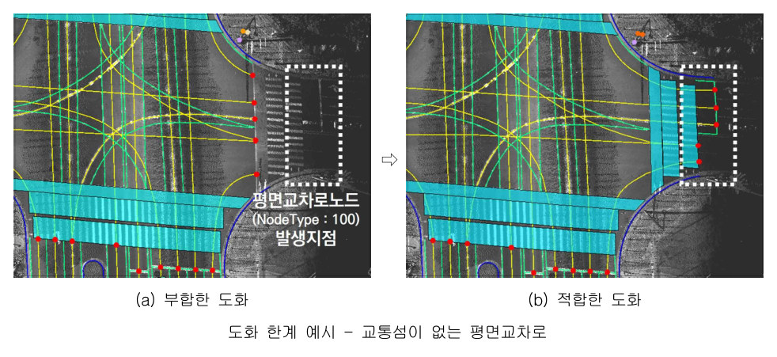

도화 한계 예시 - 교통섬이 없는 평면교차로

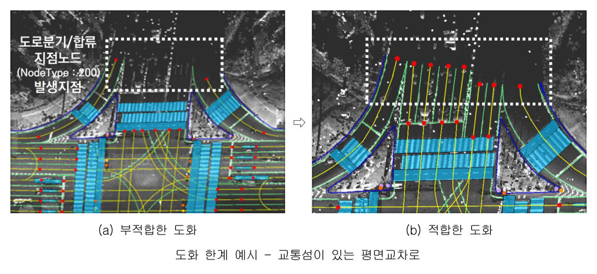

도화 한계 예시 - 교통섬이 있는 평면교차로

- 정밀도로지도 세부도화 성과의 품질이 품질항목의 기준에 적합하도록 도화한다.

   - 「정밀도로지도 구축 및 갱신 등에 관한 규정(국토지리정보원 고시 제2023-4338호)」제8조

   - 도형묘사, 도형위상, 위치정확성 등

   - ※ 개별 품질항목에서 수행되어야 하는 세부 품질 기준은 ‘정밀도로지도 품질검사 매뉴얼 (국토지리정보원, 2021.04)’을 참고한다.

### 9.3.2. 속성 구조화 기준

#### 1) 구축 항목(레이어) 공통 ‘테이블 명세’

- 「정밀도로지도 구축 및 갱신 등에 관한 규정(국토지리정보원 고시 제2023-4338호)」제24조에 따라 구축 항목(레이어)별 세부도화 성과는 속성정보 형식을 구성(테이블 명세)하고, 점군 및 사진 데이터를 판독하여 정보를 입력하여야 한다.

- 속성 항목은 구축 항목(레이어)별로 입력(테이블 명세)하며, ‘공통’ 항목과 구축 항목(레이어)의 특성에 따라 ‘고유’ 항목으로 구성한다.

   - ‘공통’ 항목의 테이블 명세는 [표 9.5]와 같으며, 입력 방법은 칼럼별 입력 기준을 참고한다.

   - ‘고유’ 항목의 테이블 명세는 구축 항목(레이어)별 입력 기준을 따른다.

- 문자 인코딩은 ‘UTF-8’을 적용한다.

   - ※ ‘*.cpg’ 파일을 함께 제출(납품)한다.

#### [표 9.5] 구축 항목(레이어) 공통 테이블 명세

|공통|공통|공통|공통|공통|공통|공통|공통|
|---|---|---|---|---|---|---|---|
||칼럼명|(한글명)|KEY|데이터<br>타입(길이)|제약조건|기본<br>단위|코드 리스트|
|①|ID|ID|PK|VARCHAR2(13)|UNIQUE/<br>NOT NULL|-|-|
||：|：|구축 항목(레이어)별 ‘고유 테이블 명세’ 참고|||||
|②|SurveyDate|취득 일자|-|VARCHAR2(8)|NOT NULL|-|-|
|③|Version|버전|-|VARCHAR2(4)|NOT NULL|-|-|
|④|Remark|비고|-|VARCHAR2(30)|-|-|-|
|⑤|HistType|갱신이력 유형|-|VARCHAR2(3)|-|-|HDM_HistType|

##### ① ID (ID)

- 정밀도로지도 객체의 ID를 의미한다.

- 정밀도로지도 ‘신규 제작(최초 구축)’ 시, 객체 ID를 신규 생성한다.

- 도로 변화(또는 신설)에 따른 ‘갱신’ 시, 변화 객체에 대한 ‘객체 신설’ 및 ‘기구축 객체의 도형 변화(도형 분할)’가 발생한 경우, ID를 신규 생성한다.

- ※ 갱신이력 유형(Hist_Type)의 ‘객체 생성(코드값 001)’, ‘공간도형 분할(코드값 004)’ 대상

- 다만, ‘오류 수정’과 ‘공간도형 합병’의 경우, ID를 신규로 생성하지 않는다.

- ※ 갱신이력 유형(Hist_Type)의 ‘공간도형과 속성을 함께 수정(코드값 002)’, ‘공간도형만 수정(코드값 003)’, ‘공간도형 합병(코드값 005)’, ‘속성만 수정(코드값 007)’ 대상

- 제약조건은 ‘NOT NULL’이다.

- [표 9.6]의 규칙에 따라 13자리로 ID를 부여한다.

- ※ 모든 ID는 중복이 발생하면 안 된다.

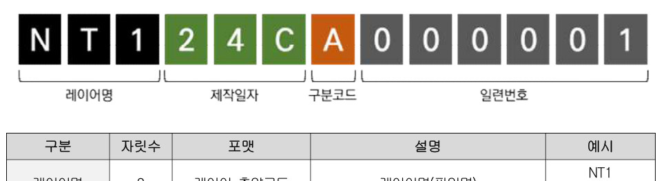

- 레이어명(3자리) : 구축 항목별 ‘축약코드(NT1, RS1, RM1, SF1 등)’를 입력한다.

- 제작일자(3자리) : ‘레이어 제작일자(신규 생성)’를 연도(2자리), 월(1자리)로 입력한다.

- ․ 1(01월), 2(02월), 3(03월), 4(04월), 5(05월), 6(06월), 7(07월), 8(08월), 9(09월), A(10월), B(11월), C(12월)

- 구분코드(1자리) : 해당 노선/구간을 제작 ․ 갱신 ․ 수정 중인 사업자의 코드를 입력한다.

- ※ 사업자코드는 사업 종류 및 연도별로 발주처에서 부여한다.

- 일련번호(6자리) : 1부터 순차적으로 부여한다.

- ․ 000001~999999

#### [표 9.6] 구축 항목(레이어) 공통 테이블 명세 - ID

|구분|자릿수|포맷|설명|예시|
|---|---|---|---|---|
|레이어명|3|레이어 축약코드|레이어명(파일명)|NT1<br>(주행경로노드)|
|제작일자|3|YYM|연도(2자리), 월(1자리(16진수))|24C<br>(2024년 12월)|
|구분코드|1|A~Z|사업범위 구분코드|A<br>(ooo회사)|
|일련번호|6|######|000001~999999|000001<br>(첫번째 생성)|

- ② SurveyDate (취득 일자)

- 해당 객체의 ‘신규 제작’ 또는 ‘갱신’을 위해 ‘MMS 측량’을 수행한 일자를 의미한다.

- 제약조건은 ‘NOT NULL’이다.

- ‘MMS 측량’ 일자를 입력한다.

   - ‘YYYYMMDD’ 형태로 입력한다.

> 예) 2024년 12월 03일 : 20241203

③ Version (버전)

- ‘기하구조(도형유형)’, ‘도형묘사’, ‘속성형식/분류’ 등의 기준이 되는 ‘데이터모델’의 버전을 의미 한다.

- 제약조건은 ‘NOT NULL’이다.

- 데이터모델의 4자리 버전(연도)을 입력한다.

> 예) 2024(데이터모델 2024), 2020(데이터 모델 2020), 2019(데이터모델 2019)

- ④ Remark (특이사항)

- ‘신규 제작’ ․ ‘갱신’ ․ ‘수정’한 객체에 대하여 특이사항이 있는 경우, 입력한다.

⑤ HistType (갱신이력 유형)

- ‘갱신’ 또는 ‘수정’ 시, 다음 조건에 해당하는 경우, 그 유형을 입력한다.

- 갱신 : ‘단순 형상 변화’, ‘속성 변화’

- 수정 : ‘공간도형과 속성을 함께 수정’, ‘공간도형만 수정’, ‘공간도형 합병’, ‘속성만 수정’

- 삭제 : 갱신 또는 수정으로 인한 ‘객체(레이어) 삭제’

- ※ ‘삭제’한 객체(레이어)의 경우, 성과를 별도로 관리 ‧ 납품한다.

- 유형은 ‘HDM_HistType(갱신이력 유형)’ 코드 리스트에서 정의하고 있는 코드를 입력한다.

- ※ ‘코드’는 국가기본도 DB명세서를 준용하며, 정밀도로지도 ‘갱신’ ․ ‘수정’ 및 ‘관리’에 적합 하도록 재정의하였다(‘위치이동(코드값 006)’은 사용 제외).

#### [표 9.7] ‘HDM_HistType(갱신이력 유형)’ 코드 리스트

|코드값|갱신이력 유형|설명|
|---|---|---|
|001|객체 생성|기존에 없던 객체의 신설|
|002|공간도형과 속성을 함께 수정|도형/속성 오류 동시 수정<br>※ 오류 수정 한정|
|003|공간도형만 수정|정합 및 최초 구축의 도형 오류 수정<br>※ 오류 수정 한정|
|004|공간도형 분할|1개의 객체를 2개 이상의 객체로 분할<br>[Case1] 객체의 선/후 갱신으로 2개로 분할<br>- ①객체(기존 객체와 동일)<br>→ 기존ID(HistType : 004)<br>- ②객체(새로운 객체 신설)<br>→ 신규ID(HistType : 001)<br>[계속]|
|004<br>(계속)|공간도형 분할<br>(계속)|[Case2] 객체의 갱신으로 3개 이상으로 분할<br>- ①객체(기존 객체와 동일)<br>→ 기존ID(HistType : 004)<br>- ②객체(새로운 객체 신설)<br>→ 신규ID(HistType : 001)<br>- ③객체(기존 객체와 동일)<br>→ 신규ID(HistType : 001)<br>⁝|
|005|공간도형 합병|2개 이상의 객체를 1개의 객체로 합병<br>※ 합병된 객체는 대표 ID 유지|
|006|위치이동|-<br>(‘공간도형만 수정’으로 대체)|
|007|속성만 수정|최초 구축의 속성 오류 수정<br>※ 오류 수정 한정|
|008|객체 삭제|객체 삭제|

#### 2) 구축 항목(레이어) 간 상호 연계(연관)

- [표 9.8]의 ‘상호 연계(연관)’가 필요한 구축 항목(레이어) 간 속성이 올바르게 연계될 수 있도록 입력한다.

   - 구축 항목(레이어) 간 연계는 ‘고유’ 항목의 테이블 명세에서 입력하며, 구축 항목(레이어)별 입력 기준을 따른다.

#### [표 9.8] 구축 항목(레이어) 간 상호 연계(연관) 속성

|구축 항목(레이어)|연계 속성|연계(연관) 구축 항목(레이어)|
|---|---|---|
|NT2_LINK<br>(주행경로링크)|FromNodeID(시점노드ID)|NT1_NODE<br>(주행경로노드)|
||ToNodeID(종점노드ID)||
||R_LinkID(우측링크ID)|NT2_LINK<br>(주행경로링크)|
||L_LinkID(좌측링크ID)||
||RoadTypeID(도로 유형ID)|RS2_ROADSTRUCTURE<br>(구간)|
|||RS3_SUBSIDIARYSECTION<br>(부속구역)|
|RS1_ROADBORDER<br>(차도경계)|R_LinkID(우측링크ID)|NT2_LINK<br>(주행경로링크)|
||L_LinkID(좌측링크ID)||
||PathwayID(보도ID)|PW1_PATHWAY<br>(보도 및 자전거도로)|
|RM1_LANELINE<br>(차선)|R_LinkID(우측링크ID)|NT2_LINK<br>(주행경로링크)|
||L_LinkID(좌측링크ID)||
|SF1_BARRIER<br>(차량방호안전시설)|R_LinkID(우측링크ID)|NT2_LINK<br>(주행경로링크)|
||L_LinkID(좌측링크ID)||
|SF2_TRAFFICSIGN<br>(교통안전표지)|PostID(지주ID)|SF4_SUPPORTPOST<br>(지주)|
|SF3_TRAFFICLIGHT<br>(교통 및 보행 신호기)|PostID(지주ID)|SF4_SUPPORTPOST<br>(지주)|

- 정밀도로지도 속성 구조화 성과의 품질이 품질항목의 기준에 적합하도록 도화한다.

   - 「정밀도로지도 구축 및 갱신 등에 관한 규정(국토지리정보원 고시 제2023-4338호)」제8조

   - 속성형식, 데이터유형, 속성유효성, 속성정확성, 속성위상 등

   - ※ 개별 품질항목에서 수행되어야 하는 세부 품질 기준은 ‘정밀도로지도 품질검사 매뉴얼 (국토지리정보원, 2021.04)’을 참고한다.

## 9.4. 도화 및 속성 구조화 방법

### 9.4.1. NT1_NODE (주행경로노드)

|분류|Network (NT)<br>(네트워크)|명칭|NODE<br>(주행경로노드)|
|---|---|---|---|
|정의|주행환경 변화지점|기하|PointZ(점형)|

#### 1) 정의

- ① 진행방향 도로에서 ‘주행환경 변화’가 발생하는 지점에 생성하는 가상의 점을 의미한다.

   - ‘주행환경 변화’란, ‘도로 형상 변화’ 또는 ‘주행환경 변화’로 주행경로링크(LINK)의 속성 변화가 발생하는 것을 의미한다.

   - ※「지능형교통체계 표준 노드 ․ 링크 구축기준(국토교통부 고시 제2013-254호)」‘4.3.1.(가) 노드 설정위치’ 참고

   - 주행경로링크(LINK)의 연결점 역할을 한다.

- ② 노드 유형(NodeType)에 따라 ‘교차로(평면 ․ 입체 교차로 시점/종점, 회전교차로)’, ‘차로변화 (차로 수 변화 지점, 도로 및 차로 분기/합류 지점, 유턴 시점/종점)’, ‘최고속도 변화’, ‘구간 (교량 ․ 고가차도 ․ 터널 ․ 지하차도 ․ 보호구역 ․ 부속구역 ․ 톨게이트 시점/종점)’, ‘교통 통제 시설물(톨게이트(요금소), 과적검문소)’, ‘행정경계’를 대상으로 한다.

   - ※ 도로 하부의 ‘굴다리(일명 토끼굴)’는 ‘교량’ 또는 ‘터널’로 분류하지 않는다.

   - ※ 도로 상부의 ‘생태터널(야생동물 이동 통로)’은 ‘터널’로 분류하지 않는다.

   - 다만, 노드 유형(NodeType)에서 정의하고 있지 않더라도, ‘주행환경 변화’가 발생하는 경우, 주행환경 변화 위치에 도화한다.

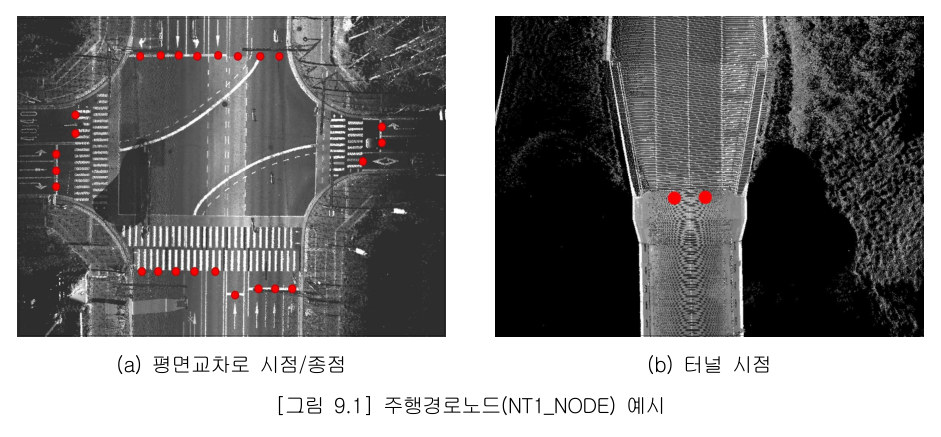

(a) 평면교차로 시점/종점 (b) 터널 시점

- [그림 9.1] 주행경로노드(NT1_NODE) 예시

#### 2) 구조

##### 폴더구조

- 세부도화(도형정보) 데이터의 저장형식은 다음과 같다.

#### [표 9.9] NT1_NODE(주행경로노드) 데이터의 저장형식

```text
             파일 경로                                                  파일 형식

구축구간             정밀도로지도                                  파일명                확장자      의무
                                                                                     조건
                                                                                          비고
(Section)      (HDM_RoadMap)                           (Filename)           (Ext.)

<노선명>

            HDMap_UTM52N_타원체고          NT1_NODE
SEC<ID>_                                                                                  단일
            HDMap_UTMK_정표고             NT1_NODE                             SHP세트    필수
<구간명>                                                                                     파일
            HDMap_UTMK_타원체고            NT1_NODE


            <노선명>\SEC<ID>_<구간명>\HDMap_UTM52N_타원체고\NT1_NODE.shp/shx/dbf/prj/cpg

            <노선명>\SEC<ID>_<구간명>\HDMap_UTMK_정표고\NT1_NODE.shp/shx/dbf/prj/cpg

            <노선명>\SEC<ID>_<구간명>\HDMap_UTMK_타원체고\NT1_NODE.shp/shx/dbf/prj/cpg
  적용
            ◦ <정밀도로지도 폴더>
  규칙
             - HDMap_UTM52N_타원체고: UTM 평면직각좌표계, 타원체고
             - HDMap_UTMK_정표고: UTM-K 단일 평면직각좌표계, 정표고
             - HDMap_UTMK_타원체고: UTM-K 단일 평면직각좌표계, 타원체고

            ◦ <확장자명>: SHP세트(*.shp, *.shx, *.dbf, *.prj, cpg)
```

##### 자료구조

- ESRI Shape(SHP) 포맷으로 제작한다.

- 도형유형(Shape Type)은 ‘PointZ(점형)’로 한다.

   - ※ 도화SW에 따라 ‘PointZ(+M)’도 혼용하여 사용할 수 있다.

- 속성형식은 다음과 같다.

#### [표 9.10] NT1_NODE(주행경로노드) 속성형식

|NT1_NODE|NT1_NODE|NT1_NODE|NT1_NODE|NT1_NODE|
|---|---|---|---|---|
||칼럼명|데이터 타입(길이)|제약조건|코드리스트|
|1|ID|VARCHAR2(13)|UNIQUE/NOT NULL|-|
|2|NodeType1|VARCHAR2(3)|NOT NULL|HDM_NodeType|
|3|NodeType2|VARCHAR2(3)|-|HDM_NodeType|
|4|NodeType3|VARCHAR2(3)|-|HDM_NodeType|
|5|StartEnd1|VARCHAR2(1)|-|HDM_StartEnd|
|6|StartEnd2|VARCHAR2(1)|-|HDM_StartEnd|
|7|StartEnd3|VARCHAR2(1)|-|HDM_StartEnd|
|8|Pseudo|VARCHAR2(1)|NOT NULL|-|
|9|GroupID|VARCHAR2(13)|NOT NULL|-|
|10|SurveyDate|VARCHAR2(8)|NOT NULL|-|
|11|Version|VARCHAR2(4)|NOT NULL|-|
|12|Remark|VARCHAR2(30)|-|-|
|13|HistType|VARCHAR2(3)|-|HDM_HistType|

#### 3) 세부도화

##### 가) 도화방법(기준)

- ① 진행방향 도로에서 주행환경 변화가 발생하는 지점에 ‘점형(PointZ)’으로 도화한다.

- 진행방향이 동일한 모든 차로에 각각 도화한다.

- 주행경로노드(NODE)와 주행경로링크(LINK)는 서로 결합(수평/수직)되어야 한다.

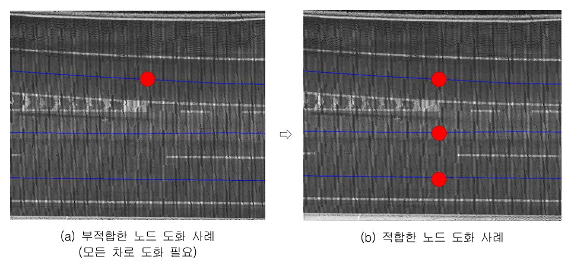

- ② 노드 유형(NodeType)을 고려하여 도화한다.

   - ㉠ 평면교차로 시점/종점

   - 평면교차로의 시점/종점 노드를 의미한다.

   - ※ 평면교차로란, 위상이 동일한 2개 이상의 도로가 서로 교차하는 지점에서 ‘좌회전’이 발생하는 경우를 의미한다.

   - ․ 신호등, 안전표지(비보호 좌회전), 노면표시가 없더라도, 좌회전이 가능하면 평면교차로로 한다.

   - ※ 신호등, 안전표지, 노면표시 중 1개라도 존재하면, 평면교차로로 한다.

   - ․ 한쪽 도로에서만 좌회전이 가능한 경우에도 평면교차로로 한다.

   - ․ 교차하는 모든 도로에서 좌회전이 불가능(좌회전 금지)하더라도, ‘교차로명’이 있으면 평면교차로로 한다.

   - ․ 교차하는 모든 도로에서 좌회전이 불가능(좌회전 금지)하더라도, 도로가 서로 교차하는

      - 지점 내에 ‘정차금지대( )’ 노면표시가 있으면, 평면교차로로 한다.

   - ․ 점유지(공동주택, 상업시설, 공공시설, 공공기관 등)와 교차하는 도로의 경우에도 좌회전이 가능하면 평면교차로로 한다.

   - 평면교차로 ‘진입 시점’ 및 ‘진출 종점’에 각각 도화한다.

   - ‘진입 시점’이란, 진행방향 도로의 중앙선 끝을 의미한다. 다만, 정지선이 존재하는 경우, 정지선을 진입 시점으로 한다.

   - ‘진출 종점’이란, 진출하는 도로의 중앙선 시작 지점을 의미한다.

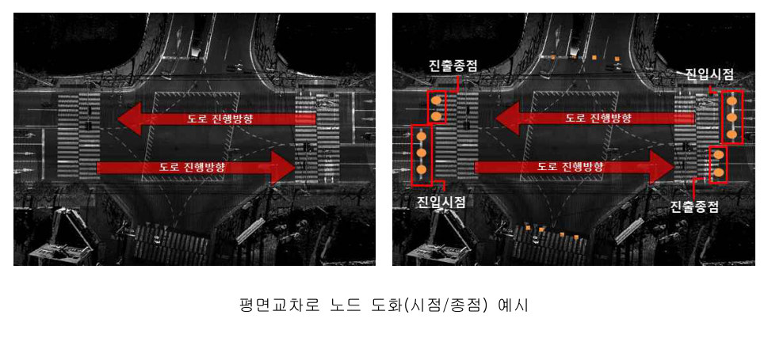

평면교차로 노드 도화(시점/종점) 예시

- ㉡ 입체교차로 시점/종점

- 입체교차로 시점/종점 노드를 의미한다.

- ※ 입체교차로란, 위상이 다른 도로가 서로 교차하는 지점에서 ‘분기’되거나 ‘합류’되는 경우를 의미한다.

- ․ ‘완전 입체교차로’, ‘불완전 입체교차로’ 모두 포함한다.

- 입체교차로 ‘시점’ 및 ‘종점’에 각각 도화한다.

- ※ ‘시점’이란, 진행방향 본선 도로에서 차선(LANELINE)이 ‘좌점혼선(또는 점선)’에서 ‘실선’ 으로 바뀌는 지점을 의미한다.

- ※ ‘종점’이란 진행방향 본선 도로에서 차선(LANELINE)이 ‘실선’에서 ‘우점혼선(또는 점선)’ 으로 바뀌는 지점을 의미한다.

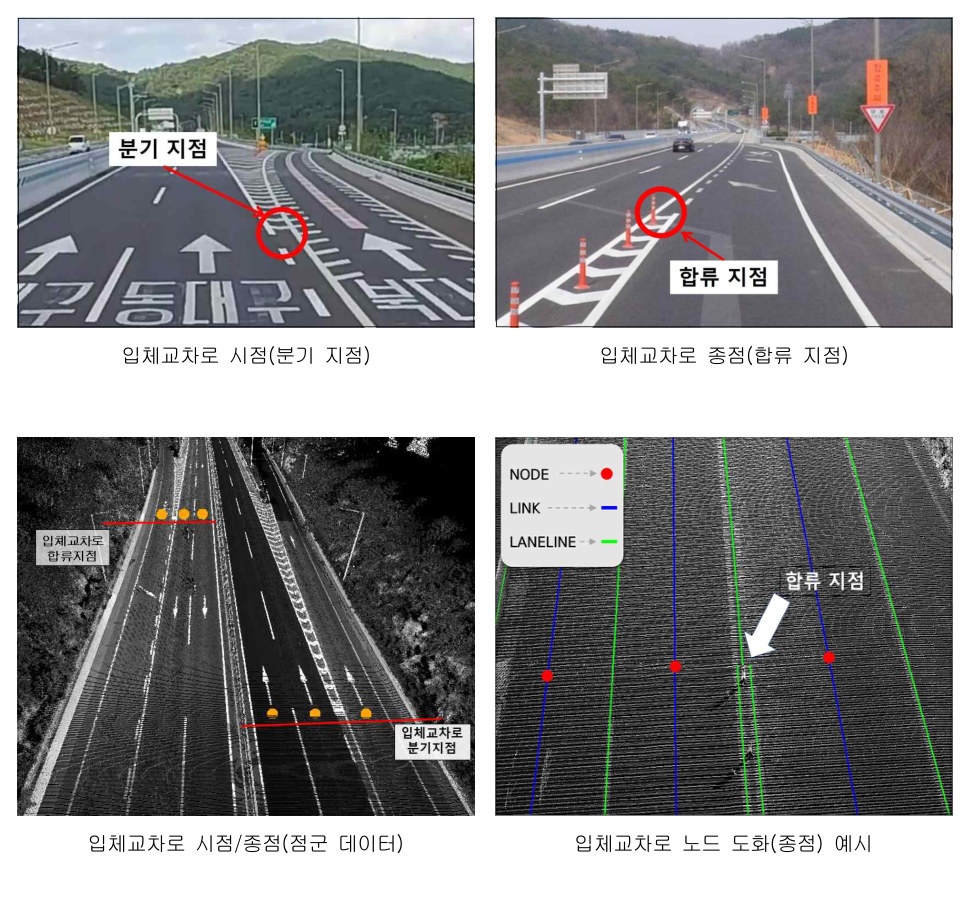

입체교차로 시점(분기 지점)

입체교차로 종점(합류 지점)

입체교차로 시점/종점(점군 데이터)

입체교차로 노드 도화(종점) 예시

- ㉢ 회전교차로

- 회전교차로 내의 노드를 의미한다.

- 회전교차로 내 주행경로링크(LINK)의 분기/합류 지점에 각각 도화( )한다.

- ※ 회전교차로 진입/진출을 위한 시점/종점은 ‘평면/입체 교차로 시점/종점’ 기준에 따라 도화( )한다.

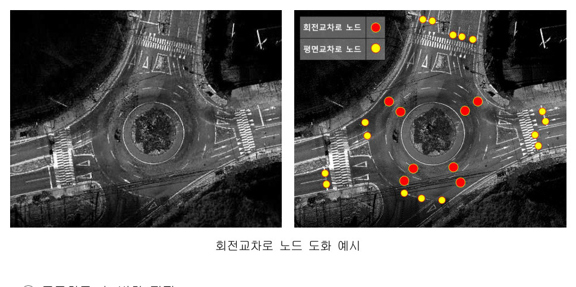

회전교차로 노드 도화 예시

- ㉣ 도로차로 수 변화 지점

- 도로 차로 수의 변화가 발생하는 지점을 의미한다.

- 도로차로수 변화 지점이란, 동일 주행차로에서 차로의 수가 증감하는 지점을 의미한다.

- ‘변속차로(감속 ․ 가속 차로) 지점’, ‘좌회전을 위한 포켓차로가 생기는 지점’ 및 ‘버스 ․ 택시 정류장 진입/진출을 위한 포켓차로’에 도화한다.

- ※ ‘가변차로’로 인한 도로 차로 수 변화는 ‘㉥ 가변차로 시점/종점’ 기준을 따른다.

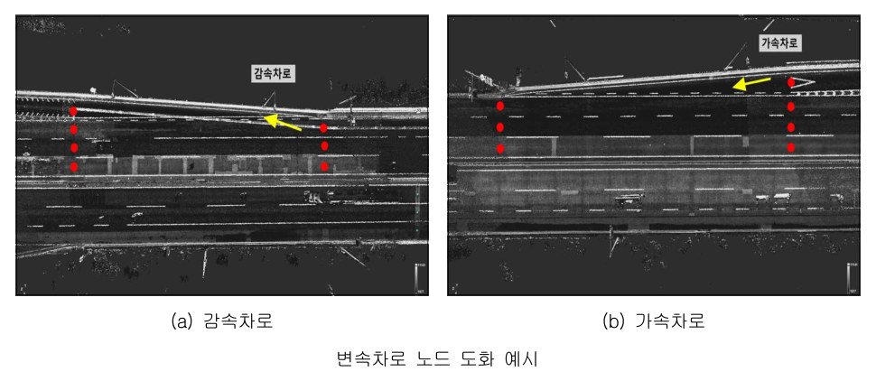

(a) 감속차로

(b) 가속차로

변속차로 노드 도화 예시

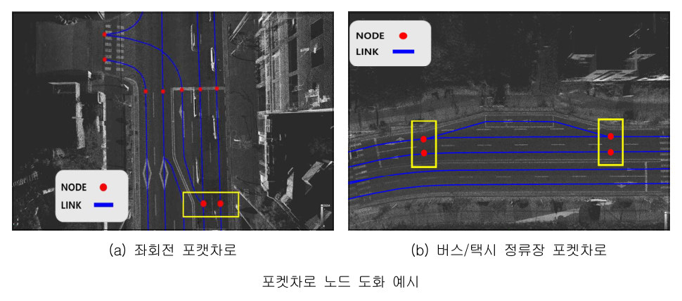

(a) 좌회전 포캣차로 (b) 버스/택시 정류장 포켓차로

포켓차로 노드 도화 예시

- 다만, 진행방향이 동일한 차로에서 다른 도로로부터의 진입, 다른 도로로의 진출이 교차 하여 발생하는 구간(좌점혼선과 우점혼선 교차)의 경우, 분기/합류되는 교차지점에 노드를 도화하지 않는다.

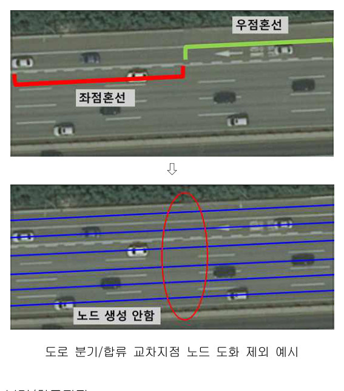

도로 분기/합류 교차지점 노드 도화 제외 예시

- ㉤ 도로 및 차로 분기/합류지점

- 도로가 분기/합류하는 지점의 노드를 의미한다.

- 도로 ‘분기’ 및 ‘합류’ 지점에 각각 도화한다.

- ※ ‘도로 분기 지점’이란, 평면교차로 교통섬 부근의 진행방향 본선 도로에서 차선 (LANELINE)이 ‘좌점혼선(또는 점선)’에서 ‘실선’으로 바뀌는 지점, 진행방향 본선 도로의

편도방향에서 다른 도로와 교차하여 회전 링크가 발생하는 지점, 입체교차로 연결로 내에서 다른 연결로와 분기하여 ‘점선(또는 좌점혼선)’에서 ‘실선’으로 바뀌는 지점, 지하차도 상부의 교차로 진입 전 유턴 형태의 분기가 발생하는 지점을 의미한다.

- ※ ‘도로 합류 지점’이란 평면교차로 교통섬 부근의 진행방향 본선 도로에서 차선 (LANELINE)이 ‘실선’에서 ‘우점혼선(또는 점선)’으로 바뀌는 지점, 진행방향 본선 도로의 편도방향에서 다른 도로와 교차하여 회전 링크가 발생하는 지점, 입체교차로 연결로 내에서 다른 연결로와 합류하여 ‘실선’에서 ‘점선(또는 우점혼선)’으로 바뀌는 지점, 지하차도 상부의 교차로 진출 후 유턴 형태의 합류가 발생하는 지점을 의미한다.

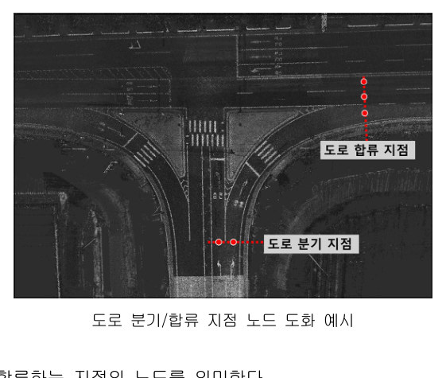

도로 분기/합류 지점 노드 도화 예시

- 차로가 분기/합류하는 지점의 노드를 의미한다.

- ※ 차로 분기/합류지점이란, 휴게소, 졸음쉼터 등의 부속구역(SUBSIDIARYSECTION) 내에서 차로가 분기 및 합류하는 지점을 말한다.

- 차로 ‘분기’ 및 ‘합류’ 지점에 각각 도화한다.

‘부속구역(휴게소/졸음쉼터) 내 분기/합류 지점(차도 분기/합류)

- ㉥ 가변차로 시점/종점

- 가변차로로 인하여 차로 수가 변화하는 시점/종점의 노드를 의미한다.

- ※ 가변차로란, 교통량 조절을 위하여 일시적으로 통행을 허용하는 차로를 의미한다.

- ※ ‘시간제’, ‘요일제’, ‘가변형 가변등’ 등으로 규제 ․ 지시하는 가변차로 모두를 포함한다.

- 가변차로의 시점/종점에 각각 도화한다.

- ※ 사진 데이터에서 가변차로 시점/종점 표지판을 이용하여 도화한다.

- 가변차로 시점/종점 표지판이 모두 없는 경우, 가변차로로 도화하지 않는다.

- 종점 표지판만 없는 경우, 가변형 가변등의 종점 위치가 가변차로의 종점 위치이다.

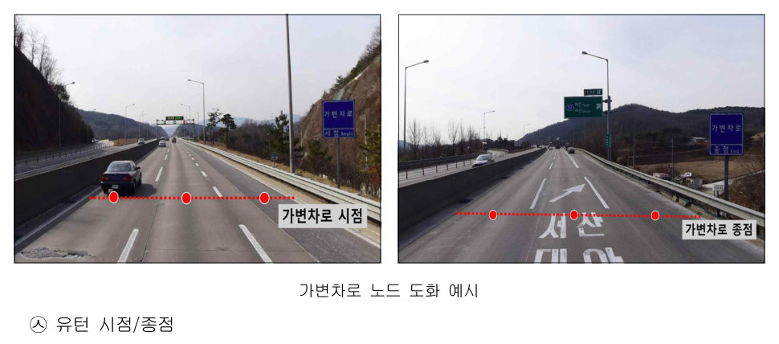

가변차로 노드 도화 예시

##### ㉦ 유턴 시점/종점

- 유턴 경로의 시점/종점을 의미한다.

- 유턴 경로의 시점/종점에 각각 도화한다.

- ※ 시점은 중앙선이 점선으로 바뀌는 시작부터 약 70~80% 위치를 기준으로 한다.

- ※ 종점은 유턴 경로(LINK)의 종점과 주행차로 주행경로링크(LINK)가 만나는 지점을 기준 으로 한다.

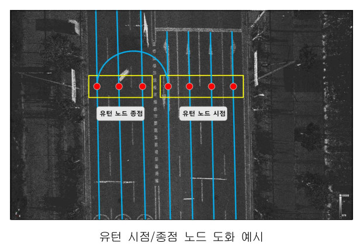

유턴 시점/종점 노드 도화 예시

- ㉧ 최고 제한속도 변화 시점

- 차도의 ‘최고 제한속도’ 변화 시점을 의미한다.

- 최고 제한속도 변화 시점에 도화한다.

- ‘최고 제한속도’ 및 ‘해제’를 의미하는 ‘교통안전표지(TRAFFICSIGN)’를 기준으로 한다.

- ※ ‘해제’를 의미하는 교통안전표지(TRAFFICSIGN) 위치는 이후 적용되는 최고 제한속도 변화의 시점을 의미한다.

- ※ ‘가변형 속도제한 표지(VSL)’를 통해 변화(상향 또는 하향)되는 제한속도 변화지점 (시점)은 도화하지 않는다.

- 교통안전표지가 없어 ‘최고 제한속도 변화지점(시점/종점)’ 및 ‘구간’ 등을 파악할 수 없는 경우에는 국토교통부「지능형교통체계 표준 노드 ․ 링크 구축 및 관리지침(국토교통부 고시 제2023-23호)」에 따라 ‘ITS 국가교통정보센터’에서 구축 중인 ‘표준노드링크’의 ‘최고 제한속도(MAX_SPD)’를 활용한다.

- 도로 공사 등으로 임시(또는 일시)적으로 최고속도를 제한하는 지점(구간)은 도화하지 않는다.

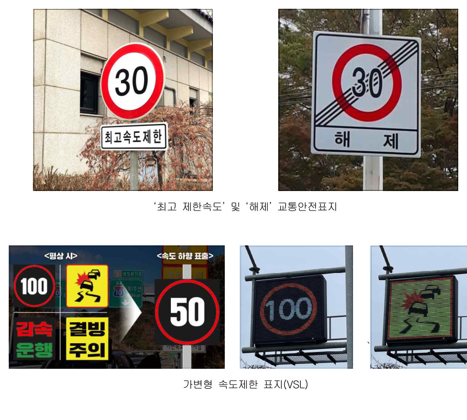

‘최고 제한속도’ 및 ‘해제’ 교통안전표지

`

가변형 속도제한 표지(VSL)

- ㉨ 교량 시점/종점

- 교량 구간의 시점/종점을 의미한다.

- 교량의 시점/종점에 각각 도화한다.

- ※ 시점/종점은 도로와 교량 간 ‘신축 이음부(핑거 조인트)’를 기준으로 한다.

- ※ 다만, 신축 이음부(핑거 조인트)가 도로포장 등으로 사라진 경우, ‘교명주’를 시점/종점 으로 한다.

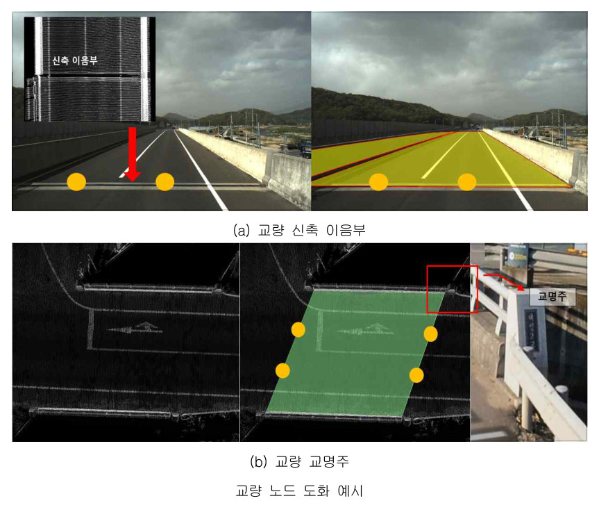

_(a) 교량 신축 이음부_

_(b) 교량 교명주_

교량 노드 도화 예시

- ㉩ 고가 ․ 지하 차도 시점/종점

- 고가 ․ 지하 차도 구간의 시점/종점을 의미한다.

- 고가 ․ 지하 차도의 시점/종점에 각각 도화한다.

- 시점/종점은 고가 ․ 지하 차도 모두 ‘교명주’를 기준으로 한다.

- 다만, 교명주가 없거나, 진행방향 차로를 기준으로 교명주 위치보다 앞서 경사 차이가 시작하는 경우, 경사 차이가 발생하는 지점을 시점/종점으로 한다.

- 다만, 진행방향 차로를 기준으로 교명주 위치보다 앞서 ‘차도경계(ROADBORDER)’ 혹은 ‘차량방호안전시설(BARRIER)’이 시작되는 경우, ‘차도경계(ROADBORDER)’ 또는 ‘차량 방호안전시설(BARRIER)’이 시작하는 지점을 시점/종점으로 한다.

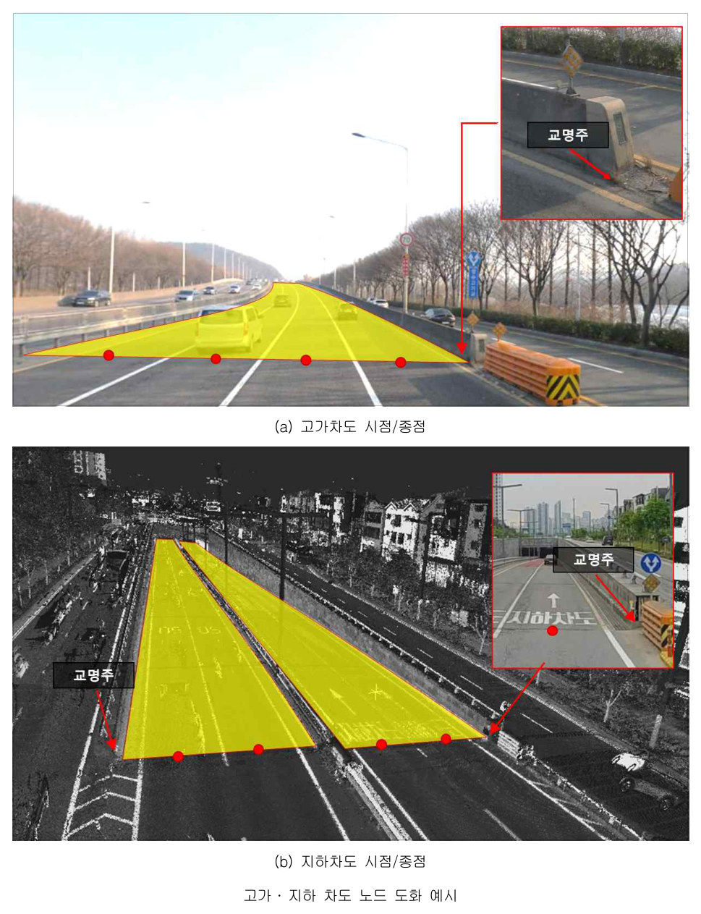

(a) 고가차도 시점/종점

(b) 지하차도 시점/종점

고가 ․ 지하 차도 노드 도화 예시

- ㉪ 터널 시점/종점

- 터널 구간의 시점/종점을 의미한다.

- 터널의 시점/종점에 각각 도화한다.

- 시점/종점은 터널의 ‘벽면이 시작/종료하는 위치’ 또는 ‘터널 이음새’를 기준으로 한다.

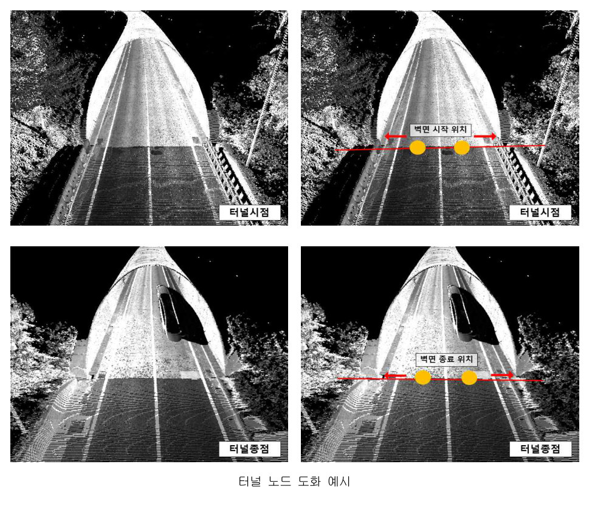

터널 노드 도화 예시

- ㉫ 보호구역 시점/종점

- 어린이/노인/(마을)주민 보호구역 구간의 시점/종점을 의미한다.

- 보호구역 구간의 시점/종점 위치는 보호구역임을 의미하는 ‘교통안전표지(TRAFFICSIGN)’를 시점/종점으로 한다

- 보호구역의 시점/종점 ‘지시’ 유형 교통안전표지(TRAFFICSIGN)가 없는 경우, ‘암적색 노면포장’ 또는 ‘기점/종점 문자 표시’를 시점/종점의 기준으로 한다.

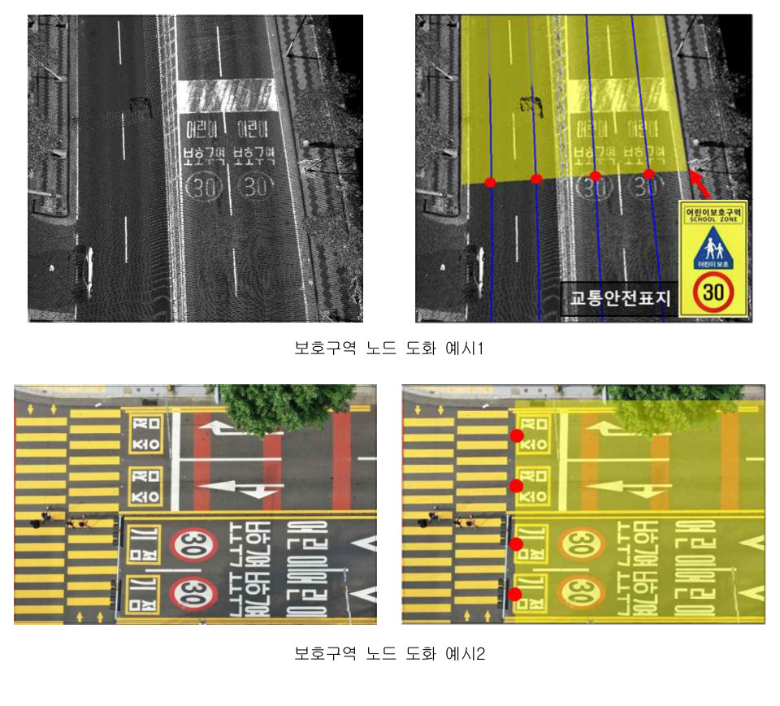

보호구역 노드 도화 예시1

보호구역 노드 도화 예시2

- ㉬ 부속구역 시점/종점

- 부속구역에 해당하는 ‘휴게소’, ‘졸음쉼터’의 시점/종점을 의미한다.

- 부속구역의 시점/종점에 각각 도화한다.

- 부속구역의 시점은 변속차로(휴게소/졸음쉼터 진입) 중 감속차로의 종점(본선 기준, 우점 혼선이 끝나는 지점)을 기준으로 한다.

- 구역의 종점은 변속차로(휴게소/졸음쉼터 진출) 중 가속차로의 시점(본선 기준, 좌점 혼선이 시작되는 지점)을 기준으로 한다.

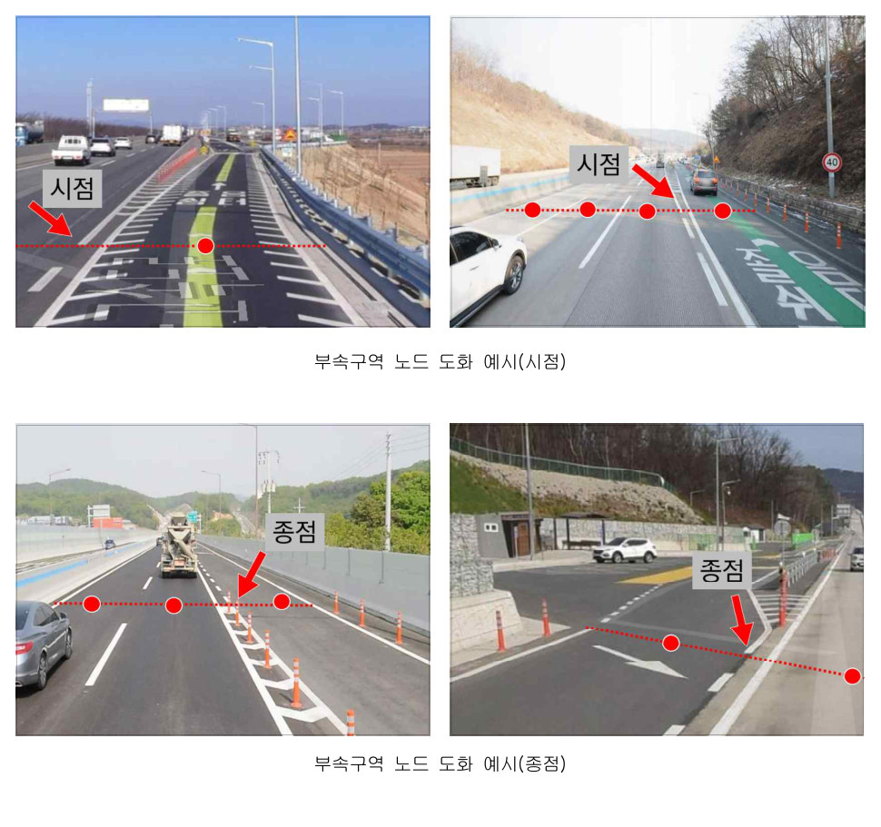

부속구역 노드 도화 예시(시점)

부속구역 노드 도화 예시(종점)


- ㉭ 톨게이트 시점/종점

- 톨게이트 구간의 시점/종점을 의미한다.

- 톨게이트 구간 진입/진출을 기준으로 진행방향에서 ‘첫 번째’ 및 ‘마지막’으로 도로 폭이 변화하는 지점에 각각 도화한다.

톨게이트 시점/종점

- ㄲ ◯ 요금소(하이패스/비하이패스)

- 요금소 위치를 의미하며, 요금소 위치에 도화한다.

- ※ 하이패스/비하이패스 모두를 의미하며, ‘노드 유형(NodeType)’으로 구분한다.

- 요금소 위치를 기준으로 동일 진행방향 차로 모두에 도화한다.

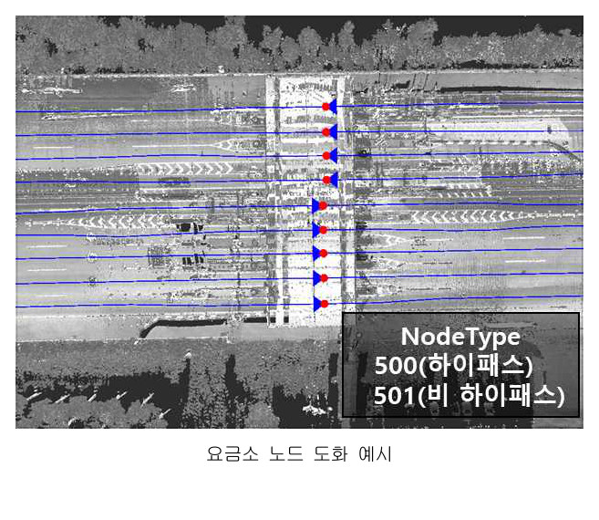

요금소 노드 도화 예시

- ◯ㄸ 과적검문소

- 과적검문소 위치를 의미하며, 과적검문소 위치에 도화한다.

- 과적검문소 진입/진출 차로는 동일 진행방향 차로들과 분리(차로 분리)한다.

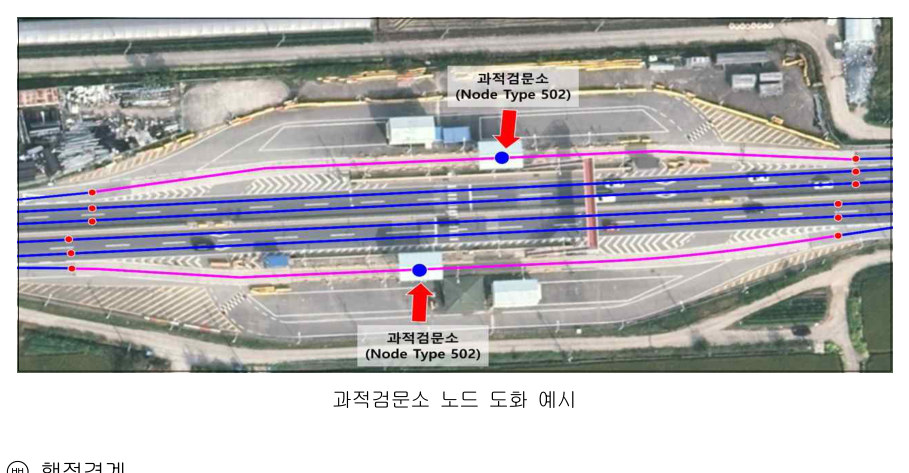

과적검문소 노드 도화 예시

##### ◯ㅃ 행정경계

- 도로를 지나는 ‘행정경계’를 의미한다.

- 발주처(또는 품질검증기관)가 제공하는 ‘법정 행정구역 경계’를 사용한다.

- 진행방향 도로를 지나는 행정경계의 위치에 도화한다.

- 행정경계가 진행방향 도로를 관통하는 경우에만 도화한다.

- 행정경계가 진행방향 도로를 사선으로 지나가면, 도로 중심에서 도로와 직교하게 도화한다.

- ※ 다만, 상행/하행이 분리된 도로에서는 상행/하행 도로 중심에서 직교하게 각각 도화한다.

행경경계 노드 도화 예시

- ③ 노드 유형(NodeType)에서 정의하지 않은 주행환경 변화(‘도로 형상 변화’ 또는 ‘주행환경 변화’로 주행경로링크(LINK)의 ‘링크 유형(LinkType) 변화 발생)가 발생하는 경우, 주행환경 변화 위치에 도화 한다.

   - ※ 노드 유형(NodeType)은 ‘기타유형(코드값 999)’를 입력한다.

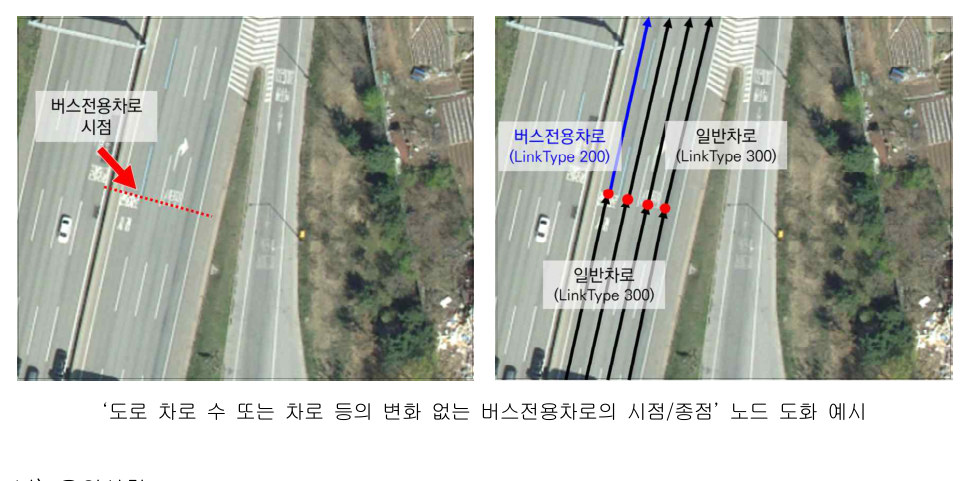

> 예) 도로 차로 수 또는 차로 등의 변화 없는 버스전용차로의 시점/종점

      - 주행경로링크(LINK)의 링크유형(LinkType)이 변화하는 지점에 도화한다.

         - ※ 차선(LANELINE)의 ‘차선 역할 유형(LaneLineKind)’이 ‘버스전용차선(코드값 504)’으로 변화

‘도로 차로 수 또는 차로 등의 변화 없는 버스전용차로의 시점/종점’ 노드 도화 예시

##### 나) 유의사항

###### (1) 제작 유의

- 동일 지점에서 복수의 노드 도화 조건 발생 시, 1개 노드를 도화하고, 복수의 노드 유형 (NodeType)을 입력한다.

- 복수의 노드 유형(NodeType)은 각각 ‘노드 유형1(NodeType1)’, ‘노드 유형2(NodeType2)’, ‘노드 유형3(NodeType3)’ 칼럼에 순차적으로 입력한다.

- 노드 유형(NodeType)에서 정의하고 있는 유형(‘코드값 999’ 제외)만을 대상으로 한다.

- 노드 유형(NodeType)의 코드값이 앞선 순서에서 순차적으로 기입한다.

> 예) ‘입체교차로 시점/종점(코드값 101)’과 ‘교량 시점/종점(코드값 300)’이 동일한 지점인 경우, ‘노드 유형1(코드값 101)’, ‘노드 유형2(코드값 300)’ 입력

- 복수로 입력한 노드 유형(NodeType)의 시점/종점 정보(StartEnd)는 각각 ‘StartEnd1~3’ 칼럼에 입력한다.

> 예) 노드 유형1(NodeType1)에 대한 시점/종점 정보는 노드 시종점1(StartEnd1)에 입력, 노드 유형2(NodeType2)에 대한 시점/종점 정보는 노드 시종점2(StartEnd2)에 입력

###### (2) 제작 예외

- ‘더미 노드’는 도화하지 않는다.

- ※ 더미노드 : ‘하나의 주행경로링크(LINK)는 유일한 시점ID(FromNodeID)와 종점ID(ToNodeID)를 가진다.’는 조건을 만족시키기 위하여 2개 이상의 시점ID/종점ID가 동일한 주행경로링크(LINK)를 강제 분절하기 위해 생성한 가상의 노드

- 더미 노드에 대한 정의 및 도화 기준은 삭제한다.

- ※ `23년 07월 이전 구축 매뉴얼(데이터모델 2019, 2020)에서 명시하고 있는 정의 및 도화 기준

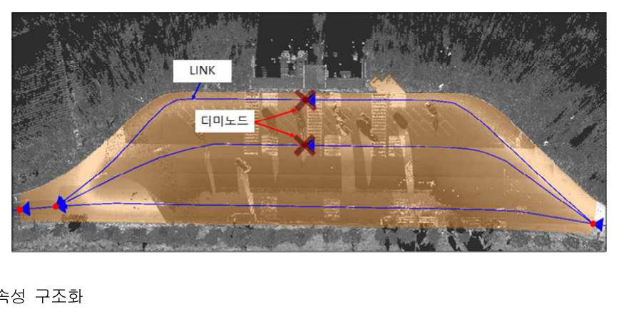

#### 4) 속성 구조화

##### 가) 테이블 명세

#### [표 9.11] NT1_NODE(주행경로노드) 테이블 명세

|NT1_NODE|NT1_NODE|NT1_NODE|NT1_NODE|NT1_NODE|NT1_NODE|NT1_NODE|NT1_NODE|
|---|---|---|---|---|---|---|---|
||칼럼명|(한글명)|KEY|데이터 타입<br>(길이)|제약조건|기본<br>단위|코드 리스트|
||ID|ID|‘구축 항목(레이어) 공통 테이블 명세’ 참고|||||
|①|NodeType1|노드 유형1|-|VARCHAR2(3)|NOT NULL|-|HDM_NodeType|
||NodeType2|노드 유형2|-|VARCHAR2(3)|-|-|HDM_NodeType|
||NodeType3|노드 유형3|-|VARCHAR2(3)|-|-|HDM_NodeType|
|②|StartEnd1|노드 시종점1|-|VARCHAR2(1)|-|-|HDM_StartEnd|
||StartEnd2|노드 시종점2|-|VARCHAR2(1)|-|-|HDM_StartEnd|
||StartEnd3|노드 시종점3|-|VARCHAR2(1)|-|-|HDM_StartEnd|
|③|Pseudo|의사노드 여부|-|VARCHAR2(1)|NOT NULL|-|-|
|④|GroupID|노드 그룹|-|VARCHAR2(13)|NOT NULL|-|-|
||칼럼명|(한글명)|KEY|데이터 타입<br>(길이)|제약조건|기본<br>단위|코드 리스트|
||SurveyDate|취득 날짜|‘구축 항목(레이어) 공통 테이블 명세’ 참고|||||
||Version|버전||||||
||Remark|비고||||||
||HistType|갱신이력 유형||||||

##### 나) 칼럼별 상세 유형

- ① NodeType (노드 유형)

- 주행환경 변화(도로의 형상 변화, 주행환경 변화 등)의 유형을 의미한다.

- 제약조건은 ‘NOT NULL’이다.

- 유형은 ‘HDM_NodeType(노드 유형)’ 코드 리스트에서 정의하고 있는 코드를 입력한다.

- ‘노드 유형(NodeType)별 도화 방법(기준)’을 참고하여 입력한다.

- 노드 유형(NodeType)에서 정의하지 않은 주행환경 변화의 경우, ‘기타유형(코드값 999)’를 입력한다.

- 복수의 노드 유형(NodeType)이 존재하는 경우, 각각 ‘노드 유형1(NodeType1)’, ‘노드 유형2 (NodeType2)’, ‘노드 유형3(NodeType3)’ 칼럼에 순차적으로 입력한다.

- 노드 유형(NodeType)에서 정의하고 있는 유형(‘코드값 999’ 제외)만을 대상으로 한다.

- 노드 유형(NodeType)의 코드값이 앞선 순서에서 순차적으로 기입한다.

> 예) ‘입체교차로 시점/종점(코드값 101)’과 ‘교량 시점/종점(코드값 300)’이 동일한 지점인 경우, ‘노드 유형1(코드값 101)’, ‘노드 유형2(코드값 300)’ 입력

#### [표 9.12] ‘HDM_NodeType(노드 유형)’ 코드 리스트

|코드값||노드 유형|설명|
|---|---|---|---|
|100|교차로|평면교차로 시점/종점|평면교차로 시점/종점 위치의 노드|
|101||입체교차로 시점/종점|입체교차로 시점/종점 위치의 노드|
|102||회전교차로|회전교차로 내의 노드|
|200|차로변화|차로 수 변화 지점|차로 수 변화 지점 위치의 노드|
|201||도로 및 차로<br>분기/합류 지점|도로 간 분기/합류 지점 위치의 노드<br>(예) 교통섬, 편도방향 분기점, 입체교차로 내 분기점, 부속구역 내<br>차로 분기점 등)|
|202||가변차로 시점/종점|가변차로 시점/종점 위치의 노드|
|203||유턴 시점/종점|유턴 경로의 시점/종점 위치의 노드|
|300|속도변화|최고 제한속도 변화 시점|제한속도가 변화하는 시점 위치의 노드|
|400|구간|교량 시점/종점|교랑 시점/종점 위치의 노드|
|401||고가차도 시점/종점|고가차도 시점/종점 위치의 노드|
|402||터널 시점/종점|터널 시점/종점 위치의 노드|
|403||지하차도 시점/종점|지하차도 시점/종점 위치의 노드|
|404||보호구역 시점/종점|어린이, 노인, 마을주민 등의 보호구역 시점/종점 위치의 노드|
|405||부속구역 시점/종점|휴게소, 졸음쉼터 시점/종점 위치의 노드|
|406||톨게이트 시점/종점|톨게이트 시점/종점 위치의 노드|
|500|교통 통제<br>시설|요금소(하이패스)|하이패스 요금소 위치 노드|
|501||요금소(비하이패스)|비 하이패스 요금소 위치 노드|
|502||과적검문소|과적검문소 위치 노드|
|600|경계|행정경계|행정경계 위치 노드|
|999|기타|기타|기타 설정되지 않은 유형의 노드|

##### ② StartEnd (노드 시종점)

- 노드유형(NodeType) 중 ‘시점/종점’ 노드유형의 ‘시점’, ‘종점’을 의미한다.

- 시점/종점은 ‘HDM_StartEnd(노드 시종점)’ 코드 리스트에서 정의하고 있는 코드를 입력한다.

- 복수의 노드 유형(NodeType)이 존재하는 경우, 복수로 입력한 노드 유형(NodeType)의 시점/ 종점 정보(StartEnd)는 각각 ‘StartEnd1~3’ 칼럼에 입력한다.

> 예) 노드 유형1(NodeType1)에 대한 시점/종점 정보는 노드 시종점1(StartEnd1)에 입력, 노드 유형2(NodeType2)에 대한 시점/종점 정보는 노드 시종점2(StartEnd2)에 입력

#### [표 9.13] ‘HDM_StartEnd(시종점 유형)’ 코드 리스트

|코드값|시종점 유형|설명|
|---|---|---|
|1|시점|시점/종점 중 시점 위치|
|2|종점|시점/종점 중 종점 노드|

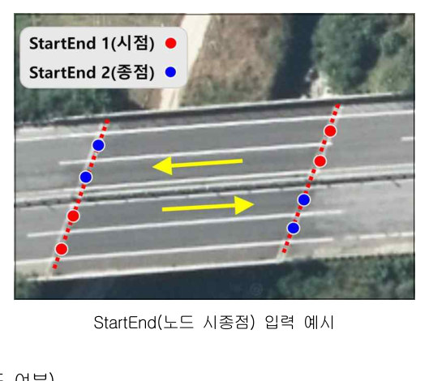

StartEnd(노드 시종점) 입력 예시

- ③ Pseudo (의사노드 여부)

- ※ 의사(Pseudo)노드

- ․ 실제가 아닌 ‘가상노드’를 의미한다. 제작 단위/관리 등의 완전성(모든 섹션(SECTION)의 시점/종점에서 완전한 데이터) 확보 목적으로 활용

- 해당 노드가 의사노드인지의 여부를 의미한다.

- ※ 섹션(SECTION)의 시점/종점 노드는 인접하는 다른 섹션의 시점/종점 노드와 공유되어야 하며, 공유되는 노드는 각각 ‘의사노드’ 또는 ‘의사노드 아님’ 속성을 가지고 있어야 한다.

- 제약조건은 ‘NOT NULL’이다.

- ‘의사노드 여부’ 입력값을 참고하여 값을 입력한다.

- 섹션(SECTION)의 인접부분에서 주행경로링크(LINK)의 ‘시점노드(FromNode)’에 해당하는 노드 ‘의사노드(값 1)’

- 섹션(SECTION)의 인접부분에서 주행경로링크(LINK)의 ‘종점노드(ToNode)’에 해당하는 노드는 ‘의사노드 아님(값 0)’

#### [표 9.14] PseudoNode(의사노드 여부) 입력값

|값|의사노드 여부|설명|
|---|---|---|
|0|의사노드 아님|의사노드가 아님|
|1|의사노드|의사노드임|

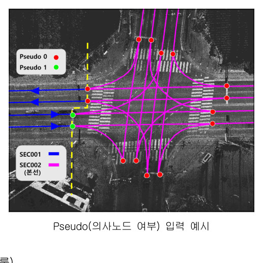

Pseudo(의사노드 여부) 입력 예시

- ④ GroupID (노드 그룹)

- 노드 유형(NodeType)에 따라 동일방향 모든 차로에 동일하게 도화한 노드들을 ‘그룹화 (Grouping)’하는 것을 의미한다.

- ※ 그룹화(Grouping)되는 모든 노드의 노드 유형(NodeType)은 동일하여야 한다.

- 제약조건은 ‘NOT NULL’이다.

- 두문자어(3자리)를 포함하여 13자리로 ID를 부여한다.

- ※ 모든 GropID는 중복이 발생하면 안 된다.

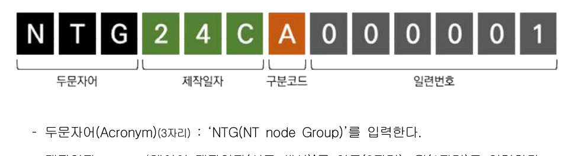

- 두문자어(Acronym)(3자리) : ‘NTG(NT node Group)’를 입력한다.

- 제작일자(3자리) : ‘레이어 제작일자(신규 생성)’를 연도(2자리), 월(1자리)로 입력한다.

- ․ 1(01월), 2(02월), 3(03월), 4(04월), 5(05월), 6(06월), 7(07월), 8(08월), 9(09월), A(10월), B(11월), C(12월)

- 구분코드(1자리) : 해당 노선/구간을 제작 ․ 갱신 ․ 수정 중인 사업자의 코드를 입력한다.

- ※ 사업자코드는 사업 종류 및 연도별로 발주처에서 부여한다.

- 일련번호(6자리) : 1부터 순차적으로 부여한다.

- ․ 000001~999999

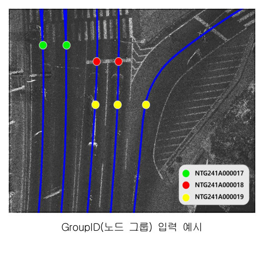

GroupID(노드 그룹) 입력 예시

### 9.4.2. NT2_LINK (주행경로링크)

|분류|Network (NT)<br>(네트워크)|명칭|LINK<br>(주행경로링크)|
|---|---|---|---|
|정의|차로의 중심을 연결한 가상의 주행경로|기하|PolylineZ (선형)|

#### 1) 정의

- ① 진행방향 차로의 중심을 연결한 가상의 선을 의미한다.

- ② 자동차의 주행이 가능한 모든 도로(구간)에서 ‘진행방향성’을 고려하여 구축한다.

- ③ 차로 유형(LinkType)에 따라 ‘교차로(평면교차로 ․ 입체교차로 ․ 회전교차로 ․ 회전차로 ․ 변속 차로)’, ‘전용차로(버스전용차로, 가변차로)’ 및 ‘일반차로’ 링크를 대상으로 한다.

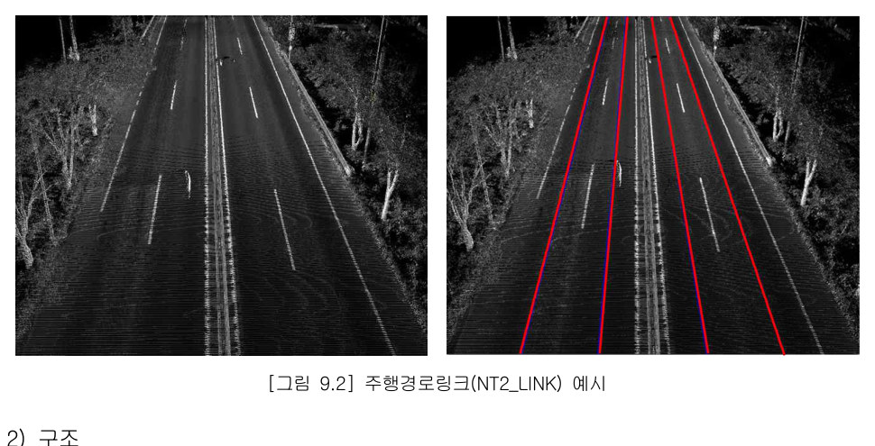

[그림 9.2] 주행경로링크(NT2_LINK) 예시

#### 2) 구조

##### 폴더구조

- 세부도화(도형정보) 데이터의 저장형식은 다음과 같다.

#### [표 9.15] NT2_LINK(주행경로링크) 데이터의 저장형식

```text
             파일 경로                                              파일 형식

구축구간            정밀도로지도                               파일명                  확장자      의무
                                                                                   조건
                                                                                        비고
(Section)     (HDM_RoadMap)                        (Filename)             (Ext.)

<노선명>

            HDMap_UTM52N_타원체고       NT2_LINK
SEC<ID>_                                                                                단일
            HDMap_UTMK_정표고          NT2_LINK                              SHP세트    필수
<구간명>                                                                                   파일
            HDMap_UTMK_타원체고         NT2_LINK


       <노선명>\SEC<ID>_<구간명>\HDMap_UTM52N_타원체고\NT2_LINK.shp/shx/dbf/prj/cpg

       <노선명>\SEC<ID>_<구간명>\HDMap_UTMK_정표고\NT2_LINK.shp/shx/dbf/prj/cpg

       <노선명>\SEC<ID>_<구간명>\HDMap_UTMK_타원체고\NT2_LINK.shp/shx/dbf/prj/cpg

  적용   ◦ <정밀도로지도 폴더>
  규칙    - HDMap_UTM52N_타원체고: UTM 평면직각좌표계, 타원체고
        - HDMap_UTMK_정표고: UTM-K 단일 평면직각좌표계, 정표고
        - HDMap_UTMK_타원체고: UTM-K 단일 평면직각좌표계, 타원체고

       ◦ <확장자명>: SHP세트(*.shp, *.shx, *.dbf, *.prj, *cpg)
```

##### 자료구조

- ESRI Shape(SHP) 포맷으로 제작한다.

- 도형유형(Shape Type)은 ‘PolylineZ(선형)’로 한다.

   - ※ 도화SW에 따라 ‘PolylineZ(+M)’도 혼용하여 사용할 수 있다.

- 속성형식은 다음과 같다.

#### [표 9.16] NT2_LINK(주행경로링크) 속성형식

|NT2_LINK|NT2_LINK|NT2_LINK|NT2_LINK|NT2_LINK|
|---|---|---|---|---|
||칼럼명|데이터 타입(길이)|제약조건|코드리스트|
|1|ID|VARCHAR2(13)|UNIQUE/NOT NULL|-|
|2|RoadRank|VARCHAR2(3)|NOT NULL|HDM_RoadRank|
|3|RoadNo|VARCHAR2(5)|-|-|
|4|AdminCode|VARCHAR2(5)|NOT NULL|-|
|5|RoadName|VARCHAR2(7)|NOT NULL|-|
|6|M_RoadRank|VARCHAR2(3)|-|HDM_RoadRank|
|7|M_RoadNo|VARCHAR2(5)|-|-|
|8|M_RoadName|VARCHAR2(7)|-|-|
|9|RoadType|VARCHAR2(3)|NOT NULL|HDM_RoadType|
|10|MaxSpeed|VARCHAR2(3)|NOT NULL|-|
|11|Direction|VARCHAR2(1)|-|HDM_Direction|
|12|LinkType|VARCHAR2(3)|NOT NULL|HDM_LinkType|
|13|Turn|VARCHAR2(1)|-|HDM_Turn|
|14|R_LinkID|VARCHAR2(13)|-|-|
|15|L_LinkID|VARCHAR2(13)|-|-|
||칼럼명|데이터 타입(길이)|제약조건|코드리스트|
|16|FromNodeID|VARCHAR2(13)|NOT NULL|-|
|17|ToNodeID|VARCHAR2(13)|NOT NULL|-|
|18|RoadTypeID|VARCHAR2(13)|-|-|
|19|SurveyDate|VARCHAR2(8)|NOT NULL|-|
|20|Version|VARCHAR2(4)|NOT NULL|-|
|21|Remark|VARCHAR2(30)|-|-|
|22|HistType|VARCHAR2(3)|-|HDM_HistType|

#### 3) 세부도화

##### 가) 도화방법(기준)

- ① ‘진행방향’을 따라 ‘차로’ 중앙에 ‘선형(PolylineZ)’으로 도화한다.

- ※ ‘차로’는 차선과 차선 중앙을 의미한다.

- 다만, 차선이 식별되지 않을 경우, 실제 주행경로를 고려하여 도화한다.

- ※ 교차로 내 주행경로, 휴게소/졸음쉼터 내 주행경로 포함

◦주행경로링크(LINK)와 주행경로노드(NODE)는 서로 결합(수평/수직)되어야 한다.

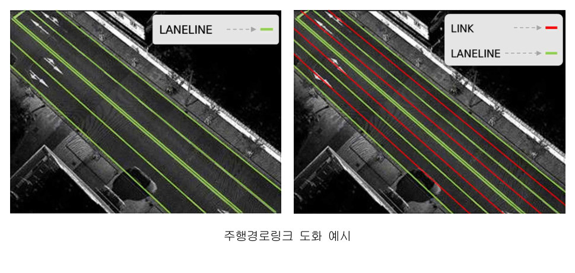

주행경로링크 도화 예시

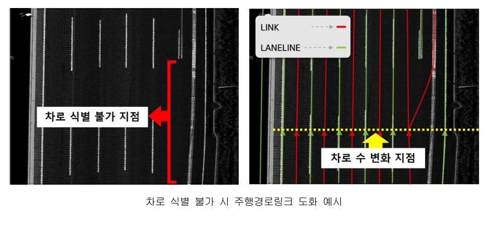

차로 식별 불가 시 주행경로링크 도화 예시

- ② 자동차의 주행환경 및 차로의 형상을 고려하여 자연스럽게 도화한다.

- ‘분기/합류가 발생하는 변속차로(감속 ․ 가속 차로)’에서 자연스럽게 진입/진출이 가능하도록 도화한다.

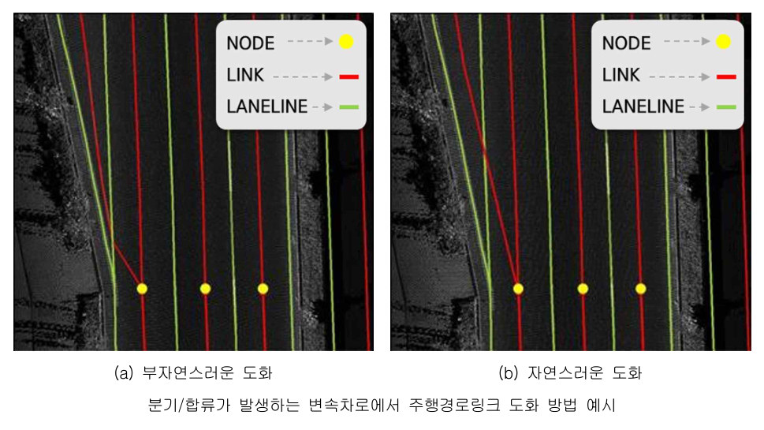

(a) 부자연스러운 도화 (b) 자연스러운 도화

분기/합류가 발생하는 변속차로에서 주행경로링크 도화 방법 예시

- 버스 ․ 택시 정류장, 비상정차대 등 일시적으로 발생하는 ‘포켓차로’로 자연스럽게 진입/진출이 가능하도록 도화한다.

- ※ 다만, ‘점선’ 등으로 진입이 가능하여야 한다(실선 제외).

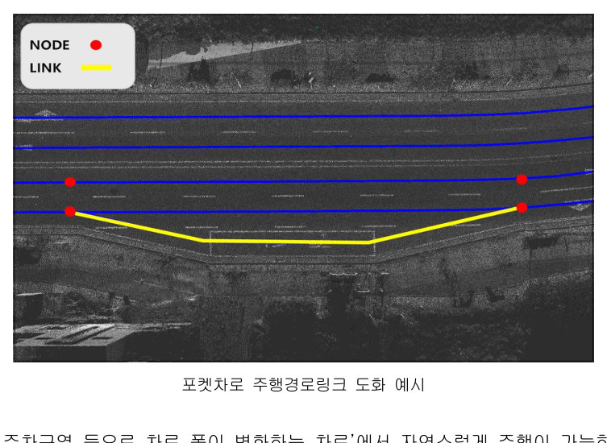

포켓차로 주행경로링크 도화 예시

- ‘노상 주차구역 등으로 차로 폭이 변화하는 차로’에서 자연스럽게 주행이 가능하도록 도화 한다.

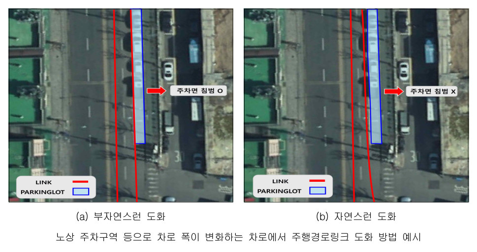

(a) 부자연스런 도화

(b) 자연스런 도화

노상 주차구역 등으로 차로 폭이 변화하는 차로에서 주행경로링크 도화 방법 예시

- ‘유턴’ 시, 자연스러운 회전이 가능하도록 도화한다.

- 중앙선이 점선으로 바뀌는 시점부터 약 70~80% 위치에서 반원으로 도화한다.

- 3차로 이상 도로에서는 3차로에, 3차로 미만 도로에서는 마지막 차로에 붙인다.

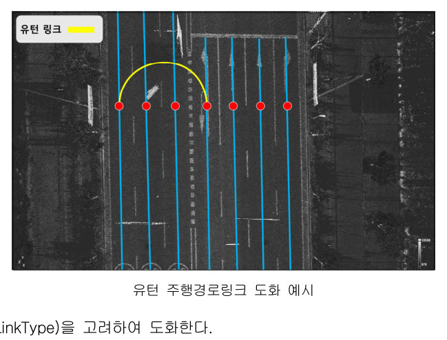

##### 유턴 주행경로링크 도화 예시

- ③ 차로 유형(LinkType)을 고려하여 도화한다.

   - ㉠ 평면교차로 링크

   - 평면교차로 내부의 주행경로링크(LINK)를 의미한다.

   - 노드 유형(NodeType) 중 ‘평면교차로 시점/종점(코드값 100)’ 사이를 진행방향에 따라 연결 되도록 도화한다.

   - 좌 ․ 우 회전 시, 실제 주행경로를 고려하여 자연스럽게 회전할 수 있도록 도화한다.

   - ※ 평면교차로 내부는 차선(LANELINE)이 대부분 없음

   - ․ 유도선 차선(LANELINE)이 있는 경우, 유도선을 고려하여 도화한다.

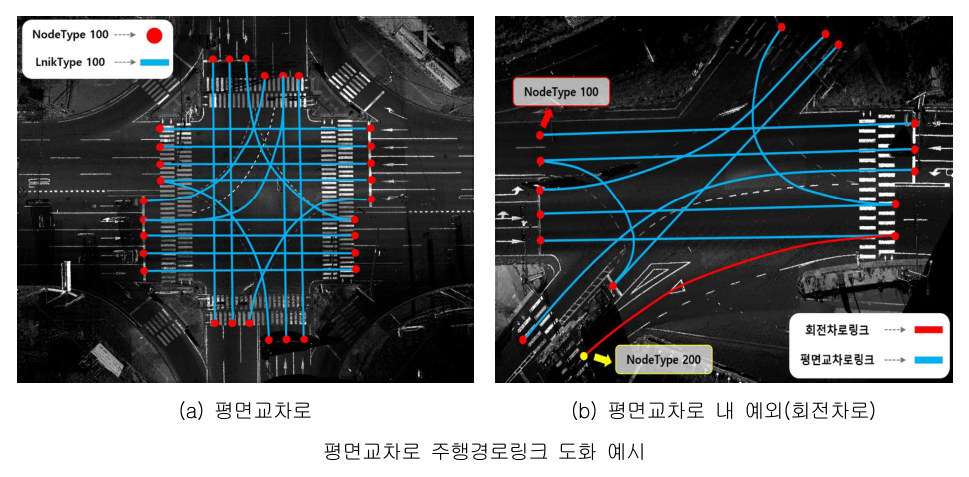

(a) 평면교차로

(b) 평면교차로 내 예외(회전차로)

평면교차로 주행경로링크 도화 예시

- ㉡ 입체교차로 링크

- 입체교차로 내부의 주행경로링크(LINK)를 의미한다.

- 노드 유형(NodeType) 중 ‘입체교차로 시점/종점(코드값 101)’과 ‘평면교차로 시점/종점 (코드값 100)’의 사이를 진행방향에 따라 연결되도록 도화한다.

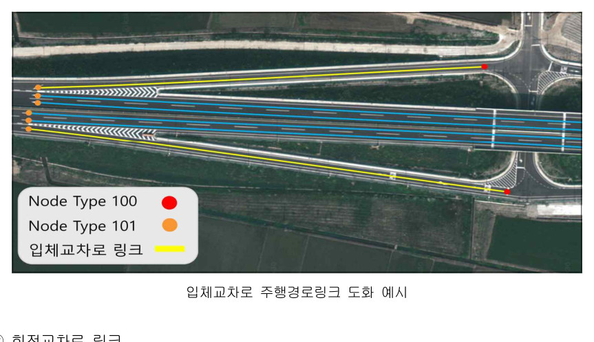

입체교차로 주행경로링크 도화 예시

- ㉢ 회전교차로 링크

- 회전교차로 내부의 주행경로링크(LINK)를 의미한다.

- 노드 유형(NodeType) 중 ‘회전교차로 시점/종점(코드값 102)’의 사이를 진행방향에 따라 연결되도록 도화한다.

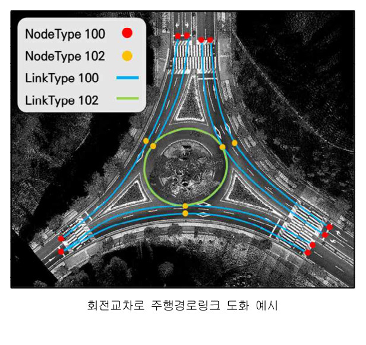

회전교차로 주행경로링크 도화 예시

##### ㉣ 회전차로 링크

- 회전이 발생하는 주행경로링크(LINK)를 의미한다.

- ‘교차로에서 교통섬, 노면표시 등에 의해 본선에서 교통류가 분리되어 회전하는 링크’, ‘편도 방향 도로 합류 및 분기로 회전이 발생하는 링크’, ‘지하차도 상부의 교차로 진입 전 유턴 형태의 분기 링크’ 등이 해당한다.

- ※ 회전이 발생하는 ‘평면교차로 링크(차로 유형(LinkType) 코드값 100)’ 및 ‘유턴(회전 방향 (Turn) 코드값 3)’은 제외한다.

- 노드 유형(NodeType) 중 ‘도로 분기/합류지점(코드값 201)’ 사이를 진행방향에 따라 연결 되도록 도화한다.

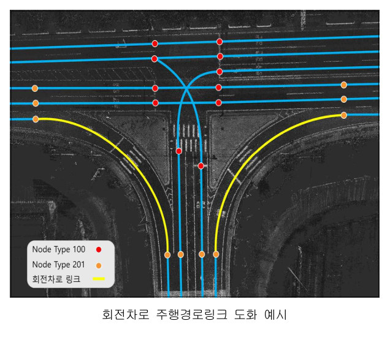

회전차로 주행경로링크 도화 예시

- ㉤ 변속차로 링크

- ‘자동차전용도로’에서 ‘입체교차로(IC/JC)’, ‘부속구역(휴게소, 졸음쉼터)’으로 안전한 진입/ 진출을 위해 설치된 변속구간(감속 ․ 가속 차로) 내의 주행경로링크(LINK)를 의미한다.

- ※ 자동차전용도로가 아닌 ‘일반도로’에 설치된 구간(분기/합류 차로)은 ‘제외’한다.

- ㉼ ‘데이터모델 2020’의 ‘휴게소 ․ 졸음쉼터 진입/진출로’, ‘교차로 진입/진출로’를 의미한다.

- ‘차선’이 ‘좌점혼선’ 혹은 ‘우점혼선’ 내부에 있는 주행경로링크(LINK)가 해당한다.

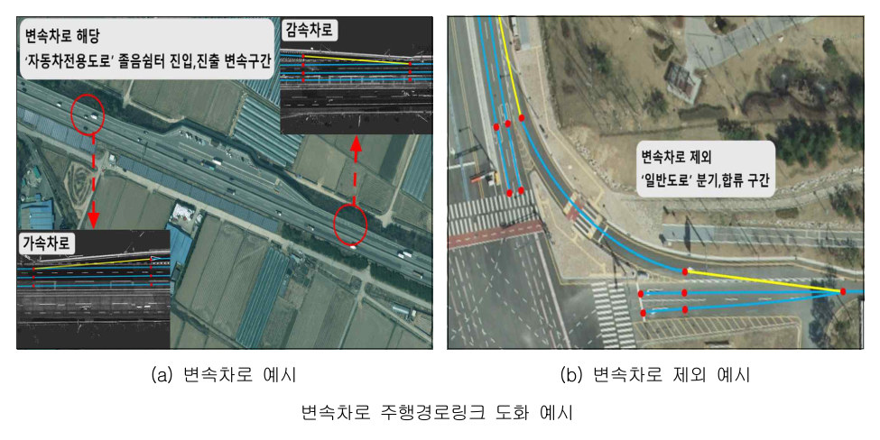

(a) 변속차로 예시

(b) 변속차로 제외 예시

변속차로 주행경로링크 도화 예시

- ㉥ 버스전용차로 링크

- ‘전일제/시간제/요일제 버스전용차로’를 의미한다.

- 차선(LANELINE)의 ‘차선 역할 유형(LaneLineKind)’이 ‘버스전용차선(코드값 504)’에 해당 하는 경우, 해당 구간의 주행경로링크의 차로 유형(LinkType)은 ‘버스전용차로(코드값 200)’로 입력한다.

- ㉦ 가변차로 링크

- 가변차로의 내의 주행경로링크(LINK)를 의미한다.

- 노드 유형(NodeType) 중 ‘가변차로 시점/종점(코드값 202)’의 사이를 진행방향에 따라 연결 되도록 도화한다.

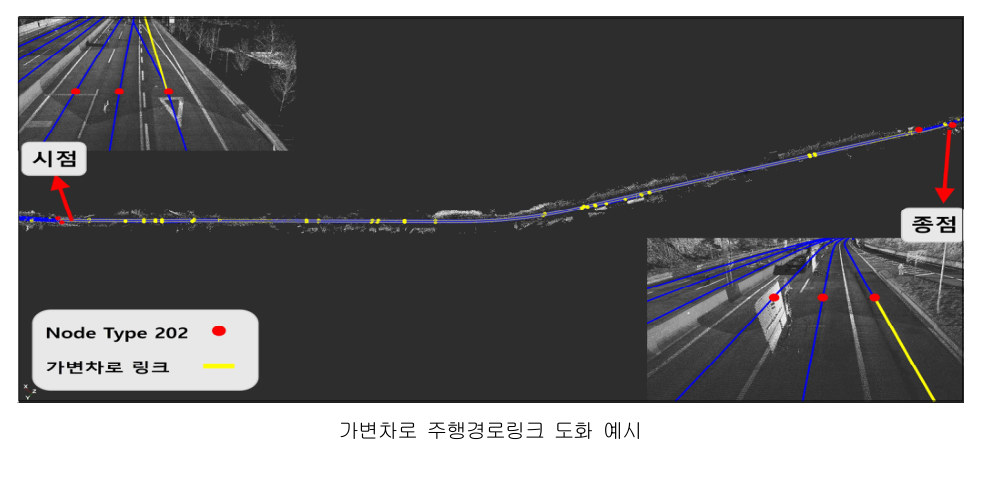

가변차로 주행경로링크 도화 예시

- ㉧ 일반차로 링크

- 차로유형(LinkType)의 ‘교차로(코드값 100번대)’, ‘전용차로(코드값 200번대)’를 제외한 일반적인 모든 주행경로링크(LINK)를 의미한다.

- ‘직진’, ‘좌회전 또는 버스 ․ 택시 정류장, 비상정차대 등 진입/진출을 위한 포켓차로’, ‘일반 도로에 설치된 분기/합류 차로’, ‘유턴’ 등이 해당한다.

직진

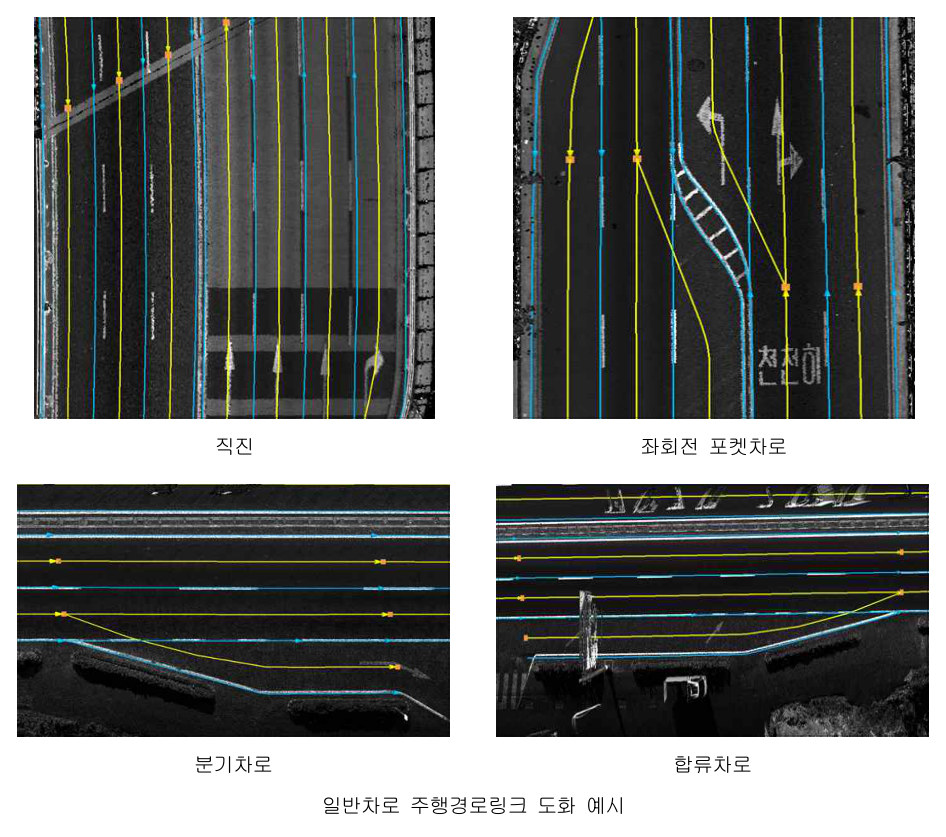

좌회전 포켓차로

분기차로

합류차로

일반차로 주행경로링크 도화 예시

##### 나) 유의사항

###### (1) 제작 유의

- ‘생활(이면)도로’의 경우, 도로 중앙에 1개의 주행경로링크(LINK)를 도화한다.

   - ※ ‘생활(이면)도로’란, 중앙선 없는 양방향 통행 및 보행자와 차량이 공존하는 도로를 의미 한다(‘보차혼용도로’라고도 한다).

   - 도로 유형(RoadType)은 ‘생활(이면)도로(코드값 200)’이다.

   - 도로 방향(Direction)은 ‘양방향(코드값 3)’이다.

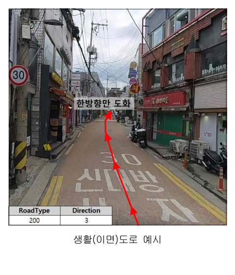

생활(이면)도로 예시

###### (2) 제작 예외

- 도화 방법(기준) 외 ‘제작 예외’ 없음

#### 4) 속성 구조화

##### 가) 테이블 명세

#### [표 9.17] NT2_LINK(주행경로링크) 테이블 명세

||NT2_LINK|NT2_LINK|NT2_LINK|NT2_LINK|NT2_LINK|NT2_LINK|NT2_LINK|
|---|---|---|---|---|---|---|---|
||칼럼명|(한글명)|KEY|데이터 타입<br>(길이)|제약조건|기본<br>단위|코드 리스트|
||ID|ID|‘구축 항목(레이어) 공통 테이블 명세’ 참고|||||
|①|RoadRank|도로 등급|-|VARCHAR2(3)|NOT NULL|-|HDM_RoadRank|
|②|RoadNo|도로 번호|-|VARCHAR2(5)|-|-|-|
|③|AdminCode|시군구 번호|-|VARCHAR2(5)|NOT NULL|-|-|
|④|RoadName|도로명 번호|-|VARCHAR2(7)|NOT NULL|-|-|
|⑤|M_RoadRank|중용도로 등급|-|VARCHAR2(3)|-|-|HDM_RoadRank|
||M_RoadNo|중용도로 번호|-|VARCHAR2(5)|-|-|-|
||M_RoadName|준용도로명 번호|-|VARCHAR2(7)|-|-|-|
|⑥|RoadType|도로 유형|-|VARCHAR2(3)|NOT NULL|-|HDM_RoadType|
|⑦|MaxSpeed|최고 제한속도|-|VARCHAR2(3)|NOT NULL|km/h|-|
|⑧|Direction|주행 방향|-|VARCHAR2(1)|-|-|HDM_Direction|
|⑨|LinkType|차로 유형|-|VARCHAR2(3)|NOT NULL|-|HDM_LinkType|
|⑩|Turn|회전 방향|-|VARCHAR2(1)|-|-|HDM_Turn|
|⑪|R_LinkID|우측링크ID|-|VARCHAR2(13)|-|-|-|
||L_LinkID|좌측링크ID|-|VARCHAR2(13)|-|-|-|
|⑫|FromNodeID|시점노드ID|FK|VARCHAR2(13)|NOT NULL|-|-|
||ToNodeID|종점노드ID|FK|VARCHAR2(13)|NOT NULL|-|-|
|⑬|RoadTypeID|도로 유형ID|FK|VARCHAR2(13)|-|-|-|
||SurveyDate|취득 날짜|‘구축 항목(레이어) 공통 테이블 명세’ 참고|||||
||Version|버전||||||
||Remark|비고||||||
||HistType|갱신이력 유형||||||

##### 나) 칼럼별 상세 유형

- ① RoadRank (도로 등급)

- 도로등급 유형을 의미한다.

- 제약조건은 ‘NOT NULL’이다.

- 국토교통부「지능형교통체계 표준 노드 ․ 링크 구축 및 관리지침(국토교통부 고시 제2023-23호)」에 따라 ‘ITS 국가교통정보센터’에서 구축 중인 ‘표준노드링크’의 ‘도로등급’을 참고한다.

- 발주처(또는 품질검증기관)가 제공하는 ‘표준노드링크’를 사용한다.

- ‘입체교차로(IC/JC) 링크’ ‘회전차로 링크’의 경우, ‘진입 할 도로’의 도로 등급을 입력한다.

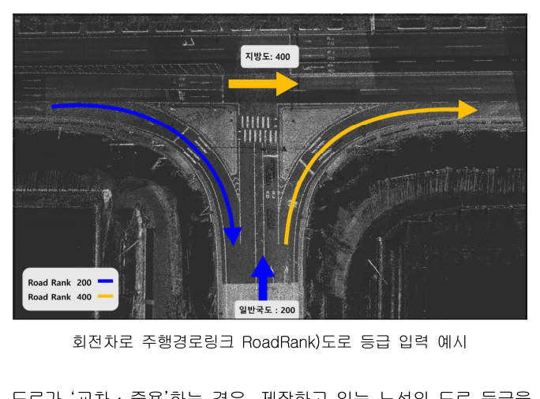

회전차로 주행경로링크 RoadRank)도로 등급 입력 예시

- 2개 이상의 도로가 ‘교차 ․ 중용’하는 경우, 제작하고 있는 노선의 도로 등급을 입력한다.

> 예) 2개 이상의 도로가 교차하는 ‘평면교차로’, 2개 이상의 도로가 일정구간 공동으로 사용하는 ‘일반차로(본선)’

- ※ 제작하고 있는 노선과 ‘교차 ․ 중용’하는 도로의 도로 등급은 ‘M_RoadRank(중용도로 등급)’에 입력한다.

- 유형은 ‘HDM_RoadRank(도로 등급)’ 코드 리스트에서 정의하고 있는 코드를 입력한다.

#### [표 9.18] ‘HDM_RoadRank(도로 등급)’ 코드 리스트

|코드값|도로 등급|설명|
|---|---|---|
|100|고속도로|도로법의 고속국도(고속도로)|
|200|일반국도|도로법의 일반국도|
|300|특별시도·광역시도|도로법의 특별시도·광역시도|
|400|지방도|도로법의 지방도(국가지원지방도 포함)|
|500|시도|도로법의 시도|
|600|군도|도로법의 군도|
|700|구도|도로법의 구도|
|999|기타도로|등급으로 구분되지 않은 유형의 도로|

- ② RoadNo (도로 번호)

- 도로의 도로 번호를 의미한다.

- 국토교통부「지능형교통체계 표준 노드 ․ 링크 구축 및 관리지침(국토교통부 고시 제2023-23호)」에 따라 ‘ITS 국가교통정보센터’에서 구축 중인 ‘표준노드링크’의 ‘도로번호’를 입력한다.

- 발주처(또는 품질검증기관)가 제공하는 ‘표준노드링크’를 사용한다.

- ‘입체교차로(IC/JC) 링크’ ‘회전차로 링크’의 경우, ‘진입 할 도로’의 도로 번호를 입력한다.

- 2개 이상의 도로가 ‘교차 ․ 중용’하는 경우, 제작하고 있는 노선의 도로 번호를 입력한다.

- 2개 이상의 도로가 교차하는 ‘평면교차로’, 2개 이상의 도로가 일정구간 공동으로 사용하는 ‘일반 차로(본선)’에 한정한다.

- ※ 제작하고 있는 노선과 ‘교차 ․ 중용’하는 도로의 도로 번호는 ‘M_RoadNo(중용도로 도로 번호)’에 입력한다.

③ AdminCode (시군구 번호)

- 도로가 속해있는 행정구역(시 ․ 군 ․ 구) ‘시군구 번호’를 의미한다.

- 제약조건은 ‘NOT NULL’이다.

- 행정안전부 ‘도로명주소’의 도로명코드 중 ‘시군구번호(5자리)’를 입력한다.

- ※ ‘도로명주소’ 누리집 → ‘주소활용서비스’ → ‘도로명 정보 조회’

> 예) ‘11680(서울특별시 강남구)’, ‘11740(서울특별시 강동구)’, ‘11230(서울특별시 동대문구)’

- ‘입체교차로(IC/JC) 링크’, ‘회전차로 링크’의 경우, ‘진입 할 도로’의 시군구 번호를 입력한다.

④ RoadName (도로명 번호)

- 도로의 ‘도로명 번호’를 의미한다.

- 제약조건은 ‘NOT NULL’이다.

- 행정안전부 ‘도로명주소’의 도로명코드 중 ‘도로명번호(7자리)’를 입력한다.

- ※ ‘도로명주소’ 누리집 → ‘주소활용서비스’ → ‘도로명 정보 조회’

> 예) ‘1000001(경부고속국도)’, ‘2102001(강남대로)’, ‘4864729(금산로1길)’

- 입체교차로(IC/JC) 링크’, ‘회전차로 링크’의 경우, ‘진입 할 도로’의 도로명 번호를 입력한다.

- 2개 이상의 도로가 ‘교차 ․ 중용’하는 경우, 제작하고 있는 노선의 도로명 번호를 입력한다. - 2개 이상의 도로가 교차하는 ‘평면교차로’에 한정한다.

- ※ 제작하고 있는 노선과 ‘교차 ․ 중용’하는 도로의 도로명 번호는 ‘M_RoadName(도로명 번호)’에 입력한다.

- 점유지(공동주택, 상업시설, 공공시설, 공공기관 등)로의 진입/진출로는 본선의 ‘도로명 번호’를 입력한다.

- ⑤ M_RoadRank (중용도로 등급), M_RoadNo (중용도로 번호) 및 M_RoadName (중용도로명 번호)

- 2개 이상의 도로가 ‘교차 ․ 중용’하는 경우, ①, ② 및 ④에 입력한 도로와 ‘교차 ․ 중용’하는 도로의 정보(‘도로 등급’, ‘도로 번호’ 및 ‘도로명 번호’)를 의미한다.

- 2개 이상의 도로가 교차하는 ‘평면교차로’, 2개 이상의 도로가 일정구간 공동으로 사용하는 ‘일반차로(본선)’에 한정한다.

- ‘교차 ․ 중용’하고 있는 도로의 ‘도로 등급’, ‘도로 번호’ 및 ‘도로명 번호’을 입력한다. - 입력 방법은 각각 ①, ② 및 ④를 따른다.

- ‘평면교차로’의 경우, ‘교차 ․ 중용’하는 도로의 정보가 반드시 입력되어야 한다.

- 평면교차로 링크 ‘시점’의 도로 정보는 ①, ② 및 ④에 입력하고, 평면교차로 링크 ‘종점’의 도로 정보는 ⑤에 입력한다.

- 일반차로(본선)에서 ‘도로 등급’, ‘도로 번호’가 다른 3개 이상의 도로가 ‘교차 ․ 중용’하는 경우, 제작하고 있는 노선을 포함하여 ‘우선순위에 따라 최대 2개 도로에 대한 정보만 입력한다.

- 1순위(도로 등급이 높은 순서), 2순위(도로 번호가 작은 순서), 3순위(도로 폭이 넓은 순서)

- ※ 1~3순위가 모두 동일한 경우, 발주처(또는 품질검증기관)가 지정한다.

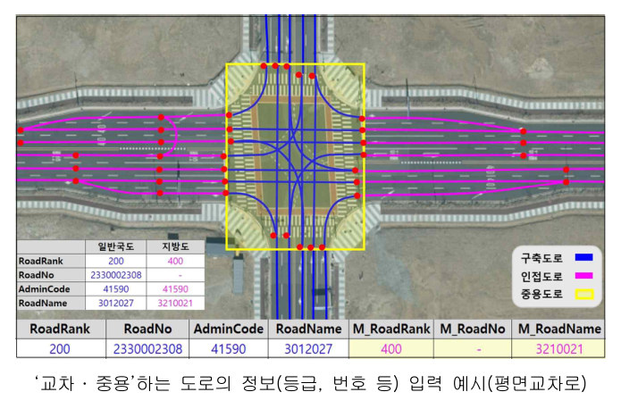

‘교차 ․ 중용’하는 도로의 정보(등급, 번호 등) 입력 예시(평면교차로)

##### ⑥ RoadType (도로 유형)

- 도로구간 유형을 의미한다.

- 제약조건은 ‘NOT NULL’이다.

- 유형은 ‘HDM_RoadType(도로 유형)’ 코드 리스트에서 정의하고 있는 코드를 입력한다.

#### [표 9.19] ‘HDM_RoadType(도로 유형)’ 코드 리스트

|코드값|도로 유형|설명|
|---|---|---|
|100|일반도로|아래 유형이 아닌 일반도로|
|200|생활(이면)도로|중앙선 없는 양방향 통행 및 보행자와 차량이 공존하는 도로1)|
|300|구간|교량, 터널, 지하차도, 고가차도, 톨게이트, 보호구역(어린이, 노인,<br>마을주민 등) 구간|
|400|부속구역|부속구역(졸음쉼터, 휴게소, 과속검문소) 구간|

#### 1) ‘「도로의 구조 시설 기준에 관한 규칙」해설(국토교통부, 2020)’ 참고

##### ⑦ MaxSpeed (최고 제한속도)

- 도로구간의 최고 제한속도를 의미한다.

- 제약조건은 ‘NOT NULL’이다.

- 단위는 km/h이다.

- ‘최고 제한속도’ 및 ‘해제’를 의미하는 ‘교통안전표지(TRAFFICSIGN)’를 기준으로 입력한다.

- ※ ‘해제’를 의미하는 교통안전표지(TRAFFICSIGN) 위치는 이후 적용되는 최고 제한속도 변화의 시점을 의미한다.

- ‘가변형 속도제한 표지(VSL)’를 통해 변화(상향 또는 하향)되는 제한속도는 고려하지 않는다.

- 도로 공사 등으로 임시(또는 일시)적으로 제한하는 제한속도는 고려하지 않는다.

- 교통안전표지가 없어 최고 제한속도를 파악할 수 없는 경우에는 국토교통부「지능형교통체계 표준 노드 ․ 링크 구축 및 관리지침(국토교통부 고시 제2023-23호)」에 따라 ‘ITS 국가교통정보 센터’에서 구축 중인 ‘표준노드링크’의 ‘최고제한속도(MAX_SPD)’를 활용한다.

- 도로 유형(RoadType) 중 ‘생활(이면)도로(코드값 200)’의 경우, 최고제한속도는 ‘20km/h’로 입력한다.

- ⑧ Direction (도로 방향)

- 진행방향 도로의 방향(기점 ․ 종점 방향, 양방향)을 의미한다.

- 진행방향 도로의 방향(기점 ․ 종점 방향, 양방향)을 입력한다.

- 행정안전부 ‘도로명주소’의 도로명코드를 이용하여 도로의 방향을 입력한다.

- ※ ‘생활(이면)도로’ 제외

- ※ ‘도로명주소’ 누리집 → ‘주소활용서비스’ → ‘도로명 정보 조회’

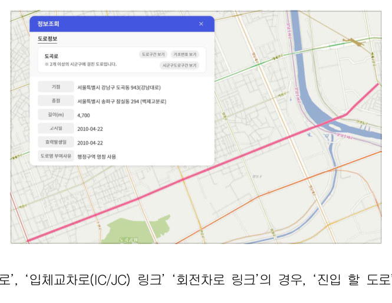

- ‘평면교차로’, ‘입체교차로(IC/JC) 링크’ ‘회전차로 링크’의 경우, ‘진입 할 도로’의 도로 방향을 입력한다.

- ※ 점유지(공동주택, 상업시설, 공공시설, 공공기관 등)로 부터의 진출로는 입력하지 않는다.

- 도로 유형(RoadType) 중 ‘생활(이면)도로(코드값 200)’의 경우, ‘양방향(코드값 3)’을 입력한다.

- 유형은 ‘HDM_Direction(도로 방향)’ 코드 리스트에서 정의하고 있는 코드를 입력한다.

#### [표 9.20] ‘HDM_Direction(도로 방향)’ 코드 리스트

|코드값|도로 방향|설명|
|---|---|---|
|1|종점방향|종점방향 도로|
|2|기점방향|기점방향 도로|
|3|양방향|중앙선 없는 양방향 통행 및 보행자와 챠량이 공존하는 도로|

##### ⑨ LinkType (차로 유형)

- 도로구간의 차로 유형을 의미한다.

- 제약조건은 ‘NOT NULL’이다.

- 유형은 ‘HDM_LinkType(차로 유형)’ 코드 리스트에서 정의하고 있는 코드를 입력한다.

- ‘차로 유형(LinkType)별 도화 방법(기준)’을 참고하여 입력한다.

#### [표 9.21] ‘HDM_LinkType(차로 유형) 코드 리스트

|코드값|차로 유형|차로 유형|설명|
|---|---|---|---|
|100|교차로|평면교차로 링크|평면교차로 주행경로링크|
|101||입체교차로 링크|입체교차로 주행경로링크|
|102||회전교차로 링크|회전교차로 주행경로링크|
|103||회전차로 링크|회전이 발생하는 주행경로링크<br>(일방 진입․진출, 교통섬 내 주행)|
|104||변속차로 링크|가속과 감속이 필요한 변속차로의 주행경로링크<br>(좌점/우점 혼선 내의 주행경로링크)|
|200|전용차로|버스전용차로 링크|버스전용차로에 대한 주행경로링크|
|201||가변차로 링크|가변차로에 대한 주행경로링크|
|300|일반차로|일반차로 링크|위의 유형이 아닌 일반주행에 해당되는 주행경로링크|

##### ⑩ Turn (회전 방향)

- 대상 링크의 회전 방향을 의미한다.

- 차로 유형(LinkType) 중, ‘평면교차로 링크(코드값 100)’, ‘회전차로 링크(코드값 103)’의 회전 방향 유형(좌회전/우회전)을 입력한다.

- ※ 회전교차로 링크(코드값 102)는 제외한다.

- ‘일반차로 링크’의 회전 방향이 ‘유턴’인 경우, 회전 방향 유형(유턴)을 입력한다.

- 유형은 ‘HDM_Turn(회전 방향)’ 코드 리스트에서 정의하고 있는 코드를 입력한다.

#### [표 9.22] ‘HDM_Turn(회전 방향)’ 코드 리스트

|코드값|회전 방향|설명|
|---|---|---|
|1|좌회전|‘평면교차로 링크’, ‘회전차로 링크’의 회전 방향이 좌회전|
|2|우회전|‘평면교차로 링크’, ‘회전차로 링크’의 회전 방향이 우회전|
|3|유턴|‘일반차로 링크’의 회전방향이 ‘유턴’|

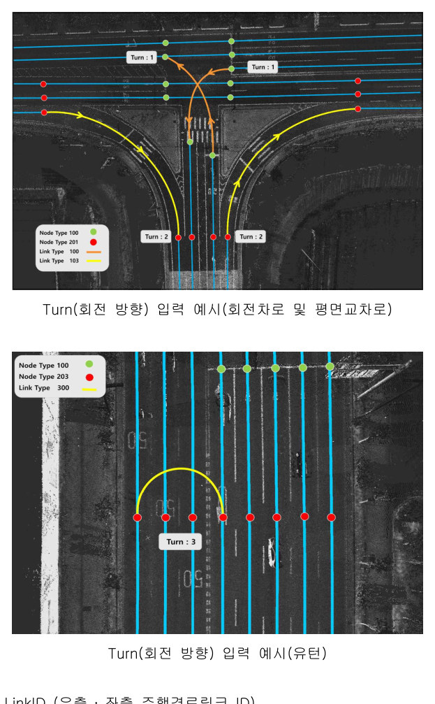

Turn(회전 방향) 입력 예시(회전차로 및 평면교차로)

Turn(회전 방향) 입력 예시(유턴)

- ⑪ R_LinkID / L_LinkID (우측 ․ 좌측 주행경로링크 ID)

- 진행방향 차로에서 연계가 가능한 우측/좌측 주행경로링크(LINK)를 의미한다.

- 진행방향 차로에서 연계가 가능한 우측/좌측 주행경로링크의 ID를 입력한다.

- 주행경로링크의 ‘우측’에 있는 주행경로링크(LINK)의 ID는 ‘R_LinkID’에 입력한다.

- 주행경로링크의 ‘좌측’에 있는 주행경로링크(LINK)의 ID는 ‘L_LinkID’에 입력한다.

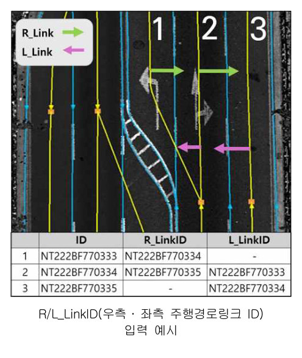

R/L_LinkID(우측 ․ 좌측 주행경로링크 ID) 입력 예시

- ⑫ FromNodeID / To_NodeID (시점 ․ 종점 주행경로노드 ID)

- 주행경로링크와 결합된 주행경로노드(NODE)의 ID를 의미한다.

- 제약조건은 ‘NOT NULL’이다.

- ‘진행방향’을 따라 도화된 주행경로링크(LINK)와 결합된 ‘주행경로노드(NODE)’의 ID를 입력한다. - ‘시점’에서 결합된 주행경로노드(NODE)의 ID는 ‘FromNodeID’에 입력한다.

- ‘종점’에서 결합된 주행경로노드(NODE)의 ID는 ‘ToNodeID’에 입력한다.

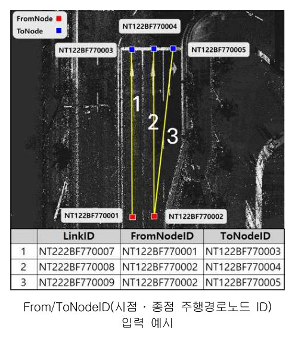

From/ToNodeID(시점 ․ 종점 주행경로노드 ID) 입력 예시

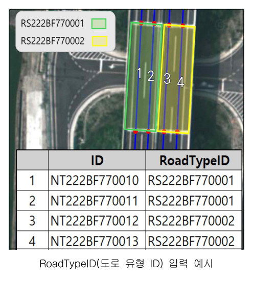

- ⑬ RoadTypeID (도로 유형 ID)

- 주행경로링크가 포함된 구간/부속구역을 의미한다.

- 주행경로링크가 포함된 ‘구간’ 또는 ‘부속구역’의 ID를 입력한다.

RoadTypeID(도로 유형 ID) 입력 예시

### 9.4.3. RS1_ROADBORDER (차도경계)

|분류|RoadStructureComponent (RS)<br>(차도 구조 구성요소)|명칭|ROADBORDER<br>(차도경계)|
|---|---|---|---|
|정의|차도 경계|기하|PolylineZ (선형)|

#### 1) 정의

- ① 차가 주행을 할 수 있는 도로(차도)의 경계를 의미한다.

- ② 차도와 인도 사이의 경계 또는 차도 이탈 방지 등을 위해 설치된 ‘연석’ 또는 ‘도로 포장면 끝(연석이 없는 도로)’을 대상으로 한다.

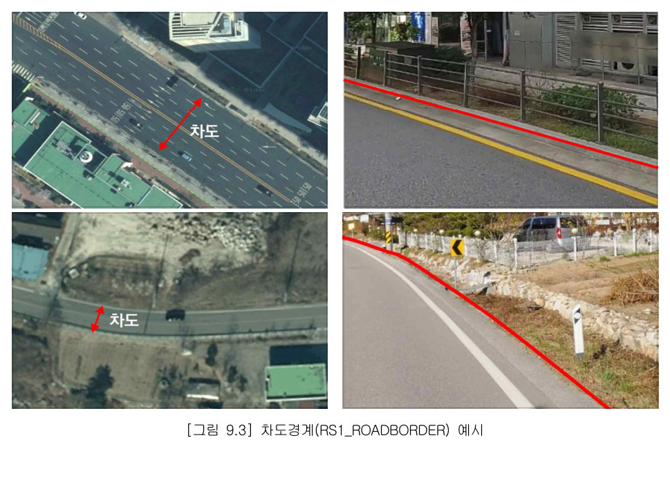

- [그림 9.3] 차도경계(RS1_ROADBORDER) 예시

#### 2) 구조

##### 폴더구조

- 세부도화(도형정보) 데이터의 저장형식은 다음과 같다.

#### [표 9.23] RS1_ROADBORDER(차도경계) 데이터의 저장형식

```text
             파일 경로                                                  파일 형식

구축구간             정밀도로지도                                  파일명                확장자      의무
                                                                                          비고
(Section)      (HDM_RoadMap)                           (Filename)           (Ext.)   조건

<노선명>


            HDMap_UTM52N_타원체고          RS1_ROADBORDER
SEC<ID>_                                                                                  단일
            HDMap_UTMK_정표고             RS1_ROADBORDER                       SHP세트    필수
<구간명>                                                                                     파일
            HDMap_UTMK_타원체고            RS1_ROADBORDER


            <노선명>\SEC<ID>_<구간명>\HDMap_UTM52N_타원체고\RS1_ROADBORDER.shp/shx/dbf/prj/cpg

            <노선명>\SEC<ID>_<구간명>\HDMap_UTMK_정표고\RS1_ROADBORDER.shp/shx/dbf/prj/cpg

            <노선명>\SEC<ID>_<구간명>\HDMap_UTMK_타원체고\RS1_ROADBORDER.shp/shx/dbf/prj/cpg
 적용
            ◦ <정밀도로지도 폴더>
 규칙
             - HDMap_UTM52N_타원체고: UTM 평면직각좌표계, 타원체고
             - HDMap_UTMK_정표고: UTM-K 단일 평면직각좌표계, 정표고
             - HDMap_UTMK_타원체고: UTM-K 단일 평면직각좌표계, 타원체고

            ◦ <확장자명>: SHP세트(*.shp, *.shx, *.dbf, *.prj, *.cpg)
```

##### 자료구조

- ESRI Shape(SHP) 포맷으로 제작한다.

- 도형유형(Shape Type)은 ‘PolylineZ(선형)’로 한다.

   - ※ 도화SW에 따라 ‘PolylineZ(+M)’도 혼용하여 사용할 수 있다.

- 속성형식은 다음과 같다.

#### [표 9.24] RS1_ROADBORDER(차도경계) 속성형식

|RS1_ROADBORDER|RS1_ROADBORDER|RS1_ROADBORDER|RS1_ROADBORDER|RS1_ROADBORDER|
|---|---|---|---|---|
||칼럼명|데이터 타입(길이)|제약조건|코드리스트|
|1|ID|VARCHAR2(13)|UNIQUE/NOT NULL|-|
|2|Kerb|VARCHAR2(1)|NOT NULL|-|
|3|TFCIsland|VARCHAR2(1)|NOT NULL|-|
|4|R_LinkID|VARCHAR2(13)|-|-|
|5|L_LinkID|VARCHAR2(13)|-|-|
|6|PathwayID|VARCHAR2(13)|-|-|
|7|SurveyDate|VARCHAR2(8)|NOT NULL|-|
|8|Version|VARCHAR2(4)|NOT NULL|-|
|9|Remark|VARCHAR2(30)|-|-|
|10|HistType|VARCHAR2(3)|-|HDM_HistType|

#### 3) 세부도화

##### 가) 도화방법(기준)

- ① 차도 중앙 또는 가장자리에 ‘이탈 방지’ 및 ‘경계 구분(차도/보도 또는 편도 차로 분리 등)’을 위하여 설치된 콘크리트 연석의 ‘상단’을 ‘선형(PolylineZ)’으로 도화한다.

   - ※ 차도 중앙에 있는 차도경계란, ‘화단형 중앙분리대’, ‘교통섬’이나, ‘터널’, ‘지하차도’ 및 ‘고가차도’ 등에서 편도 차로 분리 등을 위한 경계를 의미한다.

연석

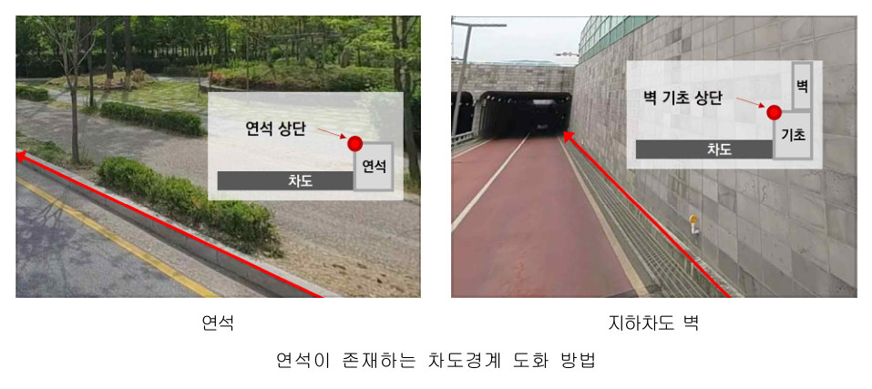

지하차도 벽

연석이 존재하는 차도경계 도화 방법

- 연석의 ‘최외곽 상단 모서리’에 도화한다. 다만, 모서리가 곡선인 경우, 곡선부의 중심에 도화 한다.

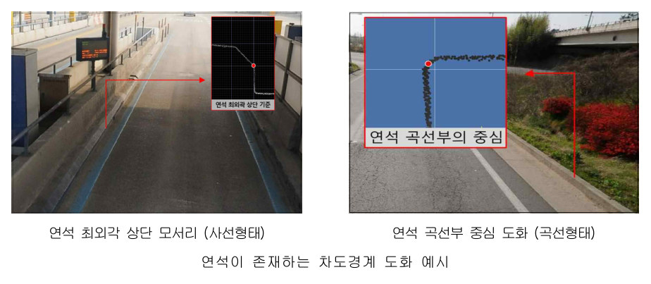

연석 최외각 상단 모서리 (사선형태) 연석 곡선부 중심 도화 (곡선형태) 연석이 존재하는 차도경계 도화 예시

- 횡단보도 등에서 단차가 발생하는 경우, 단차가 표현되도록 도화한다.

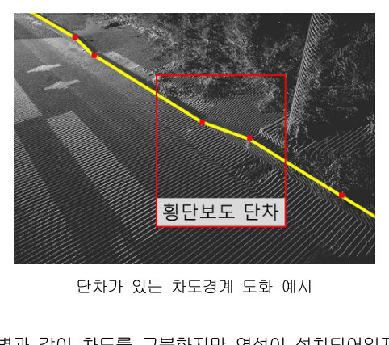

단차가 있는 차도경계 도화 예시

- 터널 및 지하차도의 벽과 같이 차도를 구분하지만 연석이 설치되어있지 않은 경우, 벽의 기초 시설과 지면부의 인접부를 기준으로 도화한다.

- 차도경계 도화는 연속성을 유지하며 구축한다. ‘연석임’에서 ‘연석아님’으로 전환되는 구간은 연속성을 고려하여 도화하며, 기준은 연석상단이 시작하는 지면부터 연석상단이 끝나는 지면과 만나는 부분까지 도화한다.

- ② 차도 가장자리에 연석 등이 없어 경계가 명확하지 않은 경우, 도로포장이 끝나는 위치를 기준으로 ‘지면’을 ‘선형(PolylineZ)’으로 도화한다.

- 연석 없이 차량방호안전시설(BARRIER)만 설치되어있는 경우, 차량방호안전시설(BARRIER)과

지면의 인접부를 기준으로 도화한다. 포장끝선 옆 배수구 및 도랑에 존재하는 차량방호시설은

도화하지 않는다.

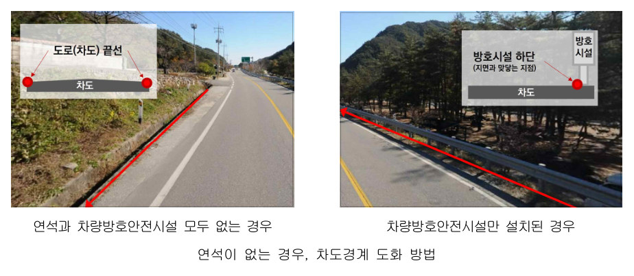

연석과 차량방호안전시설 모두 없는 경우 차량방호안전시설만 설치된 경우

연석이 없는 경우, 차도경계 도화 방법

- ③ 공공 ‧ 사유지로의 출입로(진입/진출)까지 차도경계(또는 차선)가 명확한 경우, 차도경계(또는 차선) 종점까지 도화한다.

   - ※ 차선(LANELINE)의 ‘차선 역할 유형(LaneLineKine)’ 중 ‘길가장자리구역선(코드값 505)’ 한정

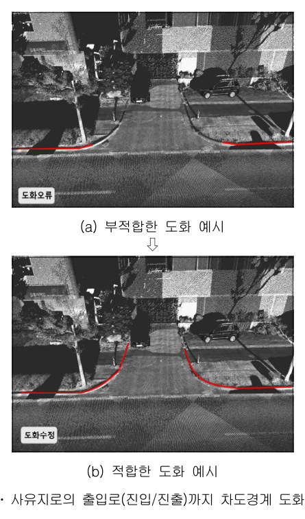

공공 ‧ 사유지로의 출입로(진입/진출)까지 차도경계 도화 예시

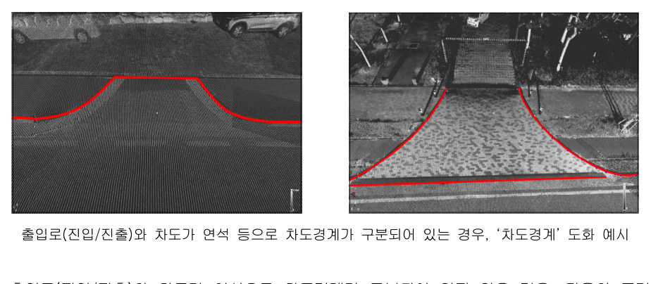

- 출입로(진입/진출)와 차도가 연석 등으로 차도경계가 구분되어 있는 경우, ‘본선 차도경계’를 따라 도화한다.

   - ‘연석 여부(Kerb)’는 ‘연석(값 1)’을 입력한다.

출입로(진입/진출)와 차도가 연석 등으로 차도경계가 구분되어 있는 경우, ‘차도경계’ 도화 예시

- 출입로(진입/진출)와 차도가 연석으로 차도경계가 구분되어 있지 않은 경우, 다음의 조건을 고려하여 도화한다.

   - ※ ‘연석 여부(Kerb)’는 ‘연석 아님(값 0)’을 입력한다.

   - 출입로까지 차선(길가장자리구역선)이 있는 경우, 차선의 종점을 침범하지 않도록 도화한다.

   - 출입로까지 차선(길가장자리구역선)이 없는 경우, ‘본선 차도경계’를 따라 도화한다.

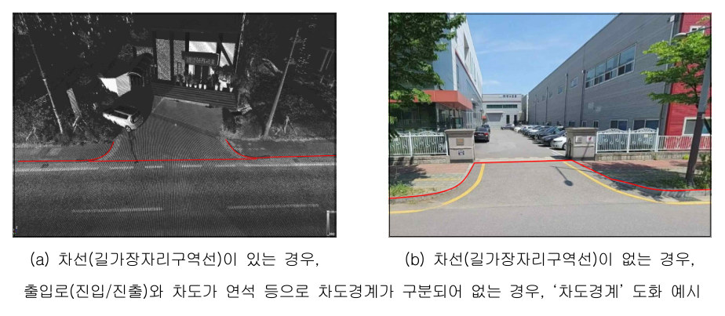

(a) 차선(길가장자리구역선)이 있는 경우, (b) 차선(길가장자리구역선)이 없는 경우, 출입로(진입/진출)와 차도가 연석 등으로 차도경계가 구분되어 없는 경우, ‘차도경계’ 도화 예시

- ④ ‘진행방향’을 따라 도화한다.

- ⑤ 주행경로링크(LINK)와 상호 연계될 수 있도록 도화한다.

- 주행경로링크(LINK)의 ‘시점/종점’과 동일한 위치에서 분절한다.

- ※ 동일 종류/형상을 가진 단일 차도경계(ROADBORDER)가 끊기지 않고 연속되더라도, 주행 경로노드(NODE) 도화 조건에 따라 도화된 주행경로링크(LINK)의 시점/종점과 동일한 선상에 위치할 수 있도록 분절한다.

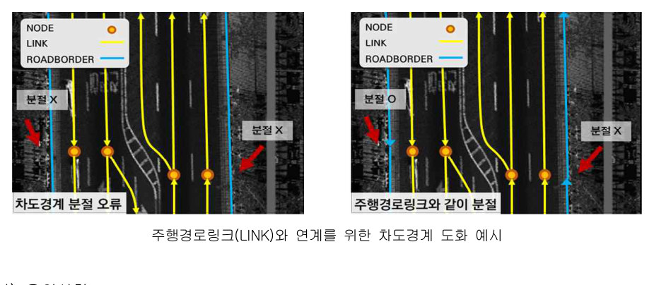

주행경로링크(LINK)와 연계를 위한 차도경계 도화 예시

##### 나) 유의사항

###### (1) 제작 유의

- 도화 방법(기준) 외 ‘제작 예외’ 없음

###### (2) 제작 예외

- 도화 방법(기준) 외 ‘제작 예외’ 없음

#### 4) 속성 구조화

##### 가) 테이블 명세

#### [표 9.25] RS1_ROADBORDER(차도경계) 테이블 명세

||RS1_ROADBORDER|RS1_ROADBORDER|RS1_ROADBORDER|RS1_ROADBORDER|RS1_ROADBORDER|RS1_ROADBORDER|RS1_ROADBORDER|
|---|---|---|---|---|---|---|---|
||칼럼명|(한글명)|KEY|데이터 타입<br>(길이)|제약조건|기본<br>단위|코드 리스트|
||ID|ID|‘구축 항목(레이어) 공통 테이블 명세’ 참고|||||
|①|Kerb|연석 여부|-|VARCHAR2(1)|NOT NULL|-|-|
|②|TFCIsland|교통섬 여부|-|VARCHAR2(1)|NOT NULL|-|-|
|③|R_LinkID|우측링크ID|FK|VARCHAR2(13)|-|-|-|
||L_LinkID|좌측링크ID|FK|VARCHAR2(13)|-|-|-|
|④|PathwayID|보도ID|FK|VARCHAR2(13)|-|-|-|
||SurveyDate|취득 날짜|‘구축 항목(레이어) 공통 테이블 명세’ 참고|||||
||Version|버전||||||
||Remark|비고||||||
||HistType|갱신이력 유형||||||

##### 나) 칼럼별 상세 유형

- ① Kerb (연석 여부)

- ‘차도경계(ROADBORDER)’의 ‘연석’ 여부를 의미한다.

- 제약조건은 ‘NOT NULL’이다.

- ‘연석 여부(Kerb)’ 입력값을 참고하여 값을 입력한다.

- 차도경계(ROADBORDER)가 ‘연석’ 또는 ‘벽 기초’가 아닌, ‘도로포장이 끝나는 위치’ 도화 (값 0)

- 차도경계(ROADBORDER)가 ‘연석’ 또는 ‘벽 기초’ 상단 도화 (값 1)

#### [표 9.26] Kerb(연석 여부) 입력값

|값|연석 여부|설명|
|---|---|---|
|0|연석아님|차도 경계가 연석(또는벽 기초)이 아님|
|1|연석|차도 경계가 연석(또는벽 기초)임|

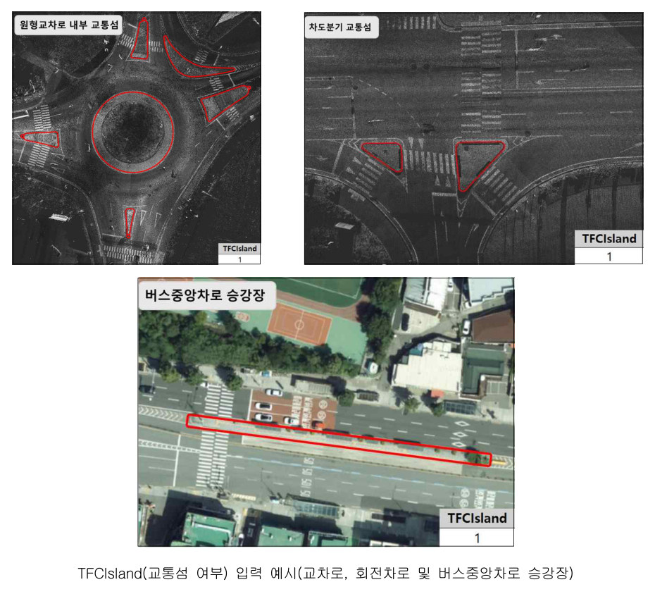

- ② TFCIsland (교통섬 여부)

- ‘차도경계(ROADBORDER)’가 ‘교통섬’인지 여부를 의미한다.

- ※ 교통섬이란, 교차로 또는 차도의 분기점 등에 설치하는 섬 모양의 시설을 의미한다. 차의 안전하고 원활한 교통 유도나 보행자 도로횡단의 안전을 확보하기 위하여 설치한다.

- 제약조건은 ‘NOT NULL’이다.

- ‘교통섬’은 다음의 조건을 만족하는 경우에만 ‘교통섬’이라고 한다.

- ‘(평면/원형) 교차로’, ‘회전차로(도로 분기)’에 설치된 교통섬

- ※ 보행자의 이용 여부와 무관

- 버스중앙차로 승강장

- 도류화 및 스태거드 횡단보도의 ‘도류화 시설’

- ※ 도류화 횡단보도란, 보행자와 차량의 흐름이 겹치는 지역에서 보행자 안전을 위하여 교통섬과 같은 도류화 시설을 포함하여 제작한 횡단보도를 의미한다.

- ※ 보행자의 이용이 불가능한 (화단형) 중앙분리대 제외

TFCIsland(교통섬 여부) 입력 예시(교차로, 회전차로 및 버스중앙차로 승강장)

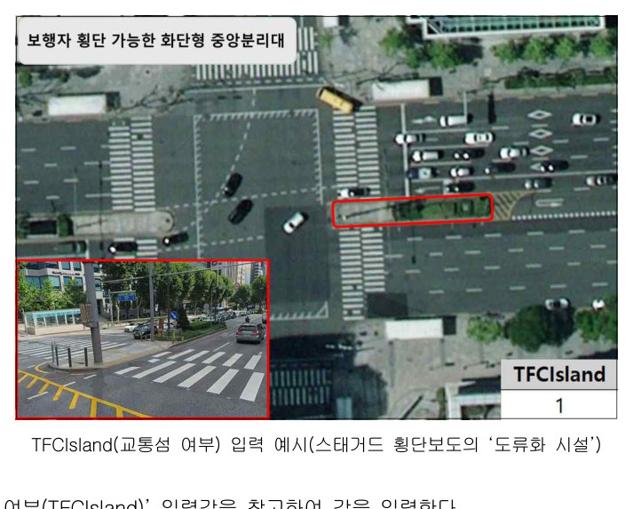

TFCIsland(교통섬 여부) 입력 예시(스태거드 횡단보도의 ‘도류화 시설’)

- ‘교통섬 여부(TFCIsland)’ 입력값을 참고하여 값을 입력한다.

- 차도경계(ROADBORDER)가 ‘교통섬’이 아님 (값 0)

- 차도경계(ROADBORDER)가 ‘교통섬’임 (값 1)

#### [표 9.27] TFCIsland(교통섬 여부) 입력값

|값|교통섬 여부|설명|
|---|---|---|
|0|교통섬아님|차도경계가 교통섬이 아님|
|1|교통섬|차도경계가 교통섬임|

- ③ R_LinkID / L_LinkID (우측 ․ 좌측 주행경로링크 ID)

- 진행방향 차로에서 ‘차도경계(ROADBORDER)’와 연계가 가능한 우측/좌측 주행경로링크 (LINK)를 의미한다.

- 제약조건과 무관하게 연계 가능한 우측/좌측 주행경로링크가 존재하는 경우, 반드시 연계 한다.

- 진행방향 차로에서 연계가 가능한 우측/좌측 주행경로링크의 ID를 입력한다.

- 차도경계(ROADBORDER)의 ‘우측’에 있는 주행경로링크(LINK)의 ID는 ‘R_LinkID’에 입력 한다.

- 차도경계(ROADBORDER)의 ‘좌측’에 있는 주행경로링크(LINK)의 ID는 ‘L_LinkID’에 입력 한다.

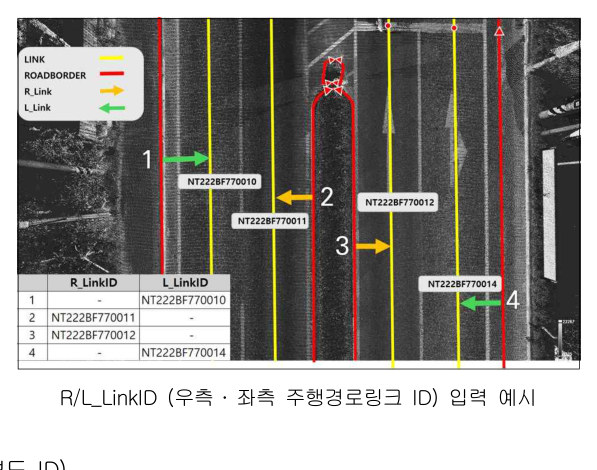

R/L_LinkID (우측 ․ 좌측 주행경로링크 ID) 입력 예시

- ④ PathwayID (보도 ID)

- 진행방향 차로에서 ‘차도경계(ROADBORDER)’와 연계가 가능한 ‘보도/자전거도로(Pathway)’ 중 ‘보도’를 의미한다.

- ※ ‘자전거도로’는 제외한다.

- 진행방향 차로에서 연계가 가능한 보도의 ID를 입력한다.

- 차도경계(ROADBORDER)와 보도(Pathway)가 인접하고 있는 경우, 인접하고 있는 보도의 ID를 입력한다.

- 차도경계(ROADBORDER)와 보도(Pathway) 사이에 자전거도로(Pathway)가 존재하는 경우, 자전거도로와 인접하고 있는 보도의 ID를 입력한다.

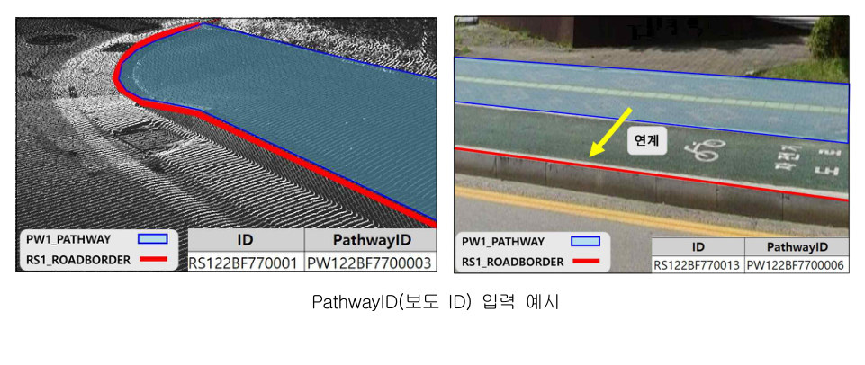

PathwayID(보도 ID) 입력 예시

### 9.4.4. RS2_ROADSTRUCTURE (구간)

|분류|RoadStructureComponent (RS)<br>(차도 구조 구성요소)|명칭|ROADSTRUCTURE<br>(구간)|
|---|---|---|---|
|정의|자동차 주행구간 중 교량, 터널,<br>지하․고가차도, 보호구역 및 톨게이트|기하|PolygonZ (면형)|

#### 1) 정의

- ① 구간 종류에 따라 ‘교량’, ‘터널’, ‘지하차도’ 및 ‘고가차도’와 같이 도로, 수계, 산림 등의 상부 /하부를 주행하는 도로구간을 의미한다.

- ※ 도로 하부의 ‘굴다리(일명 토끼굴)’는 ‘교량’ 또는 ‘터널’로 분류하지 않는다.

- ※ 도로 상부의 ‘생태터널(야생동물 이동 통로)’은 ‘터널’로 분류하지 않는다.

- ② 구간 특성에 따라 교통약자(어린이, 노인, 주민)의 안전한 통행과 편의를 목적으로 도로의 일정구간을 보호구역으로 지정하여 차량 속도 제한 및 일정 시설을 설치한 구간을 의미한다.

- ‘어린이 보호구역’, ‘노인 보호구역’, ‘(마을)주민 보호구역’ 및 ‘장애인 보호구역’ 등으로 구분 된다.

- 보호구역은 구역의 시점/종점에 보호구역임을 의미하는 ‘지시’ 유형의 ‘교통안전표지 (TRAFFICSIGN)’와 ‘암적색 노면 포장’으로 표시하고, 구역 내 ‘노면표시(ROADMARKING)’ 및 ‘안전시설(BARRIER)’ 등을 설치하여 보호구역임을 표시한다.

- ※ 도로교통법 제12조(2024.12.27 시행) 참고

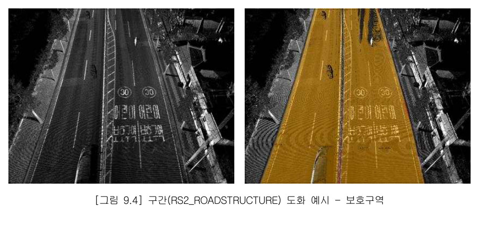

[그림 9.4] 구간(RS2_ROADSTRUCTURE) 도화 예시 - 보호구역

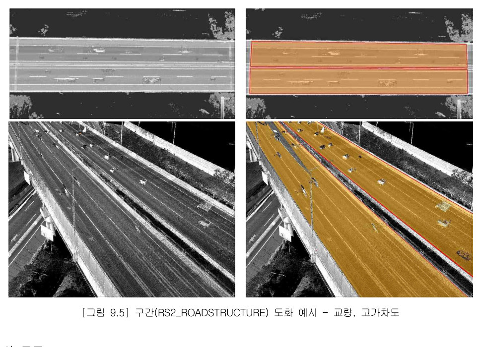

[그림 9.5] 구간(RS2_ROADSTRUCTURE) 도화 예시 - 교량, 고가차도

#### 2) 구조

##### 폴더구조

- 세부도화(도형정보) 데이터의 저장형식은 다음과 같다.

#### [표 9.28] RS2_ROADSTRUCTURE(구간) 데이터의 저장형식

```text
             파일 경로                                           파일 형식

구축구간            정밀도로지도                           파일명                   확장자       의무
                                                                                        비고
(Section)      (HDR_RoadMap)                    (Filename)              (Ext.)   조건

<노선명>


            HDMap_UTM52N_타원체고     RS3_ROADSTRUCTURE
SEC<ID>_                                                                                단일
            HDMap_UTMK_정표고        RS3_ROADSTRUCTURE                    SHP세트     조건
<구간명>                                                                                   파일
            HDMap_UTMK_타원체고       RS3_ROADSTRUCTURE


            <노선명>\SEC<ID>_<구간명>\HDMap_UTM52N_타원체고\RS3_ROADSTRUCTURE.shp/shx/dbf/prj/cpg

  적용        <노선명>\SEC<ID>_<구간명>\HDMap_UTMK_정표고\RS3_ROADSTRUCTURE.shp/shx/dbf/prj/cpg
  규칙
            <노선명>\SEC<ID>_<구간명>\HDMap_UTMK_타원체고\RS3_ROADSTRUCTURE.shp/shx/dbf/prj/cpg


       ◦ <정밀도로지도 폴더>
         - HDMap_UTM52N_타원체고: UTM 평면직각좌표계, 타원체고
         - HDMap_UTMK_정표고: UTM-K 단일 평면직각좌표계, 정표고
         - HDMap_UTMK_타원체고: UTM-K 단일 평면직각좌표계, 타원체고
       ◦ <확장자명>: SHP세트(*.shp, *.shx, *.dbf, *.prj, *.cpg)
```

##### 자료구조

- ESRI Shape(SHP) 포맷으로 제작한다.

- 도형유형(Shape Type)은 ‘PolygonZ(면형)’로 한다.

   - ※ 도화SW에 따라 ‘PolygonZ(+M)’도 혼용하여 사용할 수 있다.

- 속성형식은 다음과 같다.

#### [표 9.29] RS2_ROADSTRUCTURE(구간) 속성형식

|RS2_ROADSTRUCTURE|RS2_ROADSTRUCTURE|RS2_ROADSTRUCTURE|RS2_ROADSTRUCTURE|RS2_ROADSTRUCTURE|
|---|---|---|---|---|
||칼럼명|데이터 타입(길이)|제약조건|코드리스트|
|1|ID|VARCHAR2(13)|UNIQUE/NOT NULL|-|
|2|RSType|VARCHAR2(3)|NOT NULL|HDM_RoadStructureType|
|3|SurveyDate|VARCHAR2(8)|NOT NULL|-|
|4|Version|VARCHAR2(4)|NOT NULL|-|
|5|Remark|VARCHAR2(30)|-|-|
|6|HistType|VARCHAR2(3)|-|HDM_HistType|

#### 3) 세부도화

##### 가) 도화방법(기준)

- 구간 종류(교량, 터널, 지하차도 및 고가차도)

- ① ‘교량’, ‘터널’, ‘지하차도’ 및 ‘고가차도’ 구간의 시점에서부터 종점까지 ‘차도경계 (ROADBORDER)’의 ‘하단’을 따라 ‘면형(PolygonZ)’으로 도화한다.

- 구간(기점/종점 방향)의 중앙이 ‘차도경계(ROADBORDER)’로 구분(분리)되어 있지 않은 경우, 전체 구간(기점/종점)을 1개의 객체로 도화한다.

- 구간(기점/종점 방향)의 중앙이 ‘차도경계(ROADBORDER)’ 및 ‘차량안전방호시설(BARRIER)’로 구분(분리)되어 있는 경우, 기점/종점 방향 각각 도화한다.

- 진행방향이 동일(편도)한 차로가 터널 진입 등의 사유로 ‘차도경계(ROADBORDER)’로 구분 (분리)되어 있는 경우, 진행방향이 동일하여도 각각 도화한다.

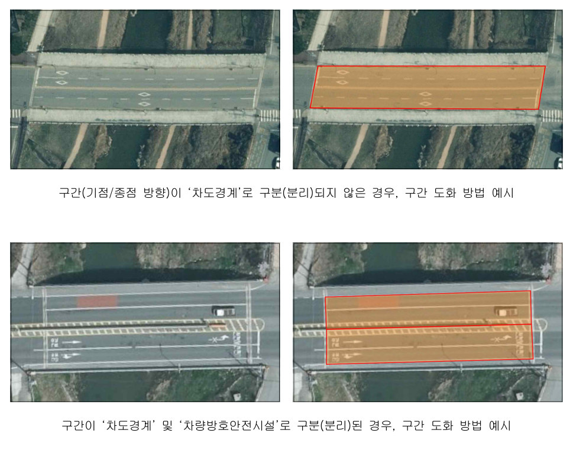

구간(기점/종점 방향)이 ‘차도경계’로 구분(분리)되지 않은 경우, 구간 도화 방법 예시

구간이 ‘차도경계’ 및 ‘차량방호안전시설’로 구분(분리)된 경우, 구간 도화 방법 예시

- ② 구간의 ‘시점/종점 위치’ 및 ‘차도경계(ROADBORDER)’를 고려하여 도화한다.

   - ㉠ 교량 구간

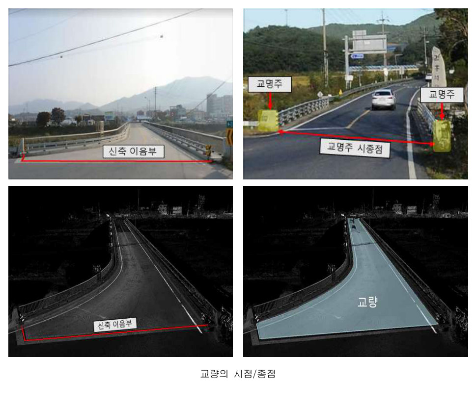

   - 교량의 시점/종점은 도로와 교량 간 ‘신축 이음부(핑거 조인트)’를 기준으로 한다.

   - 신축 이음부(핑거 조인트)가 도로포장 등으로 사라진 경우, ‘교명주’를 시점/종점으로 한다.

   - 구간의 가장자리 경계는 ‘차도경계(ROADBORDER)’의 하단을 따라 도화한다.

교량의 시점/종점

- ㉡ 지하차도, 고가차도 구간

- 지하 ‧ 고가차도 ‘교명주’를 시점/종점으로 한다.

- 교명주가 없거나, 진행방향 차로를 기준으로 교명주 위치보다 전방에서 지하/고가차도 진입 경사 차이가 발생하는 경우, 도로와 지하/고가차도 간 진입 경사 차이가 발생하는 지점을 시점/종점으로 한다.

- 구간의 가장자리 경계는 ‘차도경계(ROADBORDER)’의 하단을 따라 도화한다.

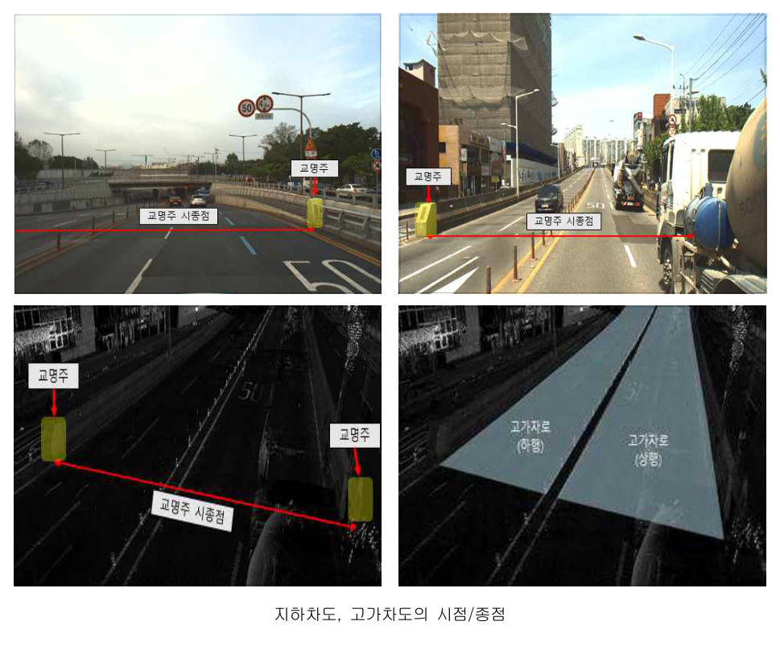

지하차도, 고가차도의 시점/종점

- ㉢ 터널 구간

- 터널의 벽면이 시작하는 지점을 시점/종점으로 한다.

- 구간의 가장자리 경계는 ‘차도경계(ROADBORDER)’의 하단을 따라 도화한다.

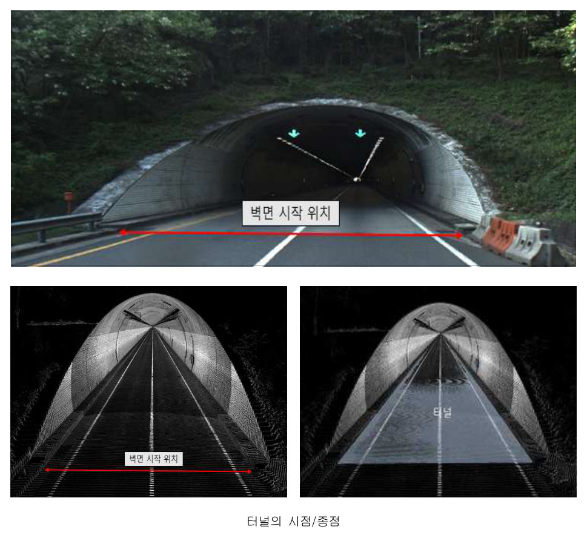

터널의 시점/종점

- ㉣ 톨게이트 구간

- 톨게이트 구간 진입/진출을 기준으로 진행방향에서 ‘첫 번째’ 및 ‘마지막’으로 도로 폭이 변화하는 지점을 시점/종점으로 한다.

- 구간의 가장자리 경계는 ‘차도경계(ROADBORDER)’의 하단을 따라 도화한다.

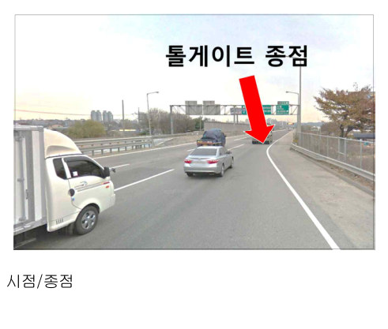

톨게이트 시점/종점

- 구간 특성(어린이/노인/(마을)주민/장애인 보호구역)

- ① 보호구역이 시점부터 종점까지 ‘차도경계(ROADBORDER)’의 하단을 따라 ‘면형(PolygonZ)’으로 도화한다.

- 구간(기점/종점 방향)의 중앙이 ‘차도경계(ROADBORDER)’로 구분(분리)되어 있지 않은 경우, 전체 구간(기점/종점)을 1개의 객체로 도화한다.

- 구간(기점/종점 방향)의 중앙이 ‘차도경계(ROADBORDER)’ 및 ‘차량안전방호시설(BARRIER)’로 구분(분리)되어 있는 경우, 기점/종점 방향 각각 도화한다.

- ② 보호구역 구간의 ‘시점/종점 위치’ 및 ‘도로경계(ROADBORDER)’를 고려하여 도화한다.

- 보호구역 시점/종점에 보호구역임을 의미하는 ‘지시’ 유형의 교통안전표지(TRAFFICSIGN)’를 시점/종점으로 한다.

- 보호구역의 시점/종점 지시 교통안전표지(TRAFFICSIGN)가 없는 경우, ‘암적색 노면포장’ 또는 ‘기점/종점 표시’를 시점/종점의 기준으로 한다.

- 구간의 가장자리 경계는 ‘차도경계(ROADBORDER)’의 하단을 따라 도화한다.

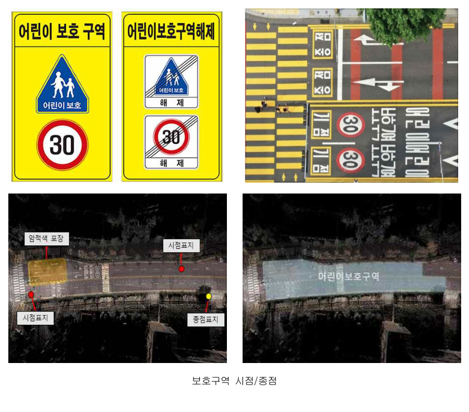

보호구역 시점/종점

##### 나) 유의사항

###### (1) 제작 유의

- 보호구역(어린이/노인/(마을)주민/장애인) 내 교량, 터널, 지하차도 및 고가차도가 존재하는 경우에는, 각각 도화한다.

- ※ ‘구간 종류’와 ‘구간 특성’의 상이함에 따른 동일 레이어 간 위치 중복을 허용한다.

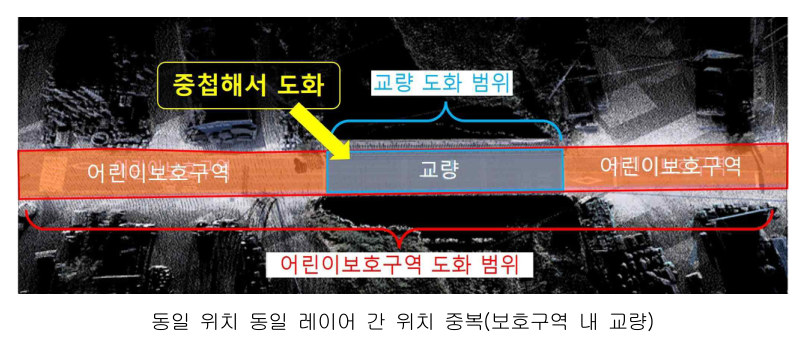

동일 위치 동일 레이어 간 위치 중복(보호구역 내 교량)

- 건설 시기가 다른 2개 이상의 교량을 서로 이어 붙여 진행방향이 동일(편도)한 차로(신축 이음부 존재)의 경우, 차량방호안전시설(BARRIER)로 분리되어 있지 않다면 1개 객체로 도화한다.

- ※ ‘차도 경계(ROADBORDER)’ 또는 ‘차량방호안전시설(BARRIER)’로 분리되어 있는 경우에는 각각 도화한다.

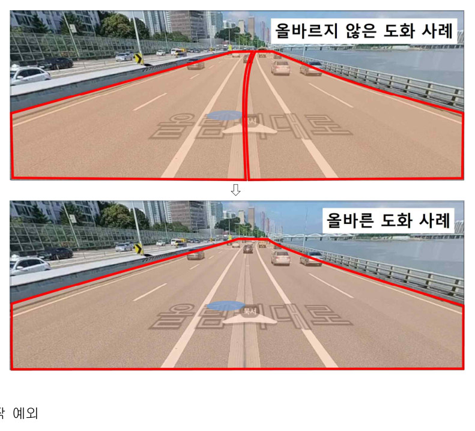

###### (2) 제작 예외

- ‘도화 방법(기준)’ 외 제작 예외 없음

#### 4) 속성 구조화

##### 가) 테이블 명세

#### [표 9.30] RS2_ROADSTRUCTURE(구간) 테이블 명세

|RS2_ROADSTRUCTURE|RS2_ROADSTRUCTURE|RS2_ROADSTRUCTURE|RS2_ROADSTRUCTURE|RS2_ROADSTRUCTURE|RS2_ROADSTRUCTURE|RS2_ROADSTRUCTURE|RS2_ROADSTRUCTURE|
|---|---|---|---|---|---|---|---|
||칼럼명|(한글명)|KEY|데이터 타입<br>(길이)|제약조건|기본<br>단위|코드 리스트|
||ID|ID|‘구축 항목(레이어) 공통 테이블 명세’ 참고|||||
|①|RSType|구간 유형|-|VARCHAR2(3)|NOT NULL|-|HDM_Road<br>StructureType|
||SurveyDate|취득 날짜|‘구축 항목(레이어) 공통 테이블 명세’ 참고|||||
||Version|버전||||||
||Remark|비고||||||
||HistType|갱신이력 유형||||||

##### 나) 칼럼별 상세 유형

- ① RSType (구간 유형)

- 도로구간 유형을 의미한다.

- 제약조건은 ‘NOT NULL’이다.

- 유형은 ‘HDM_RoadStructureType(구간 유형)’ 코드 리스트에서 정의하고 있는 코드를 입력 한다.

#### [표 9.31] ‘HDM_RoadStructureType(구간 유형)’ 코드 리스트

|코드값|구간 유형|설명|
|---|---|---|
|100|교량|교량 구간|
|101|고가차도|고가차도 구간|
|102|터널|터널 구간|
|103|지하차도|지하차도 구간|
|200|보호구역|보호구역(어린이, 노인, 마을주민 등) 구간|
|300|톨게이트|톨게이트 구간|

### 9.4.5. RS3_SUBSIDIARYSECTION (부속구역)

|분류|RoadStructureComponent (RS)<br>(차도 구조 구성요소)|명칭|SUBSIDIARYSECTION<br>(부속구역)|
|---|---|---|---|
|정의|자동차 주행구간과 분리된<br>휴게소, 졸음쉼터|기하|PolygonZ (면형)|

#### 1) 정의

- ① 도로 중 자동차의 주행구간(차도)과 분리된 휴게시설(휴게소, 졸음쉼터)을 의미한다.

- ② 정밀도로지도에서 구축하는 부속구역의 경우, 다음의 조건을 만족하는 경우에만 부속구역으로 명칭하고, 구축한다.

- ‘휴게시설’은 국가, 지방자치단체, 도로운영사(한국도로공사, 민자도로 운영사 등)에서 설치 및 관리하는 휴게소 및 졸음쉼터만 휴게시설로 명칭하고, 구축한다.

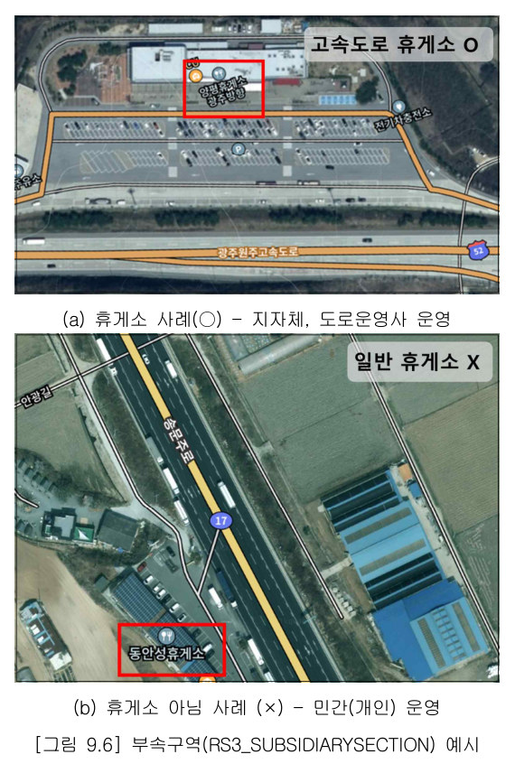

- (a) 휴게소 사례(○) - 지자체, 도로운영사 운영

   - (b) 휴게소 아님 사례 (×) - 민간(개인) 운영

- [그림 9.6] 부속구역(RS3_SUBSIDIARYSECTION) 예시

#### 2) 구조

##### 폴더구조

- 세부도화(도형정보) 데이터의 저장형식은 다음과 같다.

#### [표 9.32] RS3_SUBSIDIARYSECTION(부속구역) 데이터의 저장형식

```text
             파일 경로                                                  파일 형식

구축구간             정밀도로지도                                  파일명                 확장자           의무
                                                                                                비고
(Section)      (HDM_RoadMap)                           (Filename)             (Ext.)       조건

<노선명>


            HDMap_UTM52N_타원체고          RS3_SUBSIDIARYSECTION
SEC<ID>_                                                                                        단일
            HDMap_UTMK_정표고             RS3_SUBSIDIARYSECTION                 SHP세트         조건
<구간명>                                                                                           파일
            HDMap_UTMK_타원체고            RS3_SUBSIDIARYSECTION


            <노선명>\SEC<ID>_<구간명>\HDMap_UTM52N_타원체고\RS3_SUBSIDIARYSECTION.shp/shx/dbf/prj/cpg

            <노선명>\SEC<ID>_<구간명>\HDMap_UTMK_정표고\RS3_SUBSIDIARYSECTION.shp/shx/dbf/prj/cpg

            <노선명>\SEC<ID>_<구간명>\HDMap_UTMK_타원체고\RS3_SUBSIDIARYSECTION.shp/shx/dbf/prj/cpg
  적용
            ◦ <정밀도로지도 폴더>
  규칙
             - HDMap_UTM52N_타원체고: UTM 평면직각좌표계, 타원체고
             - HDMap_UTMK_정표고: UTM-K 단일 평면직각좌표계, 정표고
             - HDMap_UTMK_타원체고: UTM-K 단일 평면직각좌표계, 타원체고

            ◦ <확장자명>: SHP세트(*.shp, *.shx, *.dbf, *.prj, *.cpg)
```

##### 자료구조

- ESRI Shape(SHP) 포맷으로 제작한다.

- 도형유형(Shape Type)은 ‘PolygonZ(면형)’로 한다.

   - ※ 도화SW에 따라 ‘PolygonZ(+M)’도 혼용하여 사용할 수 있다.

- 속성형식은 다음과 같다.

#### [표 9.33] RS3_SUBSIDIARYSECTION(부속구역) 속성형식

|RS3_SUBSIDIARYSECTION|RS3_SUBSIDIARYSECTION|RS3_SUBSIDIARYSECTION|RS3_SUBSIDIARYSECTION|RS3_SUBSIDIARYSECTION|
|---|---|---|---|---|
||칼럼명|데이터 타입(길이)|제약조건|코드리스트|
|1|ID|VARCHAR2(13)|UNIQUE/NOT NULL|-|
|2|SubsType|VARCHAR2(3)|NOT NULL|HDM_SubsidiarySectionType|
||칼럼명|데이터 타입(길이)|제약조건|코드리스트|
|3|GasStation|VARCHAR2(1)|-|-|
|4|LPGStation|VARCHAR2(1)|-|-|
|5|EVCharger|VARCHAR2(1)|-|-|
|6|SurveyDate|VARCHAR2(8)|NOT NULL|-|
|7|Version|VARCHAR2(4)|NOT NULL|-|
|8|Remark|VARCHAR2(30)|-|-|
|9|HistType|VARCHAR2(3)|-|HDM_HistType|

#### 3) 세부도화

##### 가) 도화방법(기준)

- 휴게시설(휴게소, 졸음쉼터)

- ① 휴게소, 졸음쉼터 구역의 시점에서부터 종점까지 ‘차도경계(ROADBORDER)’의 ‘하단’을 따라 ‘면형(PolygonZ)’으로 도화한다.

- ② 구역의 ‘시점/종점 위치’ 및 ‘차도경계(ROADBORDER)’를 고려하여 도화한다.

   - 구역의 시점은 변속차로(휴게소/졸음쉼터 진입) 중 감속차로의 종점(본선 기준, 좌점 혼선이 끝나는 지점)을 기준으로 한다.

   - 구역의 종점은 변속차로(휴게소/졸음쉼터 진출) 중 가속차로의 시점(본선 기준, 우점 혼선이 시작되는 지점)을 기준으로 한다.

   - 구역의 가장자리 경계는 ‘차도경계(ROADBORDER)’ 하단을 따라 도화한다.

   - ※ 변속차로 등에서 참조할 수 있는 ‘차도경계(ROADBORDER)’가 없는 경우, 의 ‘차선 역할 유형(LaneLineKind)’이 ‘길가장자리구역선(코드값 505)’인 차선(LANELINE)의 중앙을 따라 도화한다.

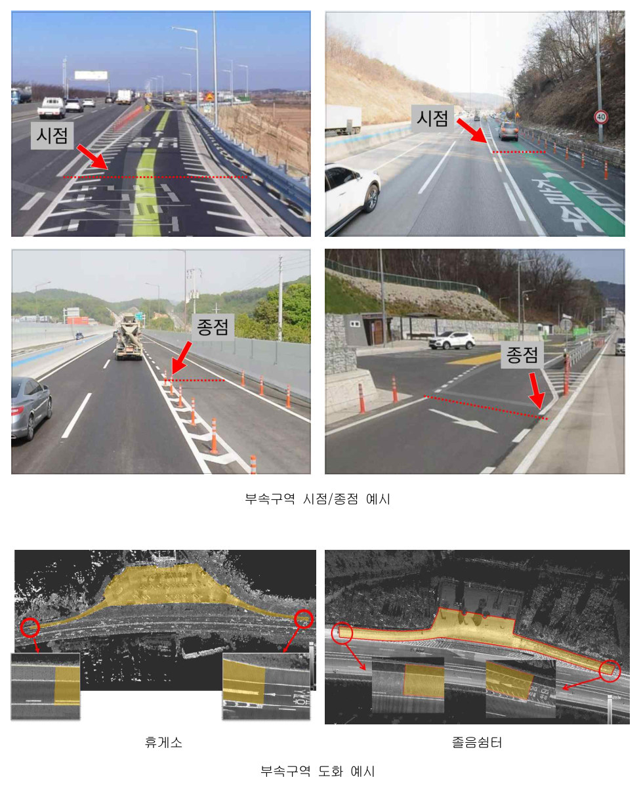

부속구역 시점/종점 예시

휴게소

졸음쉼터

부속구역 도화 예시

나) 유의사항

###### (1) 제작 유의

- 도화방법(기준) 외 ‘제작 유의’ 없음

###### (2) 제작 예외

- 도화방법(기준) 외 ‘제작 예외’ 없음

#### 4) 속성 구조화

##### 가) 테이블 명세

#### [표 9.34] RS3_SUBSIDIARYSECTION(부속구역) 테이블 명세

||RS3_SUBSIDIARYSECTION|RS3_SUBSIDIARYSECTION|RS3_SUBSIDIARYSECTION|RS3_SUBSIDIARYSECTION|RS3_SUBSIDIARYSECTION|RS3_SUBSIDIARYSECTION|RS3_SUBSIDIARYSECTION|
|---|---|---|---|---|---|---|---|
||칼럼명|(한글명)|KEY|데이터 타입<br>(길이)|제약조건|기본<br>단위|코드 리스트|
||ID|ID|‘구축 항목(레이어) 공통 테이블 명세’ 참고|||||
|①|SubsType|부속구역 유형|-|VARCHAR2(3)|NOT NULL|-|HDM_Subsidiary<br>SectionType|
|②|GasStation|주유소 유무|-|VARCHAR2(1)|-|-|-|
||LPGStation|LPG충전소 유무|-|VARCHAR2(1)|-|-|-|
||EVCharger|전기차충전소 유무|-|VARCHAR2(1)|-|-|-|
||SurveyDate|취득 날짜|‘구축 항목(레이어) 공통 테이블 명세’ 참고|||||
||Version|버전||||||
||Remark|비고||||||
||HistType|갱신이력 유형||||||

##### 나) 칼럼별 상세 유형

- ① SubsType (부속구역 유형)

- 부속구역의 유형을 의미한다.

- 제약조건은 ‘NOT NULL’이다.

- 유형은 ‘HDM_SubsidiarySectionType(부속구역 유형)’ 코드 리스트에서 정의하고 있는 코드를 입력한다.

#### [표 9.35] ‘HDM_SubsidiarySectionType(부속구역 유형)’ 코드 리스트

|코드값|부속구역 유형|설명|
|---|---|---|
|100|휴게소|도로와 연결되어 있는 휴게소 구간|
|101|졸음쉼터|도로와 연결되어 있는 졸음쉼터 구간|
|999|기타|기타 위에서 언급되지 않은 부속구역|

- ② GasStation (주유소 유무) / LPGStation (LPG충전소 유무) / EVCharger (전기차충전소 유무)

- 부속구역 내 ‘주유소’, ‘LPG 충전소’ 및 ‘전기차 충전소’ 존재 여부를 의미한다.

- ‘존재 여부’ 입력값을 참고하여 값을 입력한다..

#### [표 9.36] GasStation / LGPSStation / EvCharger (존재 여부) 입력값

|값|존재 여부|설명|
|---|---|---|
|0|미존재|주유소, LPG충전소, 전기차 충전소 미존재|
|1|존재|주유소, LPG충전소, 전기차 충전소 존재|

### 9.4.6. PW1_PATHWAY (보도/자전거도로)

|분류|Pathway (PW)<br>(보도/자전거도로)|명칭|Pathway<br>(보도/자전거도로)|
|---|---|---|---|
|정의|보도/자전거도로|기하|PolygonZ (면형)|

#### 1) 정의

- ① ‘보도’ 및 ‘자전거도로’를 의미한다.

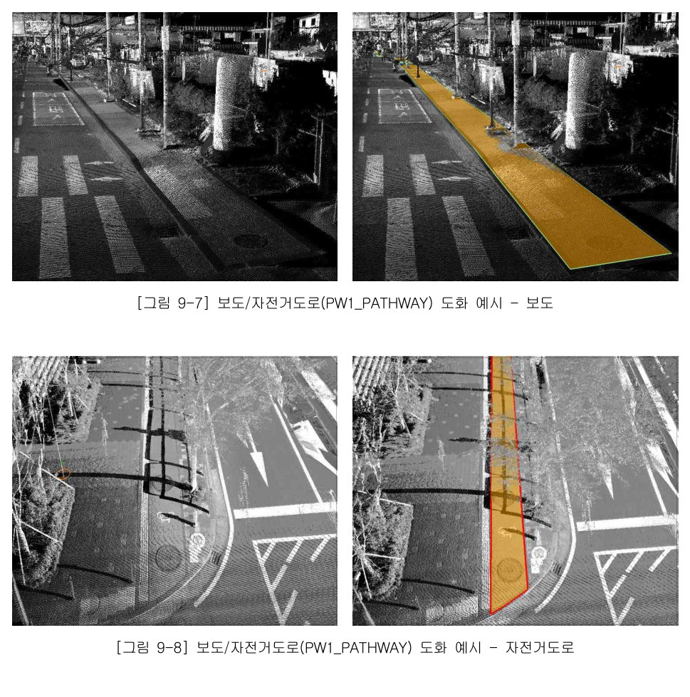

[그림 9-7] 보도/자전거도로(PW1_PATHWAY) 도화 예시 - 보도

[그림 9-8] 보도/자전거도로(PW1_PATHWAY) 도화 예시 - 자전거도로

- ② ‘보도’는 보행자의 원활한 보행을 위하여 구획된 구간으로, 연석(차도경계) 등으로 차도 구간, 사유지 등과 분리되고, 보도블럭 또는 아스콘 등으로 포장된 구간만 보도로 정의한다.

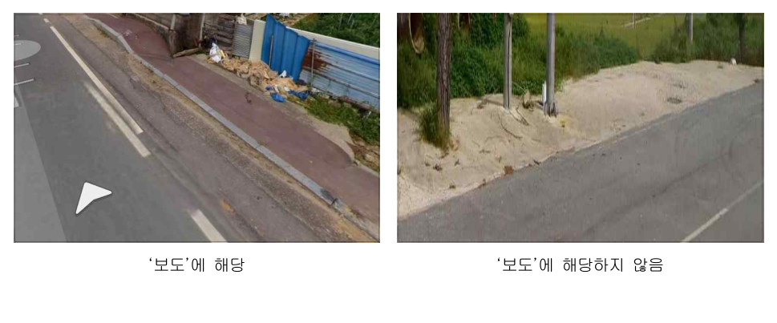

‘보도’에 해당 ‘보도’에 해당하지 않음

- ③ ‘자전거도로’는 자전거의 원활한 통행을 위하여 구획된 구간이다. 다음의 조건을 만족하는 경우 에만 자전거도로로 정의한다.

   - 차도에 설치된 경우, ⓐ‘길가장자리구역선 유형의 차선(LANELINE)’ 또는 ‘차량방호안전시설 (BARRIER)’ 등으로 차도와 분리되고, ⓑ‘지시 유형 교통안전표지(TRFFICSIGN)’ 또는 ‘노면표시 (ROADMARKING)’와 ⓒ‘차선(LANELINE)’ 내 ‘암적색 노면 포장’된 구간만을 대상으로 한다.

   - 보도에 설치된 경우, ⓐ보행 구간과 연석, 노면 포장, 재질 등으로 구분(분리)이 가능(식별) 하고, ⓑ‘지시 유형 교통안전표지(자전거전용도로(302), 자전거전용차로(318), 자전거 및 보행자 통행구분(317), 자전거나란히통행허용(333))’ 또는 ‘노면표시’가 있는 구간만을 대상으로 한다.

   - ※ 지시 유형 ‘교통안전표지(TRAFFICSIGN)’ 중 ‘자전거 및 보행자 겸용도로(303)’ 표지가 설치된 보도 구간의 자전거도로는 구축하지 않는다.

#### [표 9.37] ‘지시 유형 교통안전표지’ 중 자전거도로 예시

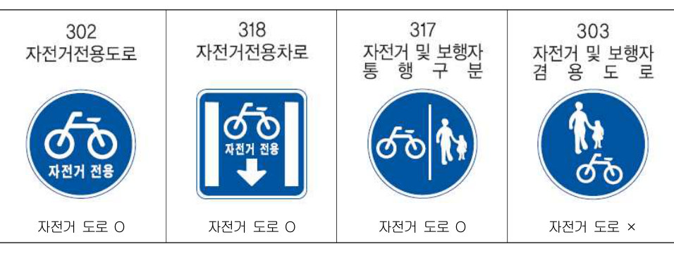

자전거 도로 O

자전거 도로 O

자전거 도로 O 자전거 도로 ×

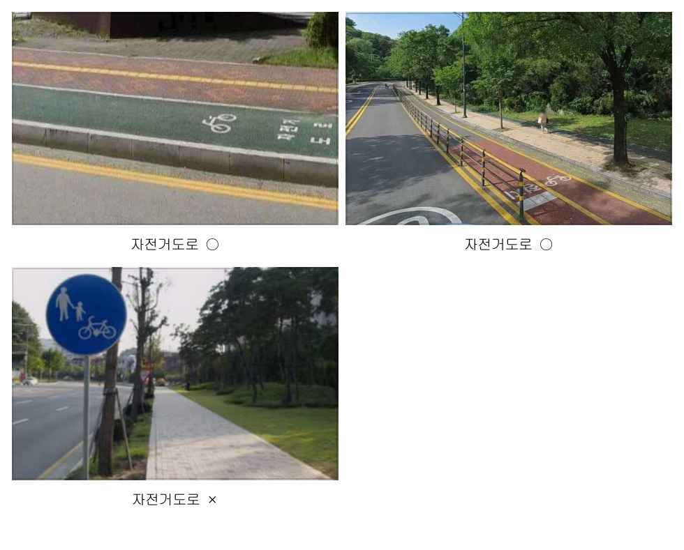

자전거도로 ○

자전거도로 ○

자전거도로 ×

#### 2) 구조

##### 폴더구조

- 세부도화(도형정보) 데이터의 저장형식은 다음과 같다.

#### [표 9.38] PW1_PATHWAY(보도/자전거도로) 데이터의 저장형식

```text
             파일 경로                                           파일 형식

구축구간             정밀도로지도                           파일명                  확장자        의무
                                                                                  조건
                                                                                       비고
(Section)      (HDM_RoadMap)                    (Filename)             (Ext.)

<노선명>

            HDMap_UTM52N_타원체고     PW1_PATHWAY
SEC<ID>_                                                                               단일
            HDMap_UTMK_정표고        PW1_PATHWAY                         SHP세트       조건
<구간명>                                                                                  파일
            HDMap_UTMK_타원체고       PW1_PATHWAY

            <노선명>\SEC<ID>_<구간명>\HDMap_UTM52N_타원체고\PW1_PATHWAY.shp/shx/dbf/prj/cpg

  적용        <노선명>\SEC<ID>_<구간명>\HDMap_UTMK_정표고\PW1_PATHWAY.shp/shx/dbf/prj/cpg
  규칙
            <노선명>\SEC<ID>_<구간명>\HDMap_UTMK_타원체고\PW1_PATHWAY.shp/shx/dbf/prj/cpg


        ◦ <정밀도로지도 폴더>
         - HDMap_UTM52N_타원체고: UTM 평면직각좌표계, 타원체고
         - HDMap_UTMK_정표고: UTM-K 단일 평면직각좌표계, 정표고
         - HDMap_UTMK_타원체고: UTM-K 단일 평면직각좌표계, 타원체고

        ◦ <확장자명>: SHP세트(*.shp, *.shx, *.dbf, *.prj, *.cpg)
```

##### 자료구조

- ESRI Shape(SHP) 포맷으로 제작한다.

- 도형유형(Shape Type)은 ‘PolygonZ(면형)’로 한다.

   - ※ 도화SW에 따라 ‘PolygonZ(+M)’도 혼용하여 사용할 수 있다.

- 속성형식은 다음과 같다.

#### [표 9.39] PW1_PATHWAY(보도/자전거도로) 속성형식

|PW1_PATHWAY|PW1_PATHWAY|PW1_PATHWAY|PW1_PATHWAY|PW1_PATHWAY|
|---|---|---|---|---|
||칼럼명|데이터 타입(길이)|제약조건|코드리스트|
|1|ID|VARCHAR2(13)|UNIQUE/NOT NULL|-|
|2|PathType|VARCHAR2(3)|NOT NULL|HDM_PathwayType|
|3|TFCIsland|VARCHAR2(1)|NOT NULL|-|
|4|SurveyDate|VARCHAR2(8)|NOT NULL|-|
|5|Version|VARCHAR2(4)|NOT NULL|-|
|6|Remark|VARCHAR2(30)|-|-|
|7|HistType|VARCHAR2(3)|-|HDM_HistType|

#### 3) 세부도화

##### 가) 도화방법(기준)

##### 보도

- ① 보도 구간의 시점에서부터 종점까지 ‘차도경계(ROADBORDER)’를 따라 ‘면형(PolygonZ)’으로 도화한다.

   - 가급적 차도경계(ROADBORDER)와 동일하게 도화한다.

   - ※ 횡단보도 등에서 발생하는 단차 역시 동일하게 표현되어야 한다.

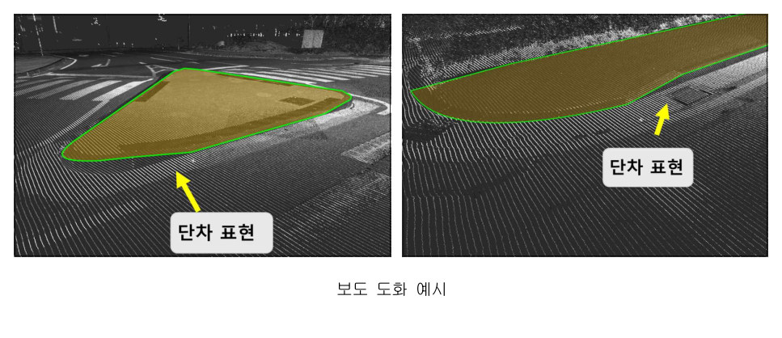

##### 보도 도화 예시

- ② 연석이 없거나, 장애물 등으로 경계의 식별이 불가능한 경우, 다음의 조건을 고려하여 도화한다. ㉼ 내측 경계: 자동차의 진행방향 차로 기준으로 ‘차도 방향’ 경계

- 외측 경계: 자동차의 진행방향 차로 기준으로 ‘차도 반대 방향’ 경계

   - 보도 구간 외측 경계에 연석이 없는 경우, 보도블럭 또는 아스콘 등 포장 경계를 따라 도화한다.

   - 보도와 건물의 경계가 없는 구간의 경우, 건물 경계를 따라 도화한다. - 건물이 연속된 경우, 가장 많이 돌출된 건물을 기준으로 도화한다.

   - 간판, 구조물, 가로수(조경수) 등 장애물로 짧은 구간에서 외측 경계의 식별이 불가능한 경우, 장애물 전방/후방의 식별이 가능한 경계와 이어서 도화한다.

   - 장애물 전방/후방 경계를 이용하여서도 도화가 불가능한 경우, 장애물을 따라 경계를 도화한다.

   - 임시시설물, 주차 차량 등으로 인하여 보도 전반에서 폐색이 발생하는 경우, 정사영상 또는 1:1,000 수치지도를 최대한 참고하여 도화한다.

- ③ 보도 내 자전거도로가 설치되어있는 경우, 각각 도화한다.

- ※ ‘보도’와 ‘자전거도로’의 유형이 상이하기 때문에 동일 레이어 간 위치 중복을 허용한다.

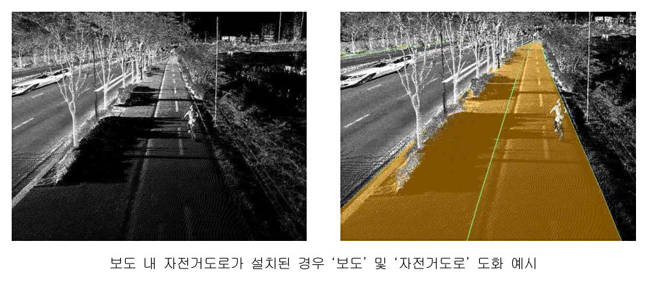

보도 내 자전거도로가 설치된 경우 ‘보도’ 및 ‘자전거도로’ 도화 예시

- ④ ‘버스중앙차로 승강장’, 도류화 및 스태거드 횡단보도의 ‘도류화 시설’은 ‘보도’로 제작한다.

   - ‘교통섬 여부(TFCIsland)’ 입력값은 ‘교통섬(값 1)’로 입력한다.

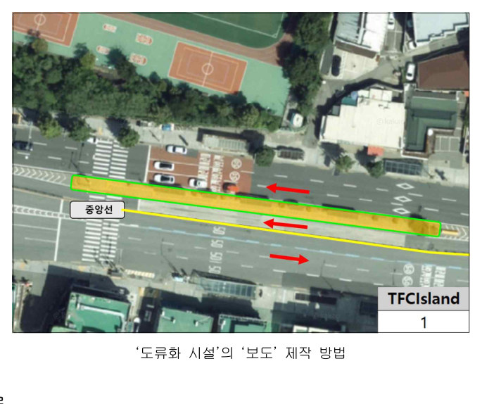

‘도류화 시설’의 ‘보도’ 제작 방법

##### 자전거도로

- ① 자전거도로 구간의 시점에서부터 ‘자전거도로 경계’를 따라 ‘면형(PolygonZ)’으로 도화한다. ◦자전거도로의 경계는 다음의 조건을 고려하여 도화한다.

   - ‘차선(LANELINE)’으로 경계가 표시된 경우, 페인트 라인 중앙을 기준으로 한다.

   - 차도에 포함된 자전거도로가 보도 구간과 ‘연석’으로 경계가 표시된 경우, 연석 하단을 기준 으로 한다.

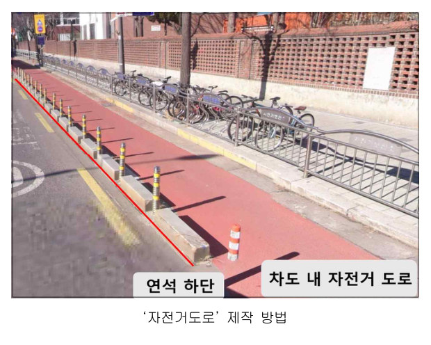

‘자전거도로’ 제작 방법

- ‘차선(LANELINE)’ 또는 ‘연석’이 없는 경우, 보도블럭 또는 아스콘 등 포장 경계를 기준으로 한다.

- 간판, 구조물, 가로수(조경수) 등 장애물로 짧은 구간에서 외측 경계의 식별이 불가능한 경우, 장애물 전방/후방의 식별이 가능한 경계와 이어서 도화한다.

- 자전거도로가 상행/하행으로 분리되어 있더라도, 상행/하행을 1개 객체로 도화한다.

- ② 보도 내 자전거도로가 설치되어있는 경우, 각각 도화한다.

- ※ ‘보도’와 ‘자전거도로’의 유형이 상이하기 때문에 동일 레이어 간 위치 중복을 허용한다.

##### 나) 유의사항

###### (1) 제작 유의

- 도화방법(기준) 외 ‘제작 유의’ 없음

###### (2) 제작 예외

- 도화방법(기준) 외 ‘제작 예외’ 없음

#### 4) 속성 구조화

##### 가) 테이블 명세

#### [표 9.40] PW1_PATHWAY(보도/자전거도로) 테이블 명세

|PW1_PATHWAY|PW1_PATHWAY|PW1_PATHWAY|PW1_PATHWAY|PW1_PATHWAY|PW1_PATHWAY|PW1_PATHWAY|PW1_PATHWAY|
|---|---|---|---|---|---|---|---|
||칼럼명|(한글명)|KEY|데이터 타입<br>(길이)|제약조건|기본<br>단위|코드 리스트|
||ID|ID|‘구축 항목(레이어) 공통 테이블 명세’ 참고|||||
|①|PathType|길유형|-|VARCHAR2(3)|NOT NULL|-|HDM_PathwayType|
|②|TFCIsland|교통섬 여부|-|VARCHAR2(1)|NOT NULL|-|-|
||SurveyDate|취득 날짜|‘구축 항목(레이어) 공통 테이블 명세’ 참고|||||
||Version|버전||||||
||Remark|비고||||||
||HistType|갱신이력 유형||||||

##### 나) 칼럼별 상세 유형

- ① PathType (길 유형)

- 보도/자전거도로 유형을 의미한다.

- 제약조건은 ‘NOT NULL’이다.

- 유형은 ‘HDM_PathwayType(길 유형)’ 코드 리스트에서 정의하고 있는 코드를 입력한다.

#### [표 9.41] ‘HDM_PathwayType(길 유형)’ 코드 리스트

|코드값|길 유형|설명|
|---|---|---|
|100|보도|도로법의 ‘보도’|
|200|자전거도로|도로법의 ‘자전거도로’|

- ② TFCIsland (교통섬 여부)

- 보도/자전거도로가 ‘교통섬’ 내에 존재하는지 여부를 입력한다.

- 제약조건은 ‘NOT NULL’이다.

- ‘교통섬’은 다음의 조건을 만족하는 경우에만 ‘교통섬’이라고 한다.

- ‘(평면/원형) 교차로’, ‘회전차로(도로 분기)’에 설치된 교통섬

- ※ 보행자의 이용 여부와 무관

- 버스중앙차로 승강장

- 도류화 및 스태거드 횡단보도의 ‘도류화 시설’

- ‘교통섬 여부(TFCIsland)’ 입력값을 참고하여 값을 입력한다.

- 보도/자전거도로(PATHWAY)가 ‘교통섬’ 내부에 위치하고 있지 않음 (값 0).

- 보도/자전거도로(PATHWAY)가 ‘교통섬’ 내부에 위치하고 있음 (값 1).

#### [표 9.42] TFCIsland(교통섬 여부) 입력값

|값|교통섬 여부|설명|
|---|---|---|
|0|교통섬아님|보도/자전거도로가 교통섬 내부에 위치하고 있지 않음|
|1|교통섬|보도/자전거도로가 교통섬 내부에 위치하고 있음|

### 9.4.7. RM1_LANELINE (차선)

|분류|RoadMarking (RM)<br>(노면표시)|명칭|LANELINE<br>(차선)|
|---|---|---|---|
|정의|차도 내 노면선표시|기하|PolylineZ (선형)|

#### 1) 정의

- ① 자동차의 주행을 돕거나 제한하기 위하여 도로 노면에 일정한 방향과 간격으로 그은 선 (차선)을 의미한다.

- ② 종류에 따라 ‘중앙선’, ‘주행선’, ‘특수차선(버스전용차선, 유턴차선, 지그재그차선, 자전거전용 차선 등)’, ‘길가장자리구역선’, ‘정지선’, ‘교차로 좌회전 유도선’을 대상으로 한다.

- ③ 색상에 따라 ‘황색(중앙선, 길가장자리구역선, 특수차선)’, ‘백색(주행선, 특수차선, 길가장 자리구역선, 정지선, 교차로 좌회전 유도선)’, ‘청색(버스전용차선 등 특수차선)’으로 도색된 차선을 대상으로 한다.

   - ※ 진행방향을 표현하는 녹색, 분홍색 등으로 표시한 ‘컬러 주행유도선’은 해당하지 않는다.

- ④ 선 형태에 따라 ‘점선’, ‘실선’, ‘겹선’ 및 ‘혼선’으로 구분한다.

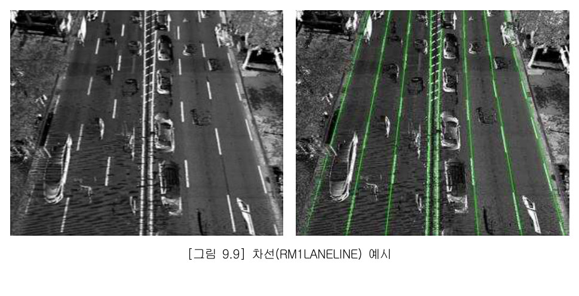

[그림 9.9] 차선(RM1LANELINE) 예시

#### 2) 구조

##### 폴더구조

- 세부도화(도형정보) 데이터의 저장형식은 다음과 같다.

#### [표 9.43] RM1_LANELINE(차선) 데이터의 저장형식

```text
             파일 경로                                                  파일 형식
구축구간              정밀도로지도                                 파일명                  확장자          의무
                                                                                           조건
                                                                                                비고
(Section)       (HRM_RoadMap)                          (Filename)             (Ext.)

<노선명>


            HDMap_UTM52N_타원체고          RM1_LANELINE
SEC<ID>_                                                                                        단일
            HDMap_UTMK_정표고             RM1_LANELINE                          SHP세트         조건
<구간명>                                                                                           파일
            HDMap_UTMK_타원체고            RM1_LANELINE


            <노선명>\SEC<ID>_<구간명>\HDMap_UTM52N_타원체고\RM1_LANELINE.shp/shx/dbf/prj/cpg

            <노선명>\SEC<ID>_<구간명>\HDMap_UTMK_정표고\RM1_LANELINE.shp/shx/dbf/prj/cpg

            <노선명>\SEC<ID>_<구간명>\HDMap_UTMK_타원체고\RM1_LANELINE.shp/shx/dbf/prj/cpg

  적용        ◦ <정밀도로지도 폴더>
  규칙         - HDMap_UTM52N_타원체고: UTM 평면직각좌표계, 타원체고
             - HDMap_UTMK_정표고: UTM-K 단일 평면직각좌표계, 정표고
             - HDMap_UTMK_타원체고: UTM-K 단일 평면직각좌표계, 타원체고

            ◦ <확장자명>: SHP세트(*.shp, *.shx, *.dbf, *.prj, *.cpg)
```

##### 자료구조

- ESRI Shape(SHP) 포맷으로 제작한다.

- 도형유형(Shape Type)은 ‘PolylineZ(선형)’로 한다.

   - ※ 도화SW에 따라 ‘PolylineZ(+M)’도 혼용하여 사용할 수 있다.

- 속성형식은 다음과 같다.

#### [표 9.44] RM1_LANELINE(차선) 속성형식

|RM1_LANELINE|RM1_LANELINE|RM1_LANELINE|RM1_LANELINE|RM1_LANELINE|
|---|---|---|---|---|
||칼럼명|데이터 타입(길이)|제약조건|코드리스트|
|1|ID|VARCHAR2(13)|UNIQUE/NOT NULL|-|
|2|LineType|VARCHAR2(3)|NOT NULL|HDM_LaneLineType|
|3|LineKind|VARCHAR2(4)|NOT NULL|HDM_LaneLineKind|
||칼럼명|데이터 타입(길이)|제약조건|코드리스트|
|4|R_linkID|VARCHAR2(13)|-|-|
|5|L_linkID|VARCHAR2(13)|-|-|
|6|SurveyDate|VARCHAR2(8)|NOT NULL|-|
|7|Version|VARCHAR2(4)|NOT NULL|-|
|8|Remark|VARCHAR2(30)|-|-|
|9|HistType|VARCHAR2(3)|-|HDM_HistType|

#### 3) 세부도화

##### 가) 도화방법(기본)

- ① 차선 페인트 라인 중앙을 ‘선형(PolylineZ)’으로 도화한다.

   - ※ 색상 구분을 위하여 사진 데이터를 참고하여 도화한다.

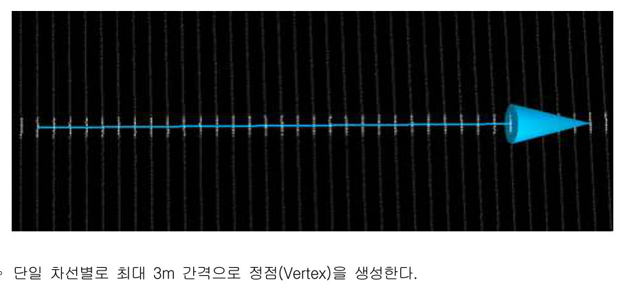

- 단일 차선별로 최대 3m 간격으로 정점(Vertex)을 생성한다.

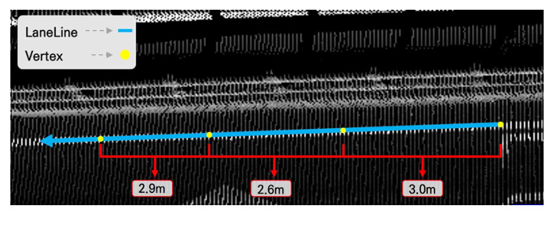

- ② 차선 형상(직선, 지그재그)과 동일하게 도화한다.

   - ※ 형태(점선, 실선, 겹선 및 혼선)와 혼동 주의

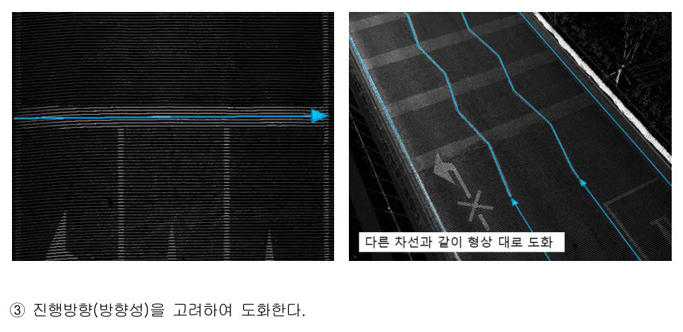

- ③ 진행방향(방향성)을 고려하여 도화한다.

   - ㉠ 중앙선

   - 단선의 경우, 기점/종점방향 각각을 겹쳐서 도화한다.

   - 겹선의 경우, 기점/종점방향 각각 도화한다.

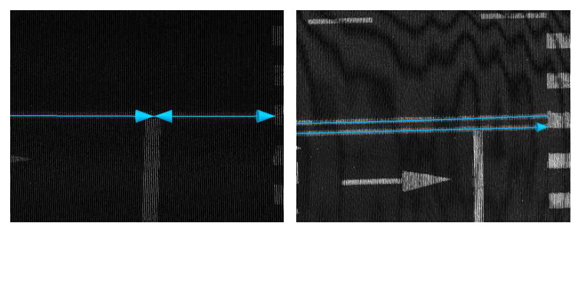

- ㉡ 이외 차선

- ※ 가변차선, 유턴구역선, 버스전용차선, 진로변경제한선, 유도선, 정지선 등

- 단선의 경우, 차선의 중앙에 도화한다.

- 겹선의 경우, 겹선의 중앙에 도화한다.

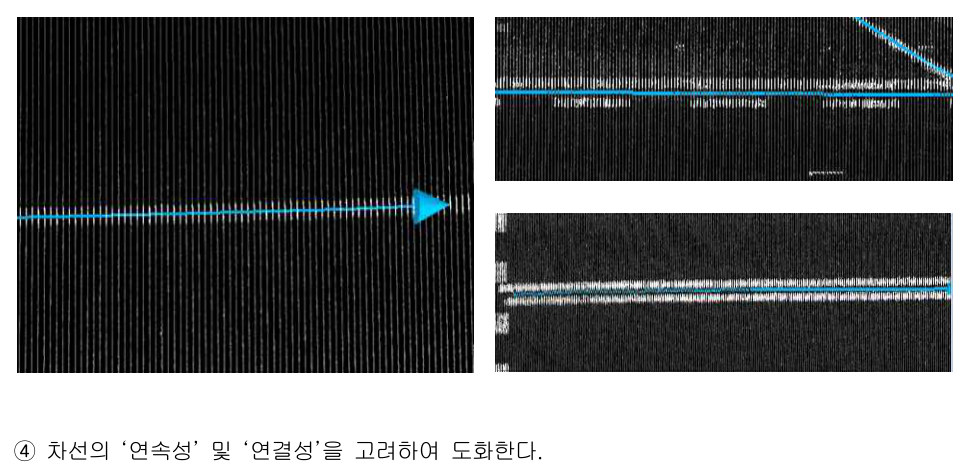

- ④ 차선의 ‘연속성’ 및 ‘연결성’을 고려하여 도화한다.

- 실선의 경우, 연속성을 고려하여 ‘실선 형태’로 도화한다.

- 점선의 경우, 연속성 및 연결성을 고려하여 ‘실선 형태’로 도화한다.

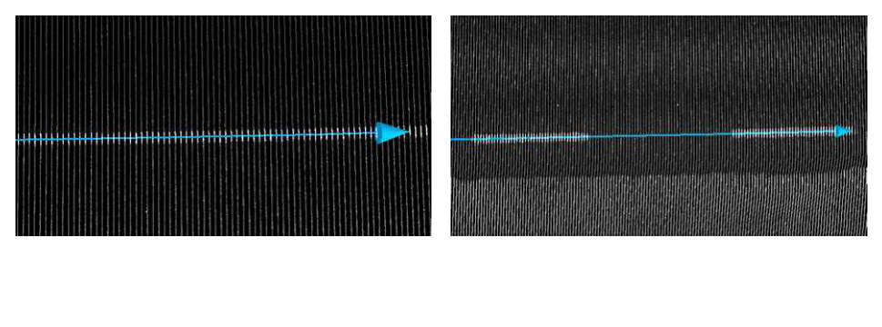

- 도로 차로 수 변화가 있는 구간의 경우, 연속성 및 연결성을 고려하여 실선 형태로 연결하여 도화한다.

- ※ 차선의 연속성 및 연결성을 확보할 수 없는 경우, 제작 여부는 ‘제작 예외’를 참고한다.

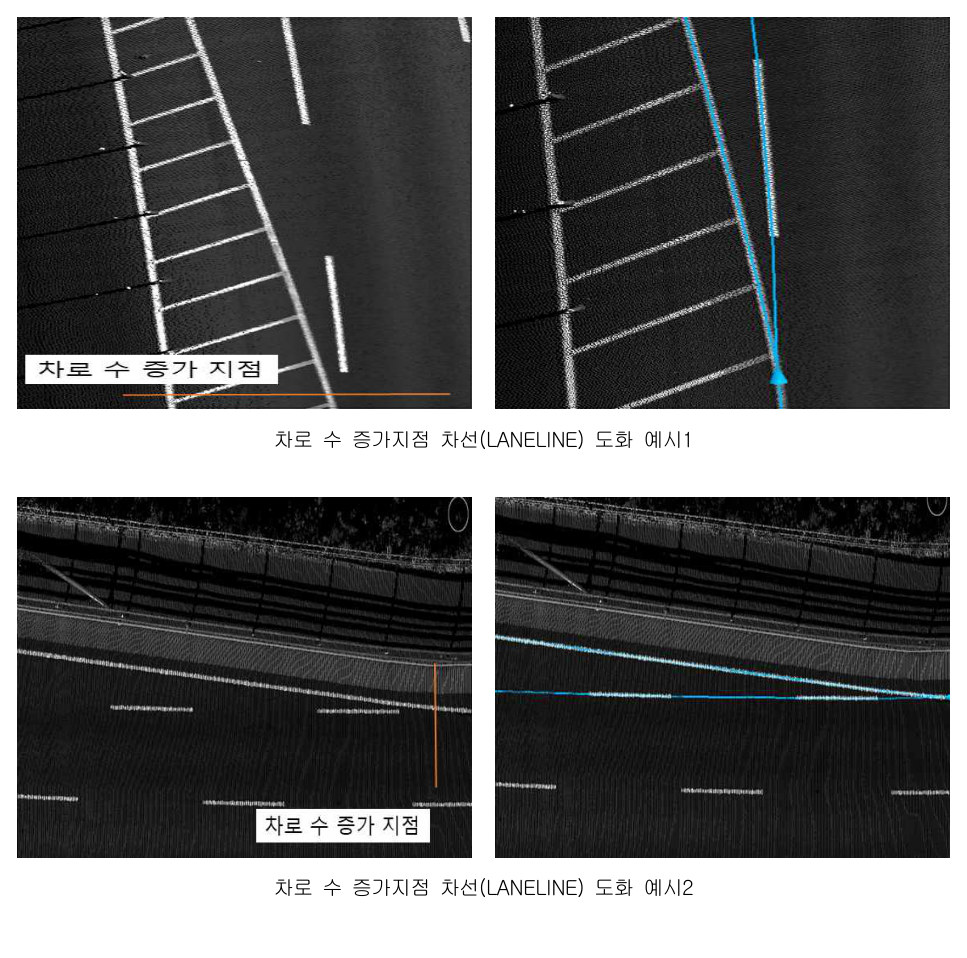

차로 수 증가지점 차선(LANELINE) 도화 예시1

차로 수 증가지점 차선(LANELINE) 도화 예시2

- ⑤ 주행경로링크(LINK)와 상호 연계될 수 있도록 도화한다.

- 주행경로링크(LINK)의 ‘시점/종점’과 동일한 위치에서 분절한다.

- ※ 동일 종류/색상/형태/형상을 가진 단일 차선이 끊기지 않고 연속되더라도, 주행경로노드 (NODE) 도화 조건에 따라 주행경로링크(LINK)의 시점/종점이 동일한 선상에 있을 수 있도록 분절한다.

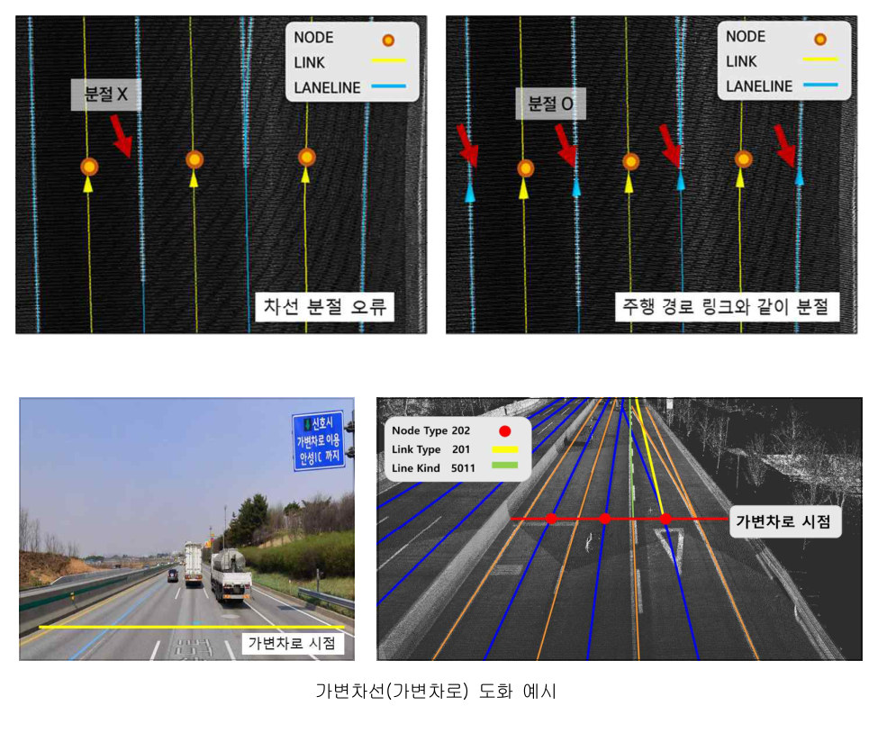

가변차선(가변차로) 도화 예시

##### 나) 유의사항

###### (1) 제작 유의

- ‘정지선’은 ‘주행경로노드(NODE)’와 연결되도록 도화한다.

- 차선(LANELINE)의 색상 및 형상에 관계없이 도로경계(가장자리)의 역할을 하는 차선은 ‘길가장 자리구역선’으로 정의한다.

- ※ ‘길가장자리구역선’이란, 진행방향의 도로경계(가장자리)를 의미한다.

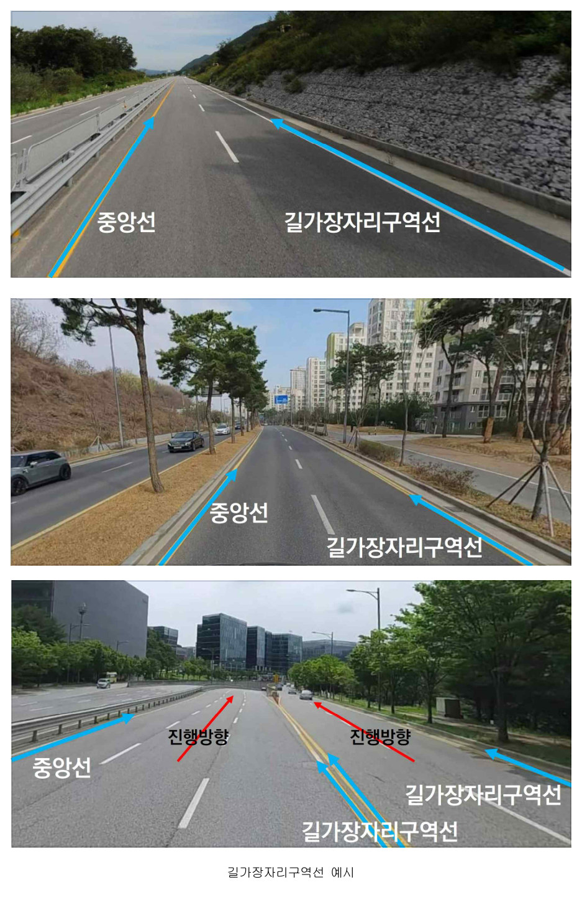

길가장자리구역선 예시

- 교통섬, 버스중앙차로 정류장, 평면/입체 교차로 진입/진출로, 좌/우회전 포켓차로 주변의 안전지대(테이퍼)는 ‘선형’으로 도화한다.

- ‘차선 역할 유형(LaneLineKind)’에 따라 ‘중앙선(코드값 501)’ 또는 ‘길가장자리구역선(코드값 505)’을 입력한다.

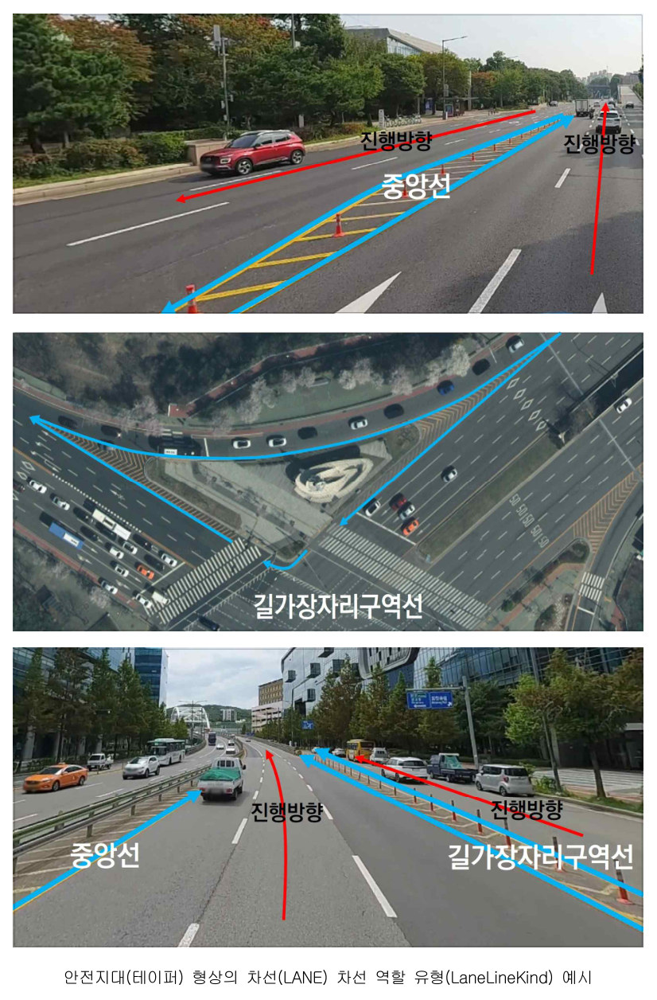

안전지대(테이퍼) 형상의 차선(LANE) 차선 역할 유형(LaneLineKind) 예시

- 도색 노후화로 차선이 지워진 경우, 제작하지 않는다. 그러나 차선이 지워진 구간이 매우 짧아 작업자 판단에 따라 차선의 연속성 및 연결성을 확보할 수 있다면 도화한다.

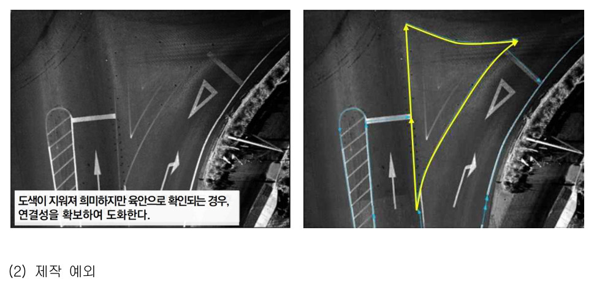

###### (2) 제작 예외

- 진행방향을 유도하는 녹색, 분홍색 등으로 표시한 ‘컬러 유도선’은 제작하지 않는다.

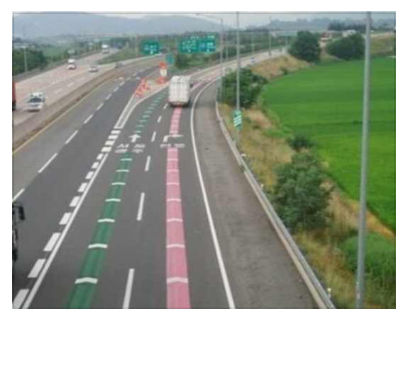

#### 4) 속성 구조화

##### 가) 테이블 명세

#### [표 9.45] RM1_LANELINE(차선) 테이블 명세

||RM1_LANELINE|RM1_LANELINE|RM1_LANELINE|RM1_LANELINE|RM1_LANELINE|RM1_LANELINE|RM1_LANELINE|
|---|---|---|---|---|---|---|---|
||칼럼명|(한글명)|KEY|데이터 타입<br>(길이)|제약조건|기본<br>단위|코드 리스트|
||ID|ID|‘구축 항목(레이어) 공통 테이블 명세’ 참고|||||
|①|LineType|차선 표시 유형|-|VARCHAR2(3)|NOT NULL|-|HDM_LaneLineType|
|②|LineKind|차선 역할 유형|-|VARCHAR2(4)|NOT NULL|-|HDM_LaneLineKind|
|③|R_LinkID|우측링크ID|FK|VARCHAR2(13)|-|-|-|
||L_LinkID|좌측링크ID|FK|VARCHAR2(13)|-|-|-|
||SurveyDate|취득 날짜|‘구축 항목(레이어) 공통 테이블 명세’ 참고|||||
||Version|버전||||||
||Remark|비고||||||
||HistType|갱신이력 유형||||||

##### 나) 칼럼별 상세 유형

- ① LineType (차선 표시 유형)

- 차선의 표시 유형(색상 ․ 겹수 ․ 형태)를 의미한다.

- 제약조건은 ‘NOT NULL’이다.

- 데이터 타입(길이)는 3자리이다.

- 색상(첫 번째 자리), 겹수(두 번째 자리), 형태(세 번째 자리)

- 유형은 ‘HDM_LaneLineType(차선 표시 유형)’ 코드 리스트에서 정의하고 있는 코드를 입력 한다.

#### [표 9.46] ‘HDM_LaneLineType(차선 표시 유형)’ 코드 리스트

|코드값|차선 표시 유형|설명|
|---|---|---|
|111|황색-단선-실선|실선으로 되어 있는 황색 단선|
|112|황색-단선-점선|점선으로 되어 있는 황색 단선|
|113|황색-단선-좌점혼선|-|
|114|황색-단선-우점혼선|-|
|121|황색-겹선-실선|실선으로 되어 있는 황색 겹선|
|122|황색-겹선-점선|점선으로 되어 있는 황색 겹선|
|123|황색-겹선-좌점혼선|좌측은 점선이고 우측은 실선인 황색 겹선|
|124|황색-겹선-우점혼선|좌측은 실선이고 우측은 점선인 황색 겹선|
|211|백색-단선-실선|실선으로 되어 있는 백색 단선|
|212|백색-단선-점선|점선으로 되어 있는 백색 단선|
|213|백색-단선-좌점혼선|-|
|214|백색-단선-우점혼선|-|
|221|백색-겹선-실선|실선으로 되어 있는 백색 겹선|
|222|백색-겹선-점선|점선으로 되어 있는 백색 겹선|
|223|백색-겹선-좌점혼선|좌측은 점선이고 우측은 실선인 백색 겹선|
|224|백색-겹선-우점혼선|좌측은 실선이고 우측은 점선인 백색 겹선|
|311|청색-단선-실선|실선으로 되어 있는 청색 단선|
|312|청색-단선-점선|점선으로 되어 있는 청색 단선|
|313|청색-단선-좌점혼선|-|
|314|청색-단선-우점혼선|-|
|321|청색-겹선-실선|실선으로 되어 있는 청색 겹선|
|322|청색-겹선-점선|점선으로 되어 있는 청색 겹선|
|323|청색-겹선-좌점혼선|좌측은 점선이고 우측은 실선인 청색 겹선|
|324|청색-겹선-우점혼선|좌측은 실선이고 우측은 점선인 청색 겹선|
|999|기타|기타 선|

##### ② LineKind (차선 역할 유형)

- 차선의 규제(역할)을 의미한다.

- 제약조건은 ‘NOT NULL’이다.

- 유형은 ‘HDM_LaneLineKind(차선 역할 유형)’ 코드 리스트에서 정의하고 있는 코드를 입력 한다.

- ※ 교통안전시설 일람표(경찰청/도로교통공단, 최신판)에서 ‘노면표시’를 참고한다.

#### [표 9.47] ‘HDM_LaneLineKind(차선 역할 유형)’ 코드 리스트

|코드값|차선 역할 유형|설명|
|---|---|---|
|501|중앙선|차마의 통행 방향을 명확하게 구분하기 위해서 도로에 황색 실선<br>이나 황색 점선등으로 표시하는 선|
|5011|가변차선|시간적·공간적으로 변화하는 도로교통의 원활한 소통을 위하여<br>교통량이 많은 쪽의 차선을 가변하여 차로를 확보하는 선|
|502|유턴구역선|인접교차로 간 거리 및 신호주기 등 주변 교통여건을 감안하여<br>자동차의 유턴이 허용된 구간 또는 장소에 표시한 선|
|503|차선|편도 2차로 이상의 차도구간내의 차로 경계를 표시할 필요가<br>있을 경우에 설치하며 차로 경계선은 백색점선으로 표시|
|504|버스전용차선|버스전용차로의 경계를 표시하는 것으로 편도 3차로 이상의<br>도로에 설치|
|505|길가장자리구역선|도로의 가장자리를 표시하는 선|
|506|진로변경제한선|차선변경 불가를 표시하는 선으로, 주행중인 차로에서 다른 차로<br>로 차선을 바꿀 수 없음을 표시하기 위해 도로에 그어 놓은 선<br>(예시 : 교차로 부근, 터널 입구, 진출입로 등)|
|525|유도선|교차로에서 통행하여야 할 방향을 유도하기 위하여 표시하는 선|
|530|정지선|건널목, 교차로, 횡단보도 앞에서 정지 신호에 따라 차량이 정지<br>해야 하는 위치를 나타내는 선|
|599|기타선|기타 위에서 정의되지 않은 규제 의미의 선형태 노면표시|

##### ③ R_LinkID / L_LinkID (우측 ․ 좌측 주행경로링크 ID)

- 진행방향 차로에서 ‘차선(LANELINE)’과 연계가 가능한 우측/좌측 주행경로링크(LINK)를 의미한다.

- 진행방향 차로에서 연계가 가능한 우측/좌측 주행경로링크의 ID를 입력한다.

- 차선(LANELINE)의 ‘우측’에 있는 주행경로링크(LINK)의 ID는 ‘R_LinkID’에 입력한다.

- 차선(LANELINE)의 ‘좌측’에 있는 주행경로링크(LINK)의 ID는 ‘L_LinkID’에 입력한다.

- 진행방향과 무관한 주행경로링크는 연계하지 않는다.

- ※ 중앙선의 왼쪽, 길가장자리구역선의 오른쪽

- 차선 역할 유형(LaneLineKind) 중 ‘정지선(코드값 530)’의 경우, 주행경로링크(LINK)의 ID를 연계 하지 않는다.

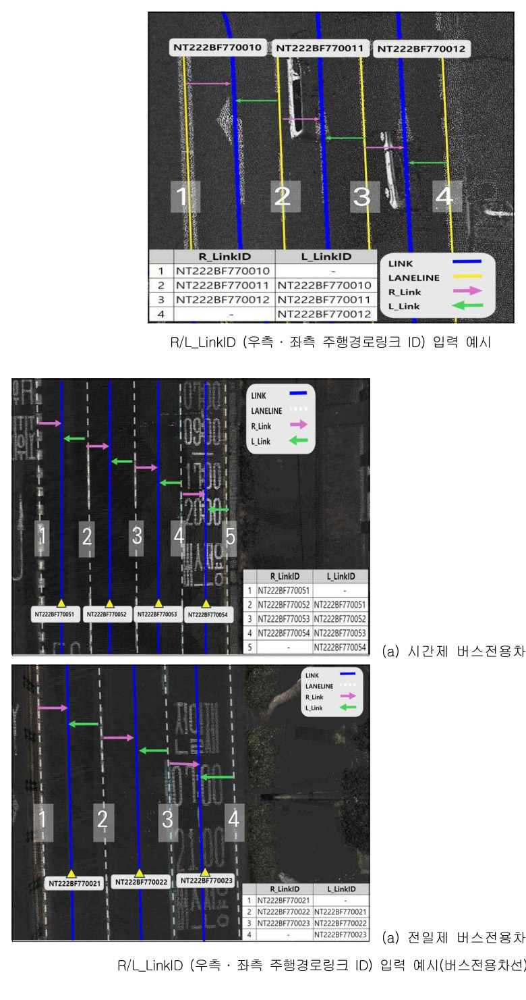

R/L_LinkID (우측 ․ 좌측 주행경로링크 ID) 입력 예시

- (a) 시간제 버스전용차로

(a) 전일제 버스전용차로 R/L_LinkID (우측 ․ 좌측 주행경로링크 ID) 입력 예시(버스전용차선)

### 9.4.8. RM2_ROADMARKING(노면표시)

|분류|RoadMarking (RM)<br>(노면표시)|명칭|ROADMARKING<br>(노면표시)|
|---|---|---|---|
|정의|차도 내 노면표시|기하|PolylgonZ (면형)|

#### 1) 정의

- ① 자동차/보행자의 안전한 주행/보행 지원을 위하여 도로 노면에 일정한 ‘패턴’, ‘숫자’, ‘문자’ 및 ‘도형’으로 표시한 기호(안내 또는 규제)를 의미한다.

- ② 종류에 따라 ‘화살표’, ‘도형’, ‘구역’ 및 ‘횡단보도(보행, 자전거)’를 대상으로 한다.

- ③ 유형에 따라 화살표(‘직진’, ‘좌회전’, ‘우회전’, ‘좌우회전’, ‘전방향’, ‘직진 및 좌회전’, ‘직진 및 우회전’, ‘직진 및 유턴’, ‘유턴’, ‘좌회전 및 유턴’ 및 ‘차로변경(좌로합류, 우로합류)’), 도형(양보 및 횡단보도 예고), 구역(버스정차구획, 택시정차구획, 정차금지대), 횡단보도 (횡단보도, 고원식 횡단보도 및 자전거 횡단보도)를 대상으로 한다.

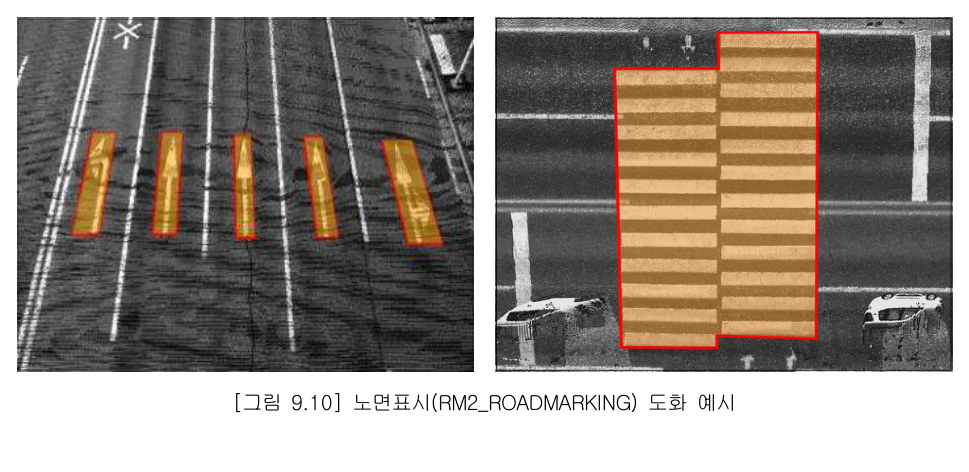

[그림 9.10] 노면표시(RM2_ROADMARKING) 도화 예시

#### 2) 구조

##### 폴더구조

- 세부도화(도형정보) 데이터의 저장형식은 다음과 같다.

#### [표 9.48] RM2_ROADMARKING(노면표시) 데이터 저장형식

```text
             파일 경로                                                  파일 형식
구축구간             정밀도로지도                                  파일명                확장자      의무
                                                                                     조건
                                                                                          비고
(Section)      (HDM_RoadMap)                           (Filename)           (Ext.)

<노선명>


            HDMap_UTM52N_타원체고          RM2_ROADMARKING
SEC<ID>_                                                                                  단일
            HDMap_UTMK_정표고             RM2_ROADMARKING                      SHP세트    조건
<구간명>                                                                                     파일

            HDMap_UTMK_타원체고            RM2_ROADMARKING


            <노선명>\SEC<ID>_<구간명>\HDMap_UTM52N_타원체고\RM2_ROADMARKING.shp/shx/dbf/prj/cpg

            <노선명>\SEC<ID>_<구간명>\HDMap_UTMK_정표고\RM2_ROADMARKING.shp/shx/dbf/prj/cpg

            <노선명>\SEC<ID>_<구간명>\HDMap_UTMK_타원체고\RM2_ROADMARKING.shp/shx/dbf/prj/cpg
  적용
            ◦ <정밀도로지도 폴더>
  규칙
             - HDMap_UTM52N_타원체고: UTM 평면직각좌표계, 타원체고
             - HDMap_UTMK_정표고: UTM-K 단일 평면직각좌표계, 정표고
             - HDMap_UTMK_타원체고: UTM-K 단일 평면직각좌표계, 타원체고

            ◦ <확장자명>: SHP세트(*.shp, *.shx, *.dbf, *.prj, *.cpg)
```

##### 자료구조

- ESRI Shape(SHP) 포맷으로 제작한다.

- 도형유형(Shape Type)은 ‘PolygonZ(면형)’로 한다.

   - ※ 도화SW에 따라 ‘Polygon(+M)’도 혼용하여 사용할 수 있다.

- 속성형식은 다음과 같다.

#### [표 9.49] RM2_ROADMARKING(노면표시) 속성형식

|RM2_ROADMARKING|RM2_ROADMARKING|RM2_ROADMARKING|RM2_ROADMARKING|RM2_ROADMARKING|
|---|---|---|---|---|
||칼럼명|데이터 타입(길이)|제약조건|코드리스트|
|1|ID|VARCHAR2(13)|UNIQUE/NOT NULL|-|
|2|MarkType|VARCHAR2(3)|NOT NULL|HDM_RoadMarkingType|
|3|MarkKind|VARCHAR2(4)|NOT NULL|HDM_RoadMarkingKind|
|4|SurveyDate|VARCHAR2(8)|NOT NULL|-|
|5|Version|VARCHAR2(4)|NOT NULL|-|
|6|Remark|VARCHAR2(30)|-|-|
|7|HistType|VARCHAR2(3)|-|HDM_HistType|

#### 3) 세부도화

##### 가) 도화방법(기준)

##### 화살표

- ① 페인트 라인 가장 바깥쪽 가장자리(외곽의 꼭지점)를 기준으로 사각형 형태의 ‘면형 (PolygonZ)’으로 도화한다.

- 1개 ‘화살표’는 1개의 객체로 도화한다.

- 대상 ‘화살표’의 유형(패턴)은 다음으로 한정한다.

- ‘직진’, ‘좌회전’, ‘우회전’, ‘좌우회전’, ‘전방향’, ‘직진 및 좌회전’, ‘직진 및 우회전’, ‘직진 및 유턴’, ‘유턴’, ‘좌회전 및 유턴’ 및 ‘차로변경(좌로합류, 우로합류)’

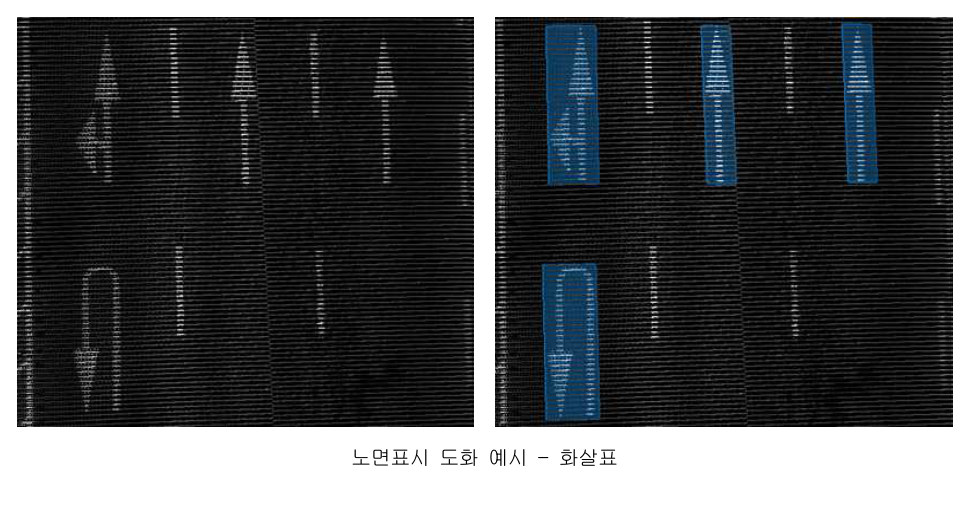

노면표시 도화 예시 - 화살표

##### 도형

- ① 페인트 라인 가장 바깥쪽 가장자리(외곽의 꼭지점)를 기준으로 사각형 형태의 ‘면형 (PolygonZ)’으로 도화한다.

- 1개 ‘도형’은 1개의 객체로 도화한다.

- 도화 대상 ‘도형’의 유형(패턴)은 다음과 같다.

- ‘횡단보도 예고 표시’, ‘양보 표시’

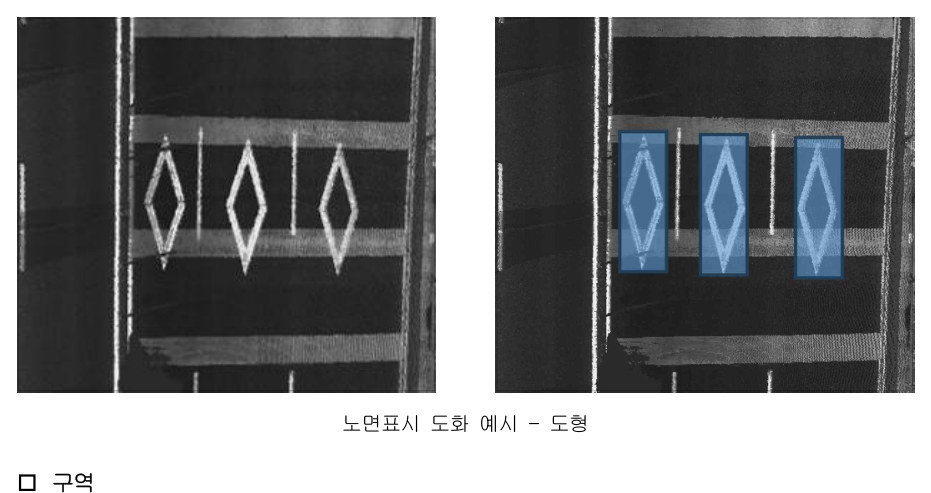

노면표시 도화 예시 - 도형

##### 구역

- ① 페인트 라인 중앙에 ‘면형(PolygonZ)’으로 도화한다.

- 구역 형상은 페인트 라인 가장 바깥쪽 가장자리 선을 기준으로 한다.

- 도화 대상 ‘구역’의 유형(패턴)은 다음과 같다.

- ‘버스정차구획’, ‘택시정차구획’, ‘교차로 내 정차금지대’

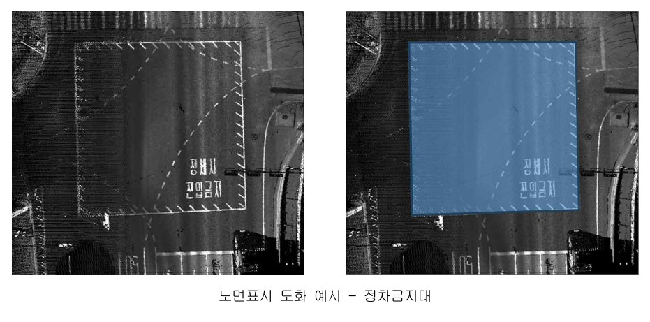

노면표시 도화 예시 - 정차금지대

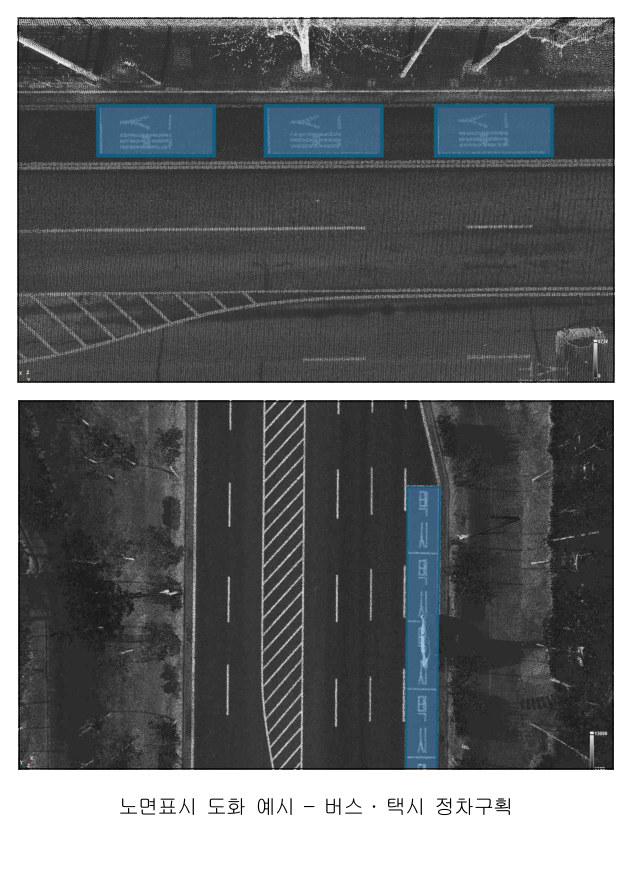

노면표시 도화 예시 – 버스 ․ 택시 정차구획

##### 횡단보도

- ① 페인트 라인 가장 바깥쪽 가장자리를 따라 ‘면형(PolygonZ)’으로 도화한다.

- 1개의 ‘횡단보도’는 보행방향과 무관하게 1개의 객체로 도화한다.

- ‘단일 형상’ 및 ‘횡단보도 선이 2개 이상 구성’된 횡단보도

- 대각선(X자형) 횡단보도

- 다음 횡단보도는 각각 도화한다.

- 도류화 횡단보도

- 기점/종점 방향이 구분된 스태거드 횡단보도

- ※ 스태거드 횡단보도란, 보행자가 2번에 나누어 도로를 횡단할 수 있도록 설계된 횡단 보도를 의미한다.

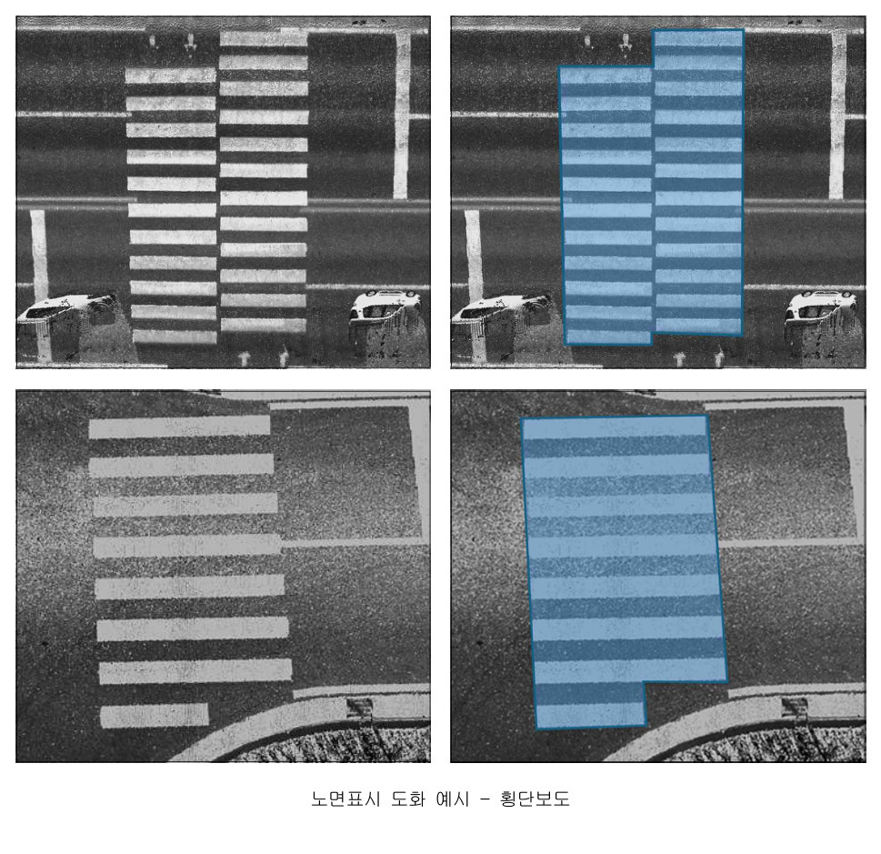

노면표시 도화 예시 - 횡단보도

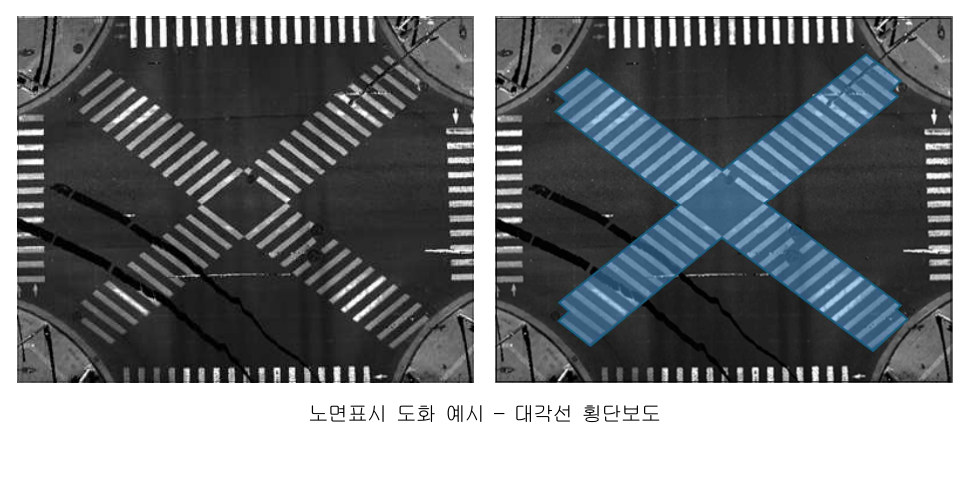

노면표시 도화 예시 – 대각선 횡단보도

- 횡단보도 ‘보행방향 표시(⇧)’는 도화하지 않는다.

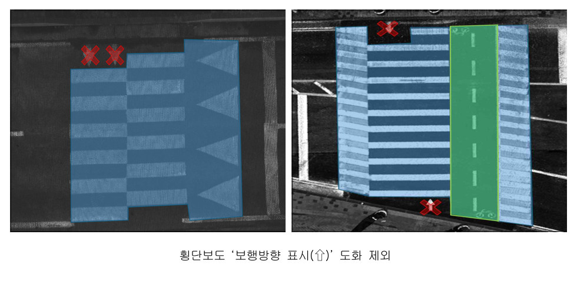

횡단보도 ‘보행방향 표시(⇧)’ 도화 제외

- ③ 고원식(험프형) 횡단보도는 다음을 고려하여 도화한다.

- ※ ‘고원식 횡단보도’란, 횡단보도 전방/후방에 ‘오르막 경사면 표시(△)’ 또는 ‘고원식 횡단보도 알림 표시(황색/흰색 사선)’가 있는 횡단보도를 의미한다.

- 오르막 경사면(‘경사면 표시’ 또는 ‘고원식 횡단보도 알림 표시’)을 포함하여 1개 객체로 도화한다.

- 노면 표시 유형(RoadMarkingType)은 ‘횡단보도(코드값 200)’를 입력한다.

- 노면표시 세부유형(RoadMarkingKind)은 ‘고원식횡단보도(코드값 533)’을 입력한다.

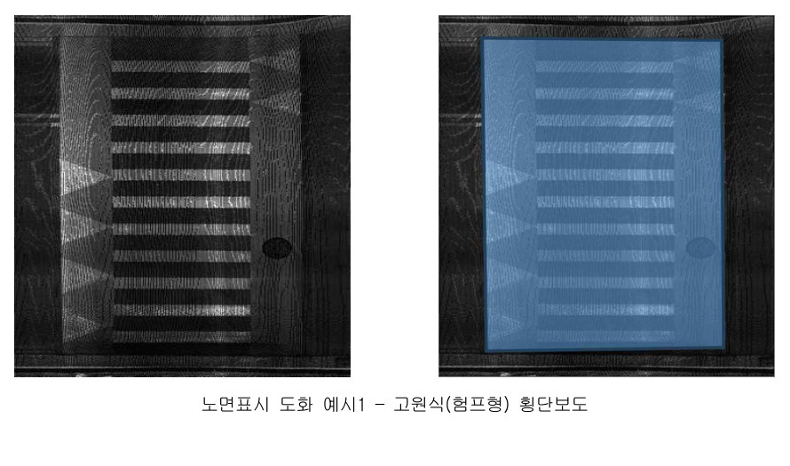

노면표시 도화 예시1 – 고원식(험프형) 횡단보도

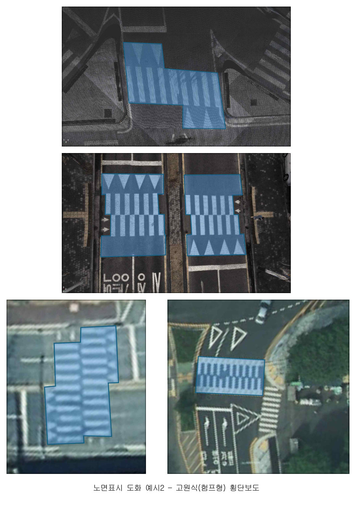

노면표시 도화 예시2 – 고원식(험프형) 횡단보도

- ④ 자전거 횡단보도는 페인트 라인 가장 바깥쪽 가장자리를 따라 ‘면형(PolygonZ)’으로 도화한다.

- ‘보행자용 횡단보도 내 또는 인접하는 경우’ 또는 ‘오르막 경사가 포함된 고원식 횡단보도 내 자전거 횡단보도가 위치하고 있는 경우’ 각각 별도의 객체로 도화한다.

- ‘보행자용 횡단보도’와 ‘자전거 횡단보도는’의 유형이 상이하기 때문에 동일 레이어 간 위치 중복을 허용한다.

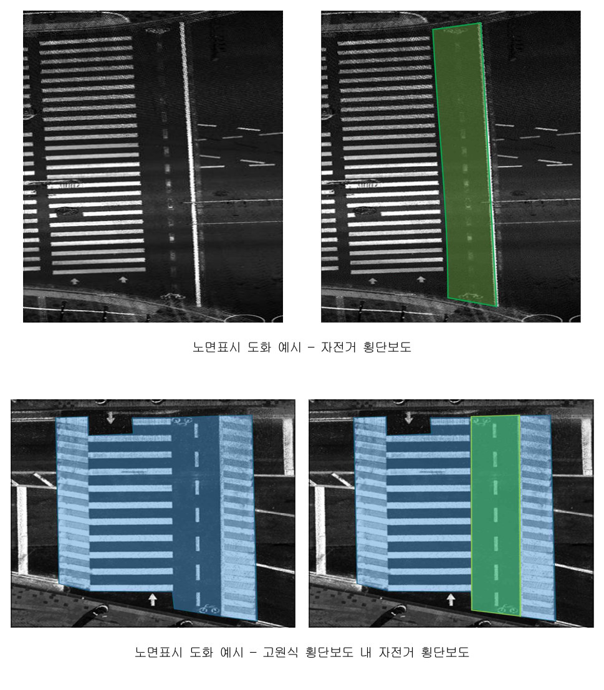

노면표시 도화 예시 – 자전거 횡단보도

노면표시 도화 예시 – 고원식 횡단보도 내 자전거 횡단보도

##### 나) 유의사항

###### (1) 제작 유의

- 도화방법(기준) 외 ‘제작 유의’ 없음

###### (2) 제작 예외

- ‘금지’를 표시하는 ‘화살표’ 노면표시는 제작하지 않는다.

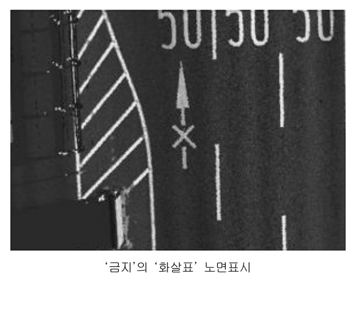

‘금지’의 ‘화살표’ 노면표시

#### 4) 속성 구조화

##### 가) 테이블 명세

#### [표 9.50] RM2_ROADMARKING(노면표시) 테이블 명세

|RM2_ROADMARKING|RM2_ROADMARKING|RM2_ROADMARKING|RM2_ROADMARKING|RM2_ROADMARKING|RM2_ROADMARKING|RM2_ROADMARKING|RM2_ROADMARKING|
|---|---|---|---|---|---|---|---|
||칼럼명|(한글명)|KEY|데이터 타입<br>(길이)|제약조건|기본<br>단위|코드 리스트|
||ID|ID|‘구축 항목(레이어) 공통 테이블 명세’ 참고|||||
|①|MarkType|노면표시 유형|-|VARCHAR2(3)|NOT NULL|-|HDM_RoadMark<br>ingType|
|②|MarkKind|노면표시 세부유형|-|VARCHAR2(4)|NOT NULL|-|HDM_RoadMark<br>ingKind|
||SurveyDate|취득 날짜|‘구축 항목(레이어) 공통 테이블 명세’ 참고|||||
||Version|버전||||||
||Remark|비고||||||
||HistType|갱신이력 유형||||||

##### 나) 칼럼별 상세 유형

- ① MarkType (노면표시 유형)

- 노면표시 형태 유형을 의미한다.

- 제약조건은 ‘NOT NULL’이다.

- 유형은 ‘HDM_RoadMarkingType(노면표시 유형)’ 코드 리스트에서 정의하고 있는 코드를 입력한다.

#### [표 9.51] ‘HDM_RoadMarkingType(노면표시 유형)’ 코드 리스트

|코드값|노면표시 유형|설명|
|---|---|---|
|100|화살표|화살표 형태의 노면표시|
|200|횡단보도|보행자․자전거 횡단보도 노면표시|
|300|도형|횡단보도 예고, 양보 노면표시|
|500|구역|버스정차구획, 택시정차구획, 정차금지대 노면표시|
|999|기타|기타 형태의 노면표시|

##### ② MarkKind (노면표시 세부유형)

- 노면표시 유형별 세부유형을 의미한다.

- 제약조건은 ‘NOT NULL’이다.

- 유형은 ‘HDM_RoadMarkingKind(노면표시 세부유형)’ 코드 리스트에서 정의하고 있는 코드를 입력한다.

- ※ 교통안전시설 일람표(경찰청/도로교통공단, 최신판)에서 ‘노면표시’를 참고한다.

#### [표 9.52] ‘HDM_RoadMarkingKind(노면표시 세부유형)’ 코드 리스트

|코드값|노면표시 세부유형|노면표시 세부유형|설명|
|---|---|---|---|
|522|도형|양보|교통안전시설일람표의 “양보” 노면표시|
|5232|구역|버스정차구획|교통안전시설일람표의 “버스정차구획” 노면표시|
|5233||택시정차구획|교통안전시설일람표의 “택시정차구획” 노면표시|
|524||정차금지대|교통안전시설일람표의 “정차금지대” 노면표시|
|529|도형|횡단보도 예고|교통안전시설일람표의 “횡단보도예고” 노면표시|
|5321|횡단<br>보도|횡단보도|교통안전시설일람표의 “횡단보도”, “대각선횡단보도” 노면표시|
|533||고원식횡단보도|교통안전시설일람표의 “고원식횡단보도” 노면표시|
|534||자전거횡단보도|교통안전시설일람표의 “자전거횡단도” 노면표시|
|5371|화살표|직진|교통안전시설일람표의 “진행방향” 노면표시 중, “직진”표시|
|5372||좌회전|교통안전시설일람표의 “진행방향” 노면표시 중, “좌회전”표시|
|5373||우회전|교통안전시설일람표의 “진행방향” 노면표시 중, “우회전”표시|
|5374||좌우회전|교통안전시설일람표의 “진행방향” 노면표시 중, “좌우회전”표시|
|5379||전방향|교통안전시설일람표의 “진행방향” 노면표시 중, “정방향”표시|
|5381||직진 및 좌회전|교통안전시설일람표의 “진행방향” 노면표시 중, “직진 및 좌회전”<br>표시|
|5382||직진 및 우회전|교통안전시설일람표의 “진행방향” 노면표시 중, “직진 및 우회전”<br>표시|
|5391||유턴|교통안전시설일람표의 “진행방향” 노면표시 중,, “유턴”표시|
|5392||좌회전 및 유턴|교통안전시설일람표의 “진행방향” 노면표시 중, “좌회전 및 유턴”<br>표시|
|5431||차로변경(좌로합류)|교통안전시설일람표의 “차로변경” 노면표시 중, “좌로합류”표시|
|5432||차로변경(우로합류)|교통안전시설일람표의 “차로변경” 노면표시 중, "우로합류" 표시|
|999|기타 노면표시||기타 위에서 정의되지 않은 노면표시|

### 9.4.9. RM3_PARKINGLOT (주차구역(면))

|분류|RoadMarking (RM)<br>(노면표시)|명칭|PARKINGLOT<br>(주차구역(면))|
|---|---|---|---|
|정의|주차면 단위 구역|기하|PolylgonZ (면형)|

#### 1) 정의

- ① ‘부속구역(휴게소, 졸음쉼터) 내에 설치된 주차구역(주차면의 집합)’ 및 ‘차도(노상)에 존재 하는 주차구역’을 의미한다.

- ② 주차구역 유형에 따라 ‘일반차량’, ‘우선주차’, ‘대형차량’, ‘장애인’, ‘친환경차(충전, 미충전)’를 대상으로 한다.

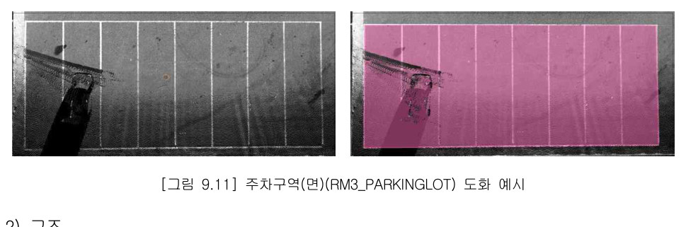

**[그림 9.11] 주차구역(면)(RM3_PARKINGLOT) 도화 예시**

#### 2) 구조

##### 폴더구조

- 세부도화(도형정보) 데이터의 저장형식은 다음과 같다.

#### [표 9.53] RM3_PARKINGLOT(주차구역(면)) 데이터의 저장형식

```text
             파일 경로                                           파일 형식
구축구간             정밀도로지도                           파일명                   확장자       의무
                                                                                  조건
                                                                                       비고
(Section)      (HDM_RoadMap)                    (Filename)              (Ext.)


<노선명>

            HDMap_UTM52N_타원체고     RM3_PARKINGLOT
SEC<ID>_                                                                               단일
            HDMap_UTMK_정표고        RM3_PARKINGLOT                       SHP세트      조건
<구간명>                                                                                  파일
            HDMap_UTMK_타원체고       RM3_PARKINGLOT


            <노선명>\SEC<ID>_<구간명>\HDMap_UTM52N_타원체고\RM3_PARKINGLOT.shp/shx/dbf/prj/cpg
  적용
            <노선명>\SEC<ID>_<구간명>\HDMap_UTMK_정표고\RM3_PARKINGLOT.shp/shx/dbf/prj/cpg
  규칙
            <노선명>\SEC<ID>_<구간명>\HDMap_UTMK_타원체고\RM3_PARKINGLOT.shp/shx/dbf/prj/cpg


         ◦ <정밀도로지도 폴더>
          - HDMap_UTM52N_타원체고: UTM 평면직각좌표계, 타원체고
          - HDMap_UTMK_정표고: UTM-K 단일 평면직각좌표계, 정표고
          - HDMap_UTMK_타원체고: UTM-K 단일 평면직각좌표계, 타원체고

         ◦ <확장자명>: SHP세트(*.shp, *.shx, *.dbf, *.prj, *.cpg)
```

##### 자료구조

- ESRI Shape(SHP) 포맷으로 제작한다.

- 도형유형(Shape Type)은 ‘PolygonZ(면형)’로 한다.

   - ※ 도화SW에 따라 ‘PolygonZ(+M)’도 혼용하여 사용할 수 있다.

- 속성형식은 다음과 같다.

#### [표 9.54] RM3_PARKINGLOT(주차구역(면)) 속성형식

|RM3_PARKINGLOT|RM3_PARKINGLOT|RM3_PARKINGLOT|RM3_PARKINGLOT|RM3_PARKINGLOT|
|---|---|---|---|---|
||칼럼명|데이터 타입(길이)|제약조건|코드리스트|
|1|ID|VARCHAR2(13)|UNIQUE/NOT NULL|-|
|2|PLType|VARCHAR2(3)|NOT NULL|HDM_ParkingLotType|
|3|SurveyDate|VARCHAR2(8)|NOT NULL|-|
|4|Version|VARCHAR2(4)|NOT NULL|-|
|5|Remark|VARCHAR2(30)|-|-|
|6|HistType|VARCHAR2(3)|-|HDM_HistType|

#### 3) 세부도화

##### 가) 도화방법(기준)

- ① 구역단위(개별 주차면의 집합)로 구역 외곽을 따라 ‘면형(PolygonZ)’으로 도화한다.

- 구역 외곽선(페인트 라인)의 중앙에 도화한다.

- 구역 유형 단위로 도화한다.

- ※ ‘주차구역 유형(HDM_ParkingLotType)’을 참고한다.

- 도화 대상 주차구역(면)은 다음과 같다.

- ‘차도(노상)’에 설치된 주차구역(면)

- ‘부속구역(휴게소, 졸음쉼터)’에 설치된 주차구역(면)

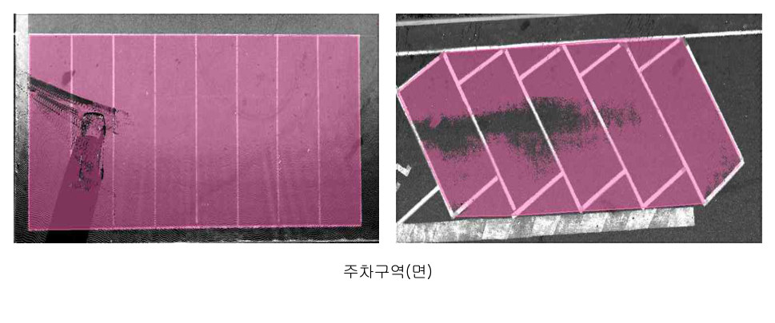

##### 주차구역(면)

나) 유의사항

###### (1) 제작 유의

- 도화방법(기준) 외 ‘제작 유의’ 없음

###### (2) 제작 예외

- 도화방법(기준) 외 ‘제작 예외’ 없음

#### 4) 속성 구조화

##### 가) 테이블 명세

#### [표 9.55] RM3_PARKINGLOT(주차구역(면)) 테이블 명세

|RM3_PARKINGLOT|RM3_PARKINGLOT|RM3_PARKINGLOT|RM3_PARKINGLOT|RM3_PARKINGLOT|RM3_PARKINGLOT|RM3_PARKINGLOT|RM3_PARKINGLOT|
|---|---|---|---|---|---|---|---|
||칼럼명|(한글명)|KEY|데이터 타입<br>(길이)|제약조건|기본<br>단위|코드 리스트|
||ID|ID|‘구축 항목(레이어) 공통 테이블 명세’ 참고|||||
|①|PLType|주차구역 유형|-|VARCHAR2(3)|NOT NULL|-|HDM_ParkingLot<br>Type|
||SurveyDate|취득 날짜|‘구축 항목(레이어) 공통 테이블 명세’ 참고|||||
||Version|버전||||||
||Remark|비고||||||
||HistType|갱신이력 유형||||||

##### 나) 칼럼별 상세 유형

- ① PLType (주차구역 유형)

- 주차할 수 있는 차량의 유형을 의미한다.

- 제약조건은 ‘NOT NULL’이다.

- 유형은 ‘HDM_ParkingLotType(주차구역 유형)’ 코드 리스트에서 정의하고 있는 코드를 입력 한다.

#### [표 9.56] ‘HDM_ParkingLotType(주차구역 유형)’ 코드 리스트

|코드값|주차구역 유형|주차구역 유형|설명|
|---|---|---|---|
|100|일반|일반차량|일반차량(소형, 중형)의 주차구역|
|101||우선주차|‘경차’, ‘거주자’ 또는 ‘가족배려(여성, 노인 등 사회적 약자)’ 등 우선<br>주차구역|
|102||대형차량|버스, 화물 등 대형 차량의 주차구역|
|200|전용|장애인|장애인만 주차할 수 있는 주차구역|
|201||전기차<br>(충전)|․전기 충전시설이 설치된 주차구역<br>․‘전기차 전용’ 및 ‘전기 충전시설이 설치된 환경친화적 차량 주차구역’|
|202||환경친화<br>(미충전)|․환경친화적 차량만 주차할 수 있는 주차구역<br>(전기 충전시설이 미설치)|
|999||기타|기타 언급되지 않은 차량에 대한 주차구역|

### 9.4.10. SF1_BARRIER (차량방호안전시설)

|분류|SafetyFixture (SF)<br>(안전시설)|명칭|BARRIER<br>(차량방호안전시설)|
|---|---|---|---|
|정의|차량 및 보행자 보호를 위한 방호안전시설|기하|PolylineZ (선형)|

#### 1) 정의

- ① 주행 중 진행방향을 잘못 잡은 차량이 길 밖 또는 대상차로 등으로 이탈하는 것을 방지하거나 차량이 구조물과의 직접적인 충돌을 방지하여 차량 탑승자 및 차량, 보행자 또는 도로변의 주요 시설을 안전하게 보호하기 위하여 설치하는 시설을 말한다.

- ② 종류에 따라 차량의 차도 이탈을 방지하는 방호울타리(콘크리트 방호벽, 가드레일, 펜스, 임시 구조물 등), 추락을 방지하는 벽 시설, 기타 시설(충격흡수시설, 중앙분리대 개구부)을 대상으로 한다.

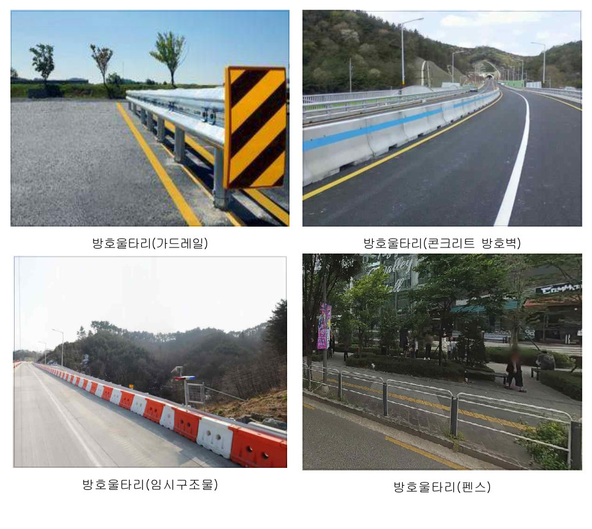

방호울타리(가드레일)

방호울타리(임시구조물)

방호울타리(콘크리트 방호벽)

방호울타리(펜스)

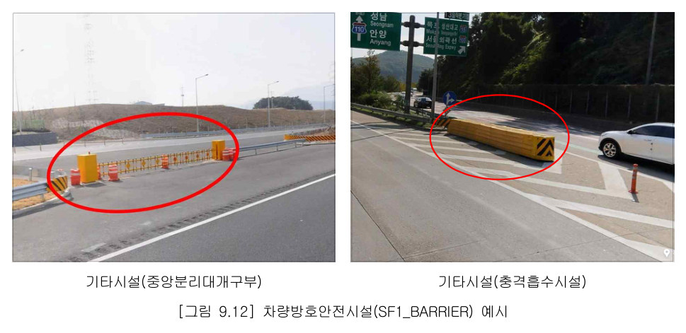

기타시설(중앙분리대개구부) 기타시설(충격흡수시설)

- [그림 9.12] 차량방호안전시설(SF1_BARRIER) 예시

#### 2) 구조

##### 폴더구조

- 세부도화(도형정보) 데이터의 저장형식은 다음과 같다.

#### [표 9.57] SF1_BARRIER(차량방호안전시설) 데이터의 저장형식

```text
             파일 경로                                                  파일 형식
구축구간             정밀도로지도                                  파일명                확장자      의무
                                                                                          비고
(Section)      (HDM_RoadMap)                           (Filename)           (Ext.)   조건

<노선명>


            HDMap_UTM52N_타원체고          SF1_BARRIER
SEC<ID>_                                                                                  단일
            HDMap_UTMK_정표고             SF1_BARRIER                          SHP세트    조건
<구간명>                                                                                     파일
            HDMap_UTMK_타원체고            SF1_BARRIER


            <노선명>\SEC<ID>_<구간명>\HDMap_UTM52N_타원체고\SF1_BARRIER.shp/shx/dbf/prjcpg

            <노선명>\SEC<ID>_<구간명>\HDMap_UTMK_정표고\SF1_BARRIER.shp/shx/dbf/prjcpg

            <노선명>\SEC<ID>_<구간명>\HDMap_UTMK_타원체고\SF1_BARRIER.shp/shx/dbf/prjcpg
  적용
            ◦ <정밀도로지도 폴더>
  규칙
             - HDMap_UTM52N_타원체고: UTM 평면직각좌표계, 타원체고
             - HDMap_UTMK_정표고: UTM-K 단일 평면직각좌표계, 정표고
             - HDMap_UTMK_타원체고: UTM-K 단일 평면직각좌표계, 타원체고

            ◦ <확장자명>: SHP세트(*.shp, *.shx, *.dbf, *.prj, *.cpg)
```

##### 자료구조

- ESRI Shape(SHP) 포맷으로 제작한다.

- 도형유형(Shape Type)은 ‘PolylineZ(선형)’로 한다.

   - ※ 도화SW에 따라 ‘PolylineZ(+M)’도 혼용하여 사용할 수 있다.

- 속성형식은 다음과 같다.

#### [표 9.58] SF1_BARRIER(차량방호안전시설) 속성형식

|SF1_BARRIER|SF1_BARRIER|SF1_BARRIER|SF1_BARRIER|SF1_BARRIER|
|---|---|---|---|---|
||칼럼명|데이터 타입(길이)|제약조건|코드리스트|
|1|ID|VARCHAR2(13)|UNIQUE/NOT NULL|-|
|2|BarrType|VARCHAR2(3)|NOT NULL|HDM_BarrierType|
|3|R_linkID|VARCHAR2(13)|-|-|
|4|L_linkID|VARCHAR2(13)|-|-|
|5|SurveyDate|VARCHAR2(8)|NOT NULL|-|
|6|Version|VARCHAR2(4)|NOT NULL|-|
|7|Remark|VARCHAR2(30)|-|-|
|8|HistType|VARCHAR2(3)|-|HDM_HistType|

#### 3) 세부도화

##### 가) 도화방법(기준)

- ① 차량안전방호시설(Barrier)의 ‘최외곽 상단’을 ‘선형(PolylineZ)’으로 도화한다.

> 예) 가드레일의 경우, ‘돌출부 최상단’ 도화

차량방호안전시설 도화 기준(지점)

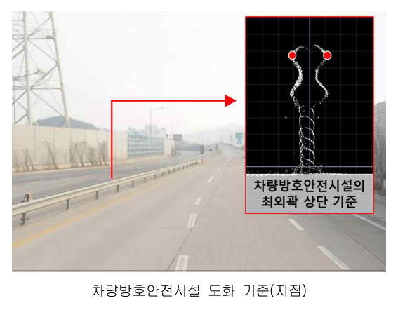

- 방호시설 유형(재질)이 다른 경우, 각각 도화한다.

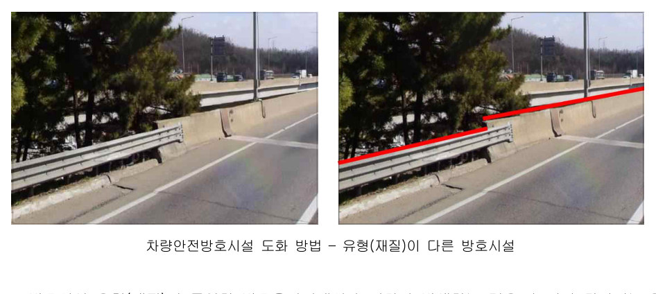

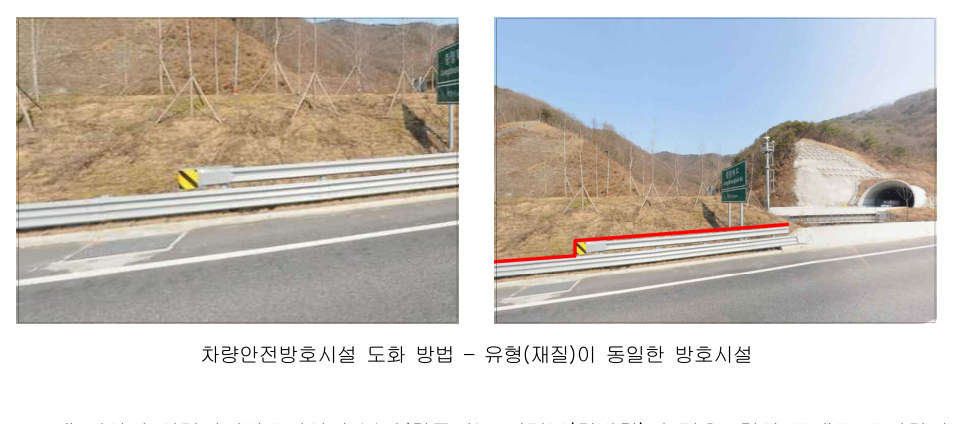

차량안전방호시설 도화 방법 – 유형(재질)이 다른 방호시설

- 방호시설 유형(재질)이 동일한 방호울타리에서 높이차가 발생하는 경우, 높이가 달라지는 곳 에서 분절하지 않고, 연결성있게 도화한다.

차량안전방호시설 도화 방법 – 유형(재질)이 동일한 방호시설

- 2개 이상의 차량안전방호시설이 분기/합류되는 연결부(횡방향)의 경우, 형상 그대로 도화한다.

- ※ 연결부가 폐합 형태이면 ‘폐합’, 개방 형태이면 ‘개방’

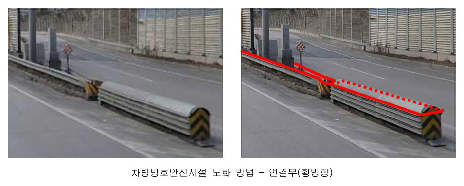

차량방호안전시설 도화 방법 – 연결부(횡방향)

- ② 진행방향(방향성)을 고려하여 진행방향별(기점/종점 방향) 각각 도화한다.

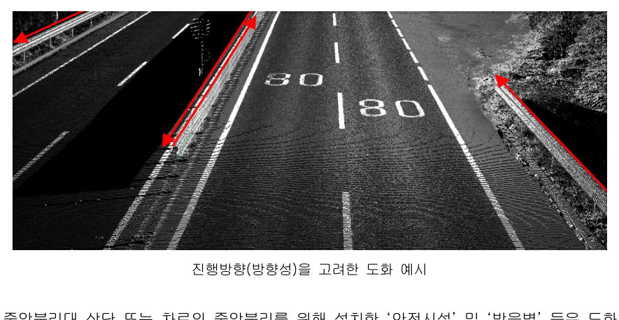

진행방향(방향성)을 고려한 도화 예시

- ③ 중앙분리대 상단 또는 차로의 중앙분리를 위해 설치한 ‘안전시설’ 및 ‘방음벽’ 등은 도화하지 않는다.

- ※ 안전시설 : 현광방지시설(차광판), 시선유도표지, 시선유도봉 등

- 방음벽, 방풍 및 방설 등의 시설물은 ‘기초시설 상단’을 도화한다.

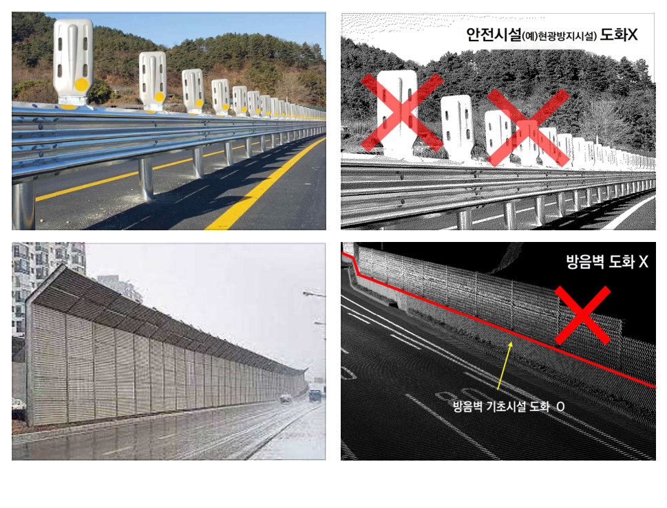

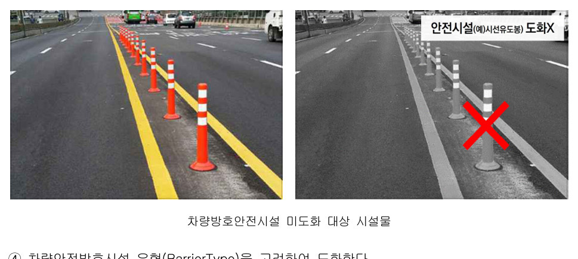

차량방호안전시설 미도화 대상 시설물

- ④ 차량안전방호시설 유형(BarrierType)을 고려하여 도화한다.

- ㉠ 방호울타리

- 콘크리트 방호벽, 가드레일, 펜스 및 임시구조물(PE 방호벽)을 의미한다.

- ※ 펜스의 경우, ‘차도경계(ROADBORDER)에 설치된 보도/차도 분리시설, 무단횡단 방지 시설 등을 포함한다.

- 방호울타리 ‘상단’을 도화한다.

- 임시구조물(PE 방호벽)의 경우, ‘고정(영구) 방호시설 역할’로 판단되는 경우에만 도화한다.

- ※ 도로 진입/출입 제한 및 유도, 수 년 이상의 공사에서 이동하지 않는 경우 등

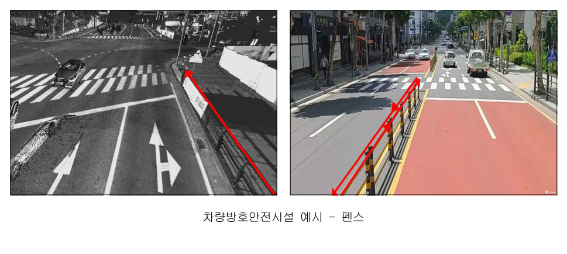

차량방호안전시설 예시 - 펜스

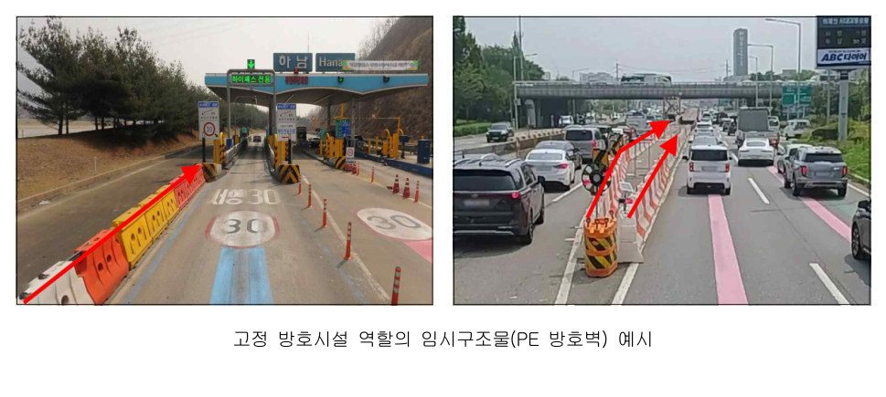

고정 방호시설 역할의 임시구조물(PE 방호벽) 예시

##### ㉡ 벽

- 터널, 지하차도 등의 벽 시설을 의미한다.

- 기초시설이 있는 경우, 해당 시설물의 ‘기초시설 상단’을 도화한다.

   - ‘차량안전방호시설 유형(BarrierType)’은 ‘벽(코드값 200)’을 입력한다.

- 기초시설이 없는 경우, 차량방호안전시설과 지면의 인접부를 기준으로 도화한다.

   - ‘차량안전방호시설 유형(BarrierType)’은 ‘벽(코드값 200)’을 입력한다.

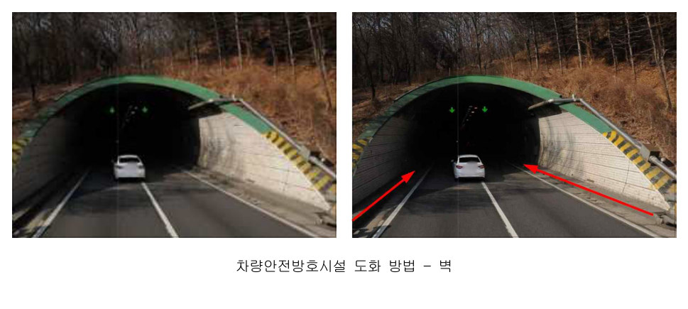

차량안전방호시설 도화 방법 - 벽

##### ㉢ 시설

- ‘충격흡수시설’ 및 ‘중앙분리대 개구부’를 의미한다.

- ※ ‘충격흡수시설’이란, 주행차로를 벗어난 차량이 고정된 구조물 등과 직접 충돌하는 것을 방지해 교통사고의 치명도를 낮추는 목적으로 설치한 시설을 의미한다.

- ※ ‘중앙분리대 개구부’란 도로 보수 공사, 긴급 상황 처리 등을 위하여 반대편 진행방향 으로 진입/출입할 수 있도록 설치한 시설을 의미한다.

- 시설의 ‘상단’을 도화한다.

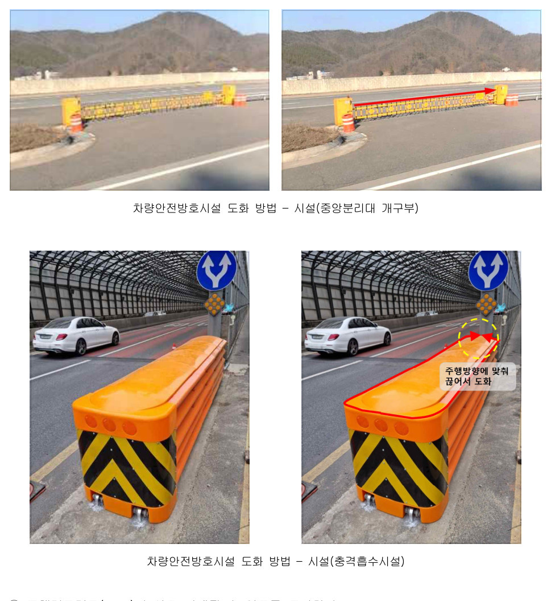

차량안전방호시설 도화 방법 – 시설(중앙분리대 개구부)

차량안전방호시설 도화 방법 – 시설(충격흡수시설)

- ⑤ 주행경로링크(LINK)와 상호 연계될 수 있도록 도화한다.

- 주행경로링크(LINK)의 ‘시점/종점’과 동일한 위치에서 분절한다.

- ※ 동일 종류/형상을 가진 단일 차량안전방호시설(BARRIER)가 끊기지 않고 연속되더라도, 주행경로노드(NODE) 도화 조건에 따라 도화된 주행경로링크(LINK)의 시점/종점과 동일한 선상에 위치할 수 있도록 분절한다.

##### 나) 유의사항

###### (1) 제작 유의

- 연속된 중앙분리대, 도로 가장자리 차량방호안전시설 중간에 일시적으로 방호시설 유형(형상, 재질) 변경 또는 일시적으로 설치된 가드레일의 경우, 형상 및 속성을 변경하지 않고, 연속된 형상으로 도화 및 속성을 입력한다.

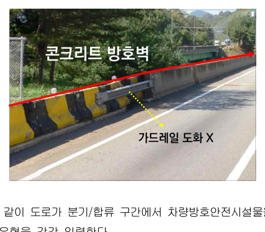

- 지하 ․ 고가차도와 같이 도로가 분기/합류 구간에서 차량방호안전시설물을 공유하는 경우, 진행 방향에서의 해당 유형을 각각 입력한다.

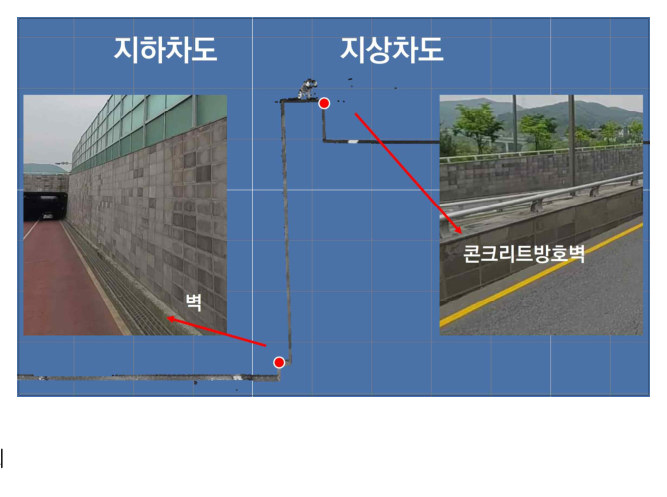

###### (2) 제작 예외

- 도화 방법(기본) 외 ‘제작 예외’ 없음

#### 4) 속성 구조화

##### 가) 테이블 명세

#### [표 9.59] SF1_BARRIER(차량방호안전시설) 테이블 명세

||SF1_BARRIER|SF1_BARRIER|SF1_BARRIER|SF1_BARRIER|SF1_BARRIER|SF1_BARRIER|SF1_BARRIER|
|---|---|---|---|---|---|---|---|
||칼럼명|(한글명)|KEY|데이터 타입<br>(길이)|제약조건|기본<br>단위|코드 리스트|
||ID|ID|‘구축 항목(레이어) 공통 테이블 명세’ 참고|||||
|①|BarrType|차량방호<br>안전시설 유형|-|VARCHAR2(3)|NOT NULL|-|HDM_BarrierType|
|②|R_LinkID|우측링크ID|FK|VARCHAR2(13)|-|-|-|
||L_LinkID|좌측링크ID|FK|VARCHAR2(13)|-|-|-|
||SurveyDate|취득 날짜|‘구축 항목(레이어) 공통 테이블 명세’ 참고|||||
||Version|버전||||||
||Remark|비고||||||
||HistType|갱신이력 유형||||||

##### 나) 칼럼별 상세 유형

- ① BarrType (차량방호안전시설 유형)

- ‘방호울타리’, ‘벽’, ‘시설’ 등 방호안전시설의 유형을 의미한다.

- 제약조건은 ‘NOT NULL’이다.

- 유형은 ‘HDM_BarrierType(방호안전시설 유형)’ 코드 리스트에서 정의하고 있는 코드를 입력한다.

#### [표 9.60] ‘HDM_BarrierType(방호안전시설 유형)’ 코드 리스트

|코드값|방호안전시설 유형|방호안전시설 유형|설명|
|---|---|---|---|
|100|방호<br>울타리|콘크리트방호벽|콘크리트 방호벽 형식의 방호울타리<br>(콘크리트 방호벽 상단의 방음/방풍시설은 도화하지 않음)|
|101||가드레일|가드레일 형식의 방호울타리|
|102||펜스|차량, 보행자를 보호하기 위한 방호 울타리<br>(보도/차도 분리시설, 무단횡단 방지시설 등)|
|103||임시구조물|고정(영구) 방호시설 역할을 하는 PE방호벽|
|200||벽|터널, 지하차도 내의 벽 시설물|
|300|시설|충격흡수시설|구조물과 충돌하기 전에 차량의 충격을 흡수하여 정차하도록 하는<br>시설물|
|301||중앙분리대 개구부|중앙분리대 개구부|
|999||기타|기타 언급되지 않은 차량방호안전시설|

- ② R_LinkID / L_LinkID (우측 ․ 좌측 주행경로링크 ID)

- 진행방향 차로에서 ‘차량방호안전시설(BARRIER)’과 연계가 가능한 우측/좌측 주행경로링크 (LINK)를 의미한다.

- 진행방향 차로에서 연계가 가능한 우측/좌측 주행경로링크의 ID를 입력한다.

- 차량방호안전시설(BARRIER)의 ‘우측’에 있는 주행경로링크(LINK)의 ID는 ‘R_LinkID’에 입력한다.

- 차량방호안전시설(BARRIER)의 ‘좌측’에 있는 주행경로링크(LINK)의 ID는 ‘L_LinkID’에 입력한다.

- 진행방향과 무관한 주행경로링크는 연계하지 않는다.

### 9.4.11. SF2_TRAFFICSIGN (교통안전표지)

|분류|SafetyFixture (SF)<br>(안전시설)|명칭|TRAFFICSIGN<br>(교통안전표지)|
|---|---|---|---|
|정의|교통안전표지|기하|PointZ (선형)|

#### 1) 정의

- ① 자동차의 원활한 주행을 위한 도로 주행 및 통행 방법, 안전한 주행을 위한 정보 등을 전달 하기 위하여 진행방향 도로 상공 및 가장자리에 표지판 형태로 설치한 표지를 의미한다.

- ※ 발광형(LED형, 점멸형) 표지판(주의/규제/지시/보조)도 대상으로 한다.

- ② 종류에 따라 주의표지(도로 형상이나 상태), 규제표지(각종 제한이나 금지), 지시표지(통행방법 및 구분), 보조표지(주의/규제/지시표지의 보조)를 대상으로 한다.

- ※ 다만, ‘보조표지’의 경우, 단독으로는 구축하지 않으며, ‘신호동화상태’, ‘교통규제’, ‘중량’, ‘노폭’, ‘거리’, ‘해제’ 만을 대상으로 한다.

- ※ 교통안전시설 일람표(경찰청/도로교통공단, 최신판)에서 정의하고 있는 ‘교통안전표지(주의 /규제/지시/보조표지)’ 외 ‘방향표지(지명 이정)’, ‘차로/(구간)속도 단속 표지’, ‘도로 전광 표지판(VMS)’는 구축하지 않는다.

- ③ 유형에 따라 주의표지(T자형 교차로, 미끄러운 도로 및 어린이 보호 등 42종), 규제표지(좌회 전/직진/유턴/진입 금지, 최고속도제한 및 서행 등 29종), 지시표지(직진, 좌회전, 회전교차로, 자동차전용도로, 일방통행 등 41종), 보조표지(거리, 구역, 시간, 구간시작, 구간 끝 등 28종 중 신호동화상태, 교통규제, 중량, 노폭, 거리, 해제의 6종만 해당)를 대상으로 한다.

   - ※ 교통안전시설 일람표(경찰청/도로교통공단, 최신판)에서 ‘주의/규제/지시/보조표지’를 참고한다.

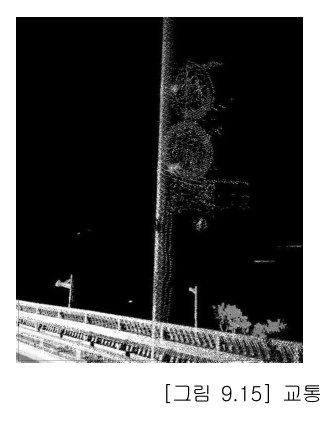

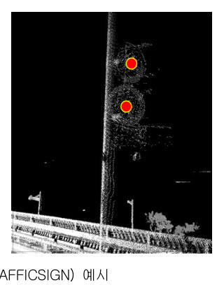

- [그림 9.15] 교통안전표지(SF2_TRAFFICSIGN) 예시

#### 2) 구조

##### 폴더구조

- 세부도화(도형정보) 데이터의 저장형식은 다음과 같다.

#### [표 9.61] SF2_TRAFFICSIGN(교통안전표지) 데이터의 저장형식

```text
             파일 경로                                                  파일 형식

구축구간             정밀도로지도                                  파일명                확장자      의무
                                                                                          비고
(Section)      (HDM_RoadMap)                           (Filename)           (Ext.)   조건

<노선명>


            HDMap_UTM52N_타원체고          SF2_TRAFFICSIGN
SEC<ID>_                                                                                  단일
            HDMap_UTMK_정표고             SF2_TRAFFICSIGN                      SHP세트    조건
<구간명>                                                                                     파일
            HDMap_UTMK_타원체고            SF2_TRAFFICSIGN


            <노선명>\SEC<ID>_<구간명>\HDMap_UTM52N_타원체고\SF2_TRAFFICSIGN.shp/shx/dbf/prj/cpg

            <노선명>\SEC<ID>_<구간명>\HDMap_UTMK_정표고\SF2_TRAFFICSIGN.shp/shx/dbf/prj/cpg

            <노선명>\SEC<ID>_<구간명>\HDMap_UTMK_타원체고\SF2_TRAFFICSIGN.shp/shx/dbf/prj/cpg
  적용
            ◦ <정밀도로지도 폴더>
  규칙
             - HDMap_UTM52N_타원체고: UTM 평면직각좌표계, 타원체고
             - HDMap_UTMK_정표고: UTM-K 단일 평면직각좌표계, 정표고
             - HDMap_UTMK_타원체고: UTM-K 단일 평면직각좌표계, 타원체고

            ◦ <확장자명>: SHP세트(*.shp, *.shx, *.dbf, *.prj, *.cpg)
```

##### 자료구조

- ESRI Shape(SHP) 포맷으로 제작한다.

- 도형유형(Shape Type)은 ‘PointZ(점형)’로 한다.

   - ※ 도화SW에 따라 ‘PointZ(+M)’도 혼용하여 사용할 수 있다.

- 속성형식은 다음과 같다.

#### [표 9.62] SF2_TRAFFICSIGN(교통안전표지) 속성형식

|SF2_TRAFFICSIGN|SF2_TRAFFICSIGN|SF2_TRAFFICSIGN|SF2_TRAFFICSIGN|SF2_TRAFFICSIGN|
|---|---|---|---|---|
||칼럼명|데이터 타입(길이)|제약조건|코드리스트|
|1|ID|VARCHAR2(13)|UNIQUE/NOT NULL|-|
|2|SignType|VARCHAR2(3)|NOT NULL|HDM_TrafficSignType|
|3|PostID|VARCHAR2(13)|-|-|
|4|SurveyDate|VARCHAR2(8)|NOT NULL|-|
|5|Version|VARCHAR2(4)|NOT NULL|-|
|6|Remark|VARCHAR2(30)|-|-|
|7|HistType|VARCHAR2(3)|-|HDM_HistType|

#### 3) 세부도화

##### 가) 도화방법(기준)

- ① 표지판(안전표지)의 중앙에 ‘점형(PointZ)’으로 도화한다.

- ※ 가로수 등에 가려 누락되는 경우를 방지하기 위하여 사진 데이터를 참고한다.

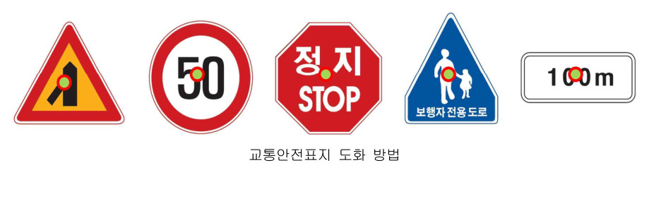

교통안전표지 도화 방법

- 교통안전표지 종류(주의/규제/지시/보조)별 도화 대상 세부유형은 다음과 같다.

   - ※ 교통안전시설 일람표(경찰청/도로교통공단, 최신판)에서 ‘주의/규제/지시/보조표지’를 참고한다.

   - ※ ‘보조표지’의 경우, 단독으로는 구축하지 않으며, 조건을 고려하여 구축 여부를 결정한다.

#### [표 9.63] 교통안전표지 세부유형

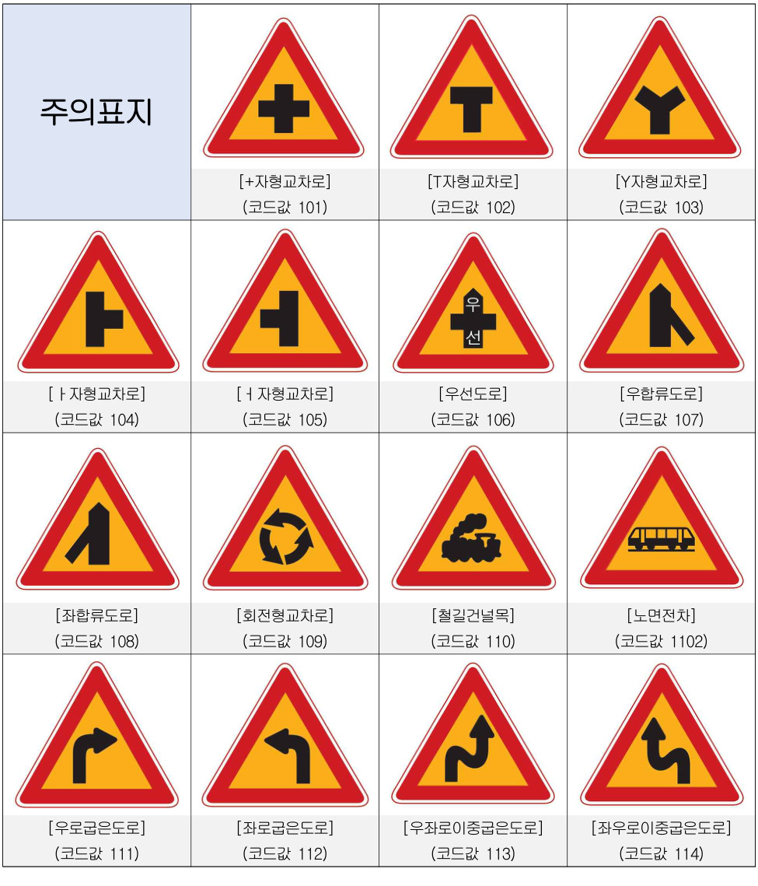

주의표지
[+자형교차로] [T자형교차로] [Y자형교차로]
(코드값 101) (코드값 102) (코드값 103)
[ㅏ자형교차로] [ㅓ자형교차로] [우선도로] [우합류도로]
(코드값 104) (코드값 105) (코드값 106) (코드값 107)
[좌합류도로] [회전형교차로] [철길건널목] [노면전차]
(코드값 108) (코드값 109) (코드값 110) (코드값 1102)

[우로굽은도로] [좌로굽은도로] [우좌로이중굽은도로] [좌우로이중굽은도로]
(코드값 111) (코드값 112) (코드값 113) (코드값 114)

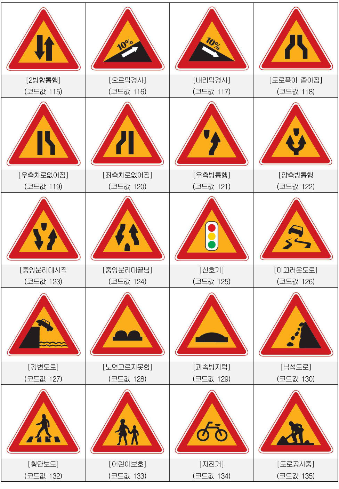

[2방향통행] [오르막경사] [내리막경사] [도로푝이 좁아짐]
(코드값 115) (코드값 116) (코드값 117) (코드값 118)
[우측차로없어짐] [좌측차로없어짐] [우측방통행] [양측방통행
(코드값 119) (코드값 120) (코드값 121) (코드값 122)
[중앙분리대시작 [중앙분리대끝남] [신호기] [미끄러운도로]
(코드값 123) (코드값 124) (코드값 125) (코드값 126)
[강변도로] [노면고르지못함] [과속방지턱] [낙석도로]
(코드값 127) (코드값 128) (코드값 129) (코드값 130)

[횡단보도] [어린이보호] [자전거] [도로공사중]
(코드값 132) (코드값 133) (코드값 134) (코드값 135)

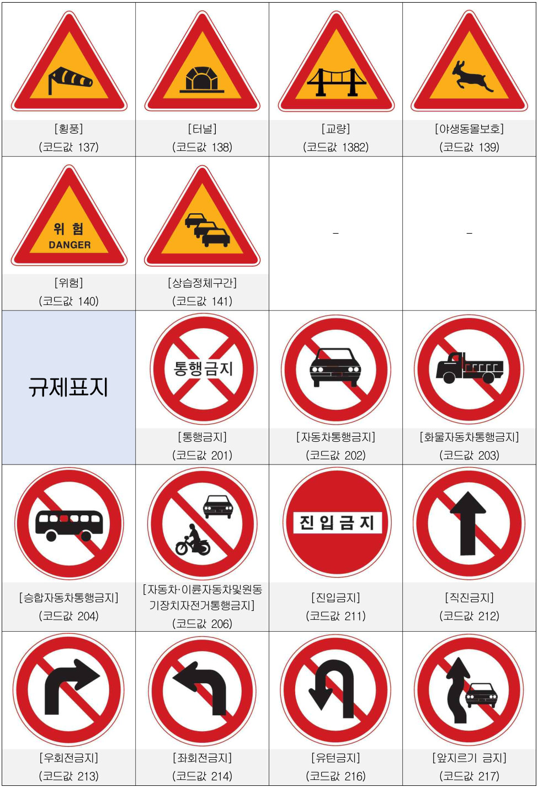

[횡풍] [터널] [교량] [야생동몰보호]
(코드값 137) (코드값 138) (코드값 1382) (코드값 139)
- -
[위험] [상습정체구간]
(코드값 140) (코드값 141)
규제표지
[통행금지] [자동차통행금지] [화물자동차통행금지]
(코드값 201) (코드값 202) (코드값 203)
[자동차·이륜자동차및원동
[승합자동차통행금지] [진입금지] [직진금지]
기장치자전거통행금지]
(코드값 204) (코드값 211) (코드값 212)
(코드값 206)

[우회전금지] [좌회전금지] [유턴금지] [앞지르기 금지]
(코드값 213) (코드값 214) (코드값 216) (코드값 217)

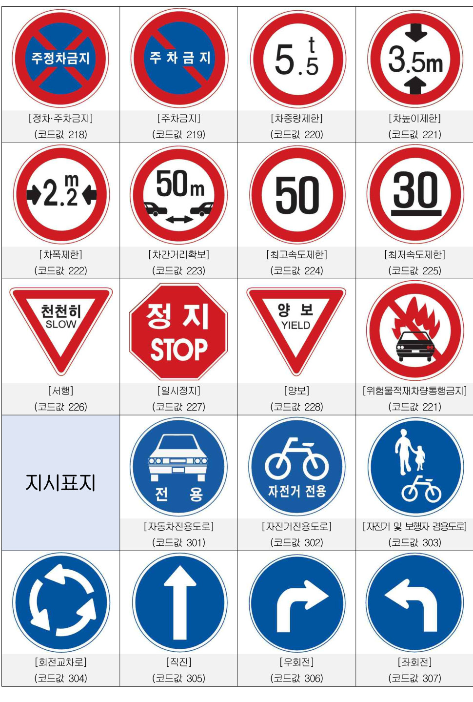

[정차·주차금지] [주차금지] [차중량제한] [차높이제한]
(코드값 218) (코드값 219) (코드값 220) (코드값 221)
[차폭제한] [차간거리확보] [최고속도제한] [최저속도제한]
(코드값 222) (코드값 223) (코드값 224) (코드값 225)
[서행] [일시정지] [양보] [위험물적재차량통행금지]
(코드값 226) (코드값 227) (코드값 228) (코드값 221)
지시표지
[자동차전용도로] [자전거전용도로] [자전거 및 보행자 겸용도로]
(코드값 301) (코드값 302) (코드값 303)

[회전교차로] [직진] [우회전] [좌회전]
(코드값 304) (코드값 305) (코드값 306) (코드값 307)

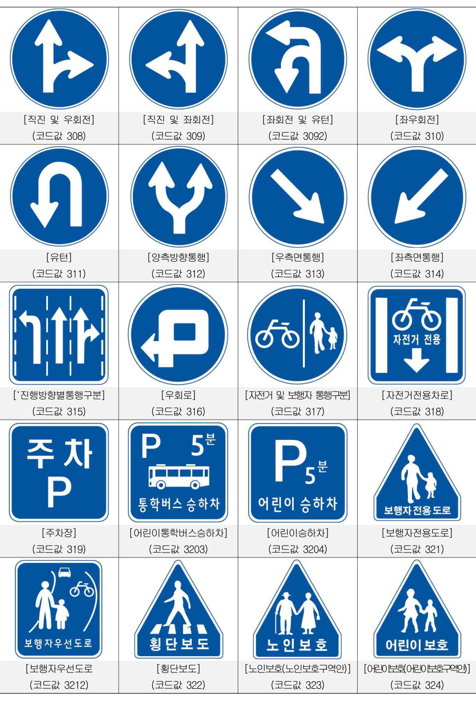

[직진 및 우회전] [직진 및 좌회전] [좌회전 및 유턴] [좌우회전]
(코드값 308) (코드값 309) (코드값 3092) (코드값 310)
[유턴] [양측방향통행] [우측면통행] [좌측면통행]
(코드값 311) (코드값 312) (코드값 313) (코드값 314)
[‘진행방향별통행구분] [우회로] [자전거 및 보행자 통행구분] [자전거전용차로]
(코드값 315) (코드값 316) (코드값 317) (코드값 318)
[주차장] [어린이통학버스승하차] [어린이승하차] [보행자전용도로]
(코드값 319) (코드값 3203) (코드값 3204) (코드값 321)

[보행자우선도로 [횡단보도] [노인보호(노인보호구역안)] [어린이보호(어린이보호구역안)]
(코드값 3212) (코드값 322) (코드값 323) (코드값 324)

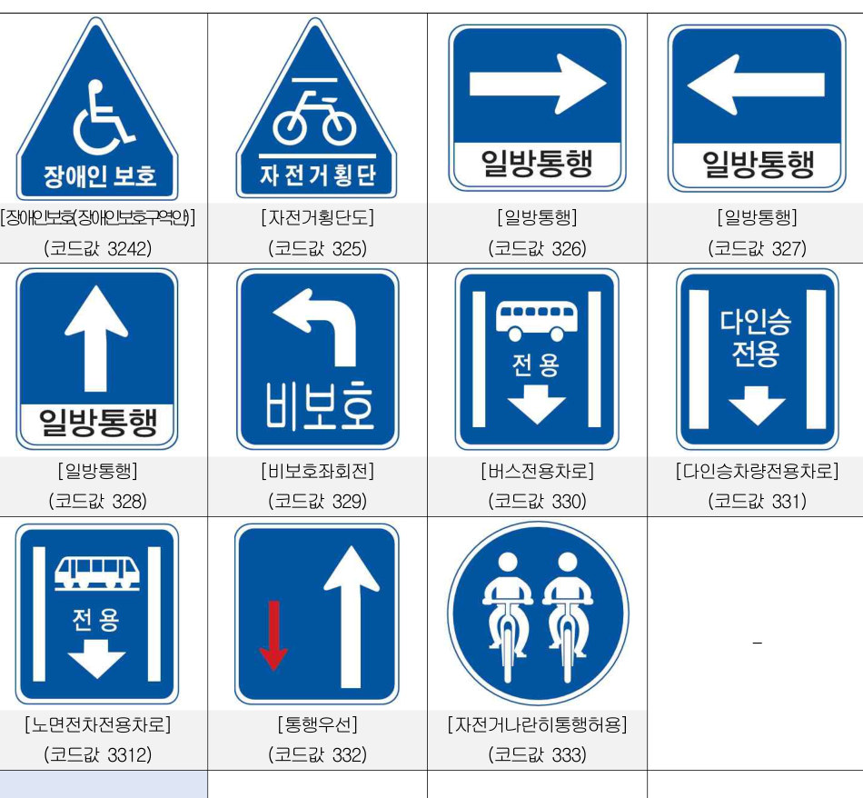

[장애인보호(장애인보호구역안)] [자전거횡단도] [일방통행] [일방통행]
(코드값 3242) (코드값 325) (코드값 326) (코드값 327)
[일방통행] [비보호좌회전] [버스전용차로] [다인승차량전용차로]
(코드값 328) (코드값 329) (코드값 330) (코드값 331)
-

[노면전차전용차로] [통행우선] [자전거나란히통행허용]
(코드값 3312) (코드값 332) (코드값 333)
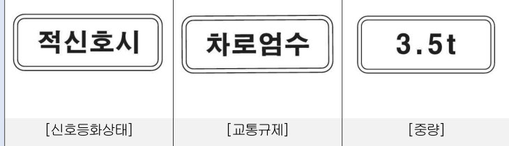

보조표지

[신호등화상태] [교통규제] [중량]
(코드값 407) (코드값 412) (코드값 423)
-
[노폭] [거리] [해제]

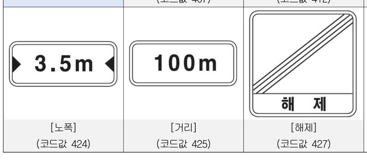

(코드값 424) (코드값 425) (코드값 427)

- ② 가변형 속도제한 표지(VSL), 1개의 표지판에 여러 표지가 함께 도식된 경우도 모두 도화한다.

- 가변형 속도제한 표지(VSL)의 ‘교통안전표지 유형(TrafficSignType)’은 ‘규제(코드값 200)’를 입력한다.

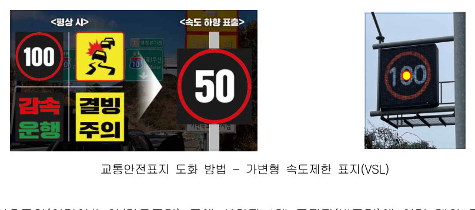

교통안전표지 도화 방법 - 가변형 속도제한 표지(VSL)

- 보호구역(어린이/노인/마을주민) 등에 설치된 1개 표지판(비규격)에 여러 개의 표지(주의/ 규제/지시)가 함께 표시(도식)되어 있는 경우, 각각 도화한다.

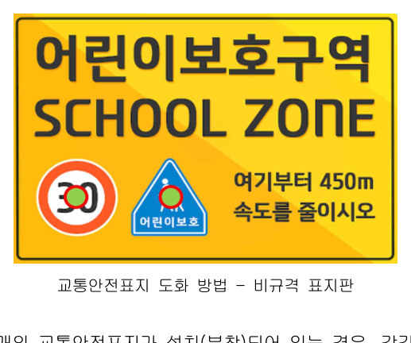

교통안전표지 도화 방법 - 비규격 표지판

- ③ 1개 지주에 여러 개의 교통안전표지가 설치(부착)되어 있는 경우, 각각 도화한다.

- ④ 보조표지의 경우, 다음의 조건을 고려하여 도화한다.

   - 보조표지만 단독으로 설치되어있는 경우, 도화하지 않는다.

   - 교통안전시설 일람표(경찰청/도로교통공단, 최신판)에서 정의하고 있는 교통안전표지의 ‘보조표지’ 중 ‘신호동화상태’, ‘교통규제’, ‘중량’, ‘노폭’, ‘거리’, ‘해제’ 만을 대상으로 한다.

   - 주의/규제/지시 표지와 내용과 관련이 있는 보조표지가 함께 설치(부착)되어 있는 경우, 보조표지를 제작하며, ‘주의/규제/지시 표지’ 및 ‘보조표지’를 각각 도화한다.

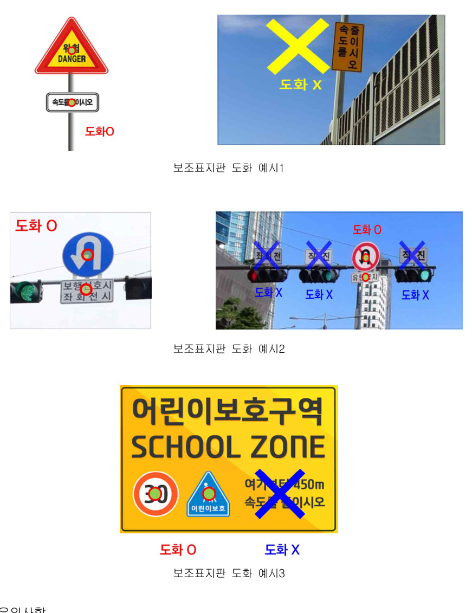

보조표지판 도화 예시1

보조표지판 도화 예시2

보조표지판 도화 예시3

나) 유의사항

###### (1) 제작 유의

- 터널 진출입 구간, 터널 내 설치된 가변등 교통신호기 중 ‘진입 ․ 진입금지 ․ 가변속도’ 등이 함께 표출되는 가변등 교통신호기는 다음의 조건에 따라 교통안전표지(TRAFFICSIGN)과 교통신호기(TRAFFICLIGHT)로 구분하여 도화한다.

- ※ 교통 신호기(TRAFFICLIGHT) 도화 방법은 ‘SF3_TRAFFICLIGHT (교통 및 보행 신호기)’를 참고한다.

- 교통 신호기의 동일 렌즈에서 ‘진입/진입금지’만 표출되는 경우, ‘교통 신호기(TRAFFICLIGHT)’로 도화한다.

- 교통 신호기의 동일 렌즈에서 ‘진입/진입금지/가변속도’가 표출되는 경우, ‘교통 신호기(TRAFFICLIGHT)’로 도화한다.

- 교통 신호기의 렌즈가 좌측/우측으로 구분되어 있고, ‘진입/진입금지’와 ‘가변속도’가 분리 되어 표출되는 경우, ‘교통 신호기(TRAFFICLIGHT)’와 ‘교통안전표지(TRAFFICSIGN)’로 각각 도화한다.

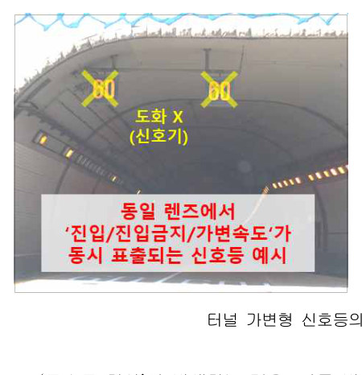

터널 가변형 신호등의 표지판(안전표지) 도화 조건

- ‘고스트 현상’이 발생하는 경우, 판독 범위 내에서 최대한 실제 형태를 기준으로 도화한다.

- ※ MMS 차량의 속도, 레이저 주사각도 등으로 점군 데이터의 일부가 유실되어 형상의 식별이 용이하지 않은 현상

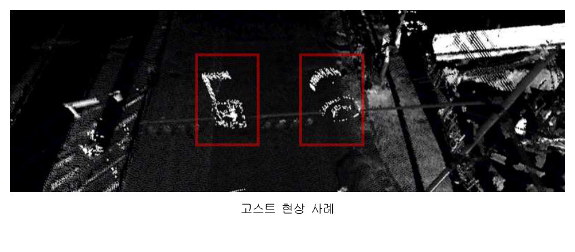

고스트 현상 사례

###### (2) 제작 예외

- 공사 등으로 임시(또는 일시)일시적으로 설치한 표지판은 도화하지 않는다.

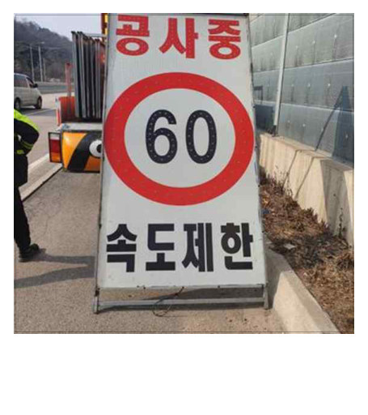

#### 4) 속성 구조화

##### 가) 테이블 명세

#### [표 9.64] SF2_TRAFFICSIGN(교통안전표지) 테이블 명세

|SF2_TRAFFICSIGN|SF2_TRAFFICSIGN|SF2_TRAFFICSIGN|SF2_TRAFFICSIGN|SF2_TRAFFICSIGN|SF2_TRAFFICSIGN|SF2_TRAFFICSIGN|SF2_TRAFFICSIGN|
|---|---|---|---|---|---|---|---|
||칼럼명|(한글명)|KEY|데이터 타입<br>(길이)|제약조건|기본<br>단위|코드 리스트|
||ID|ID|‘구축 항목(레이어) 공통 테이블 명세’ 참고|||||
|①|SignType|교통안전표지<br>유형|-|VARCHAR2(3)|NOT NULL|-|HDM_TrafficSign<br>Type|
|②|PostID|지주ID|FK|VARCHAR2(13)|-|-|-|
||SurveyDate|취득 날짜|‘구축 항목(레이어) 공통 테이블 명세’ 참고|||||
||Version|버전||||||
||Remark|비고||||||
||HistType|갱신이력 유형||||||

##### 나) 칼럼별 상세 유형

- ① SignType (교통안전표지 유형)

- 교통안전표지의 종류에 따른 유형을 의미한다.

- ※ 교통안전시설 일람표(경찰청/도로교통공단, 최신판)에서 ‘주의/규제/지시/보조표지’를 참고한다.

#### [표 9.65] SF_TRAFFICSIGN SignType(교통안전표지 유형) 예시

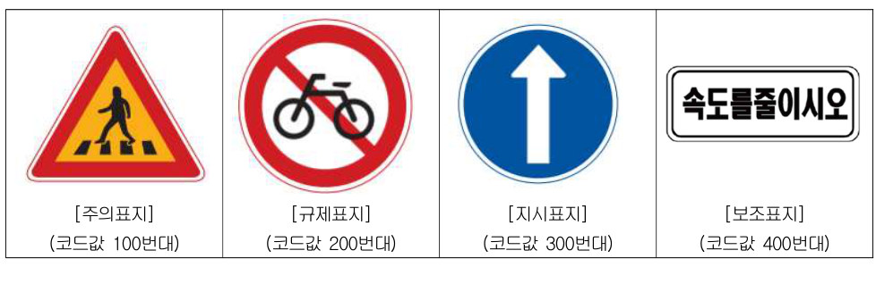

[주의표지] [규제표지] [지시표지] [보조표지]
(코드값 100번대) (코드값 200번대) (코드값 300번대) (코드값 400번대)

- 제약조건은 ‘NOT NULL’이다.

- 유형은 ‘HDM_TrafficSignType(교통안전표지 유형)’ 코드 리스트에서 정의하고 있는 코드를 입력한다.

#### [표 9.66] ‘HDM_TrafficSignType(교통안전표지 유형)’ 코드 리스트

|코드값|교통안전표지 유형|설명|
|---|---|---|
|100|주의표지|교통안전시설일람표의 주의표지|
|200|규제표지|교통안전시설일람표의 규제표지|
|300|지시표지|교통안전시설일람표의 지시표지|
|400|보조표지|교통안전시설일람표의 보조표지|

##### ② PostID (지주ID)

- 교통안전표지가 부착된 지주의 ID를 입력한다.

- ※ 교통안전표지가 지주(SUPPORTPOST)에 부착되어 있지 않은 경우, 지주 ID는 입력하지 않는다.

### 9.4.12. SF3_TRAFFICLIGHT (교통 및 보행 신호기)

|분류|SafetyFixture (SF)<br>(안전시설)|명칭|TRAFFICLIGHT<br>(교통 및 보행 신호기)|
|---|---|---|---|
|정의|교통 및 보행 신호기|기하|PointZ (점형)|

#### 1) 정의

- ① 교통안전시설의 종류로써 적색 ․ 녹색 ․ 황색 및 녹색 화살 표시 따위의 점멸로 통행 차량이나 사람에게 정지 ․ 우회 ․ 진행 ․ 주의 따위를 지시하는 장치를 말한다.

- ② 종류에 따라 차량(일반차량, 버스) 전용, 자전거 전용, 보행자 전용 등으로 구분한다.

- ③ 신호등 형상에 따라 원형 등화, 화살표 등화, 사각형 등화(가변형, 버스 등) 등으로 구분한다.

- ④ 신호등 형태/유형에 따라 ‘지시(차량 가로형 (화살표)삼색등/사색등, 차량 세로형 (화살표) 삼색등/사색등, 버스 삼색등, 노면전차육구등, 가로형이색등, 차량 보조등(세로형 삼색등/사색등), 가변등, 보행등, 자전거 세로형 이색등/삼색등)’, ‘주의(경보형 가변등)’ 및 ‘보조(차량 중형 삼색등/사색등)’로 구분한다.

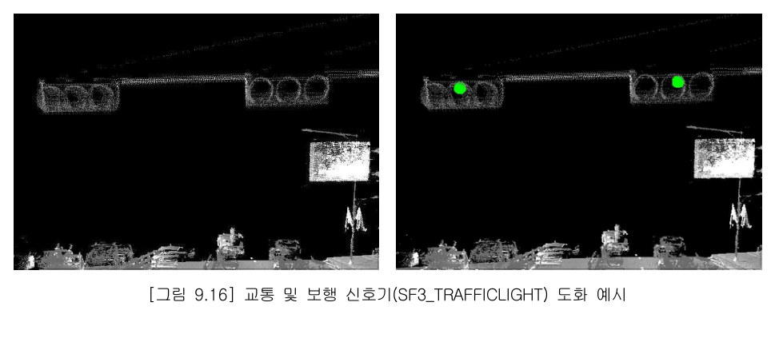

- [그림 9.16] 교통 및 보행 신호기(SF3_TRAFFICLIGHT) 도화 예시

#### 2) 구조

##### 폴더구조

- 세부도화(도형정보) 데이터의 저장형식은 다음과 같다.

#### [표 9.67] SF_TRAFFICLIGHT(교통 및 보행 신호기) 데이터의 저장형식

```text
             파일 경로                                                  파일 형식
구축구간             정밀도로지도                                  파일명                확장자      의무
                                                                                     조건
                                                                                          비고
(Section)      (HDM_RoadMap)                           (Filename)           (Ext.)

<노선명>


            HDMap_UTM52N_타원체고          SF3_TRAFFICLIGHT
SEC<ID>_                                                                                  단일
            HDMap_UTMK_정표고             SF3_TRAFFICLIGHT                     SHP세트    조건
<구간명>                                                                                     파일
            HDMap_UTMK_타원체고            SF3_TRAFFICLIGHT


            <노선명>\SEC<ID>_<구간명>\HDMap_UTM52N_타원체고\SF3_TRAFFICLIGHT.shp/shx/dbf/prj/cpg

            <노선명>\SEC<ID>_<구간명>\HDMap_UTMK_정표고\SF3_TRAFFICLIGHT.shp/shx/dbf/prj/cpg

            <노선명>\SEC<ID>_<구간명>\HDMap_UTMK_타원체고\SF3_TRAFFICLIGHT.shp/shx/dbf/prj/cpg
  적용
            ◦ <정밀도로지도 폴더>
  규칙
             - HDMap_UTM52N_타원체고: UTM 평면직각좌표계, 타원체고
             - HDMap_UTMK_정표고: UTM-K 단일 평면직각좌표계, 정표고
             - HDMap_UTMK_타원체고: UTM-K 단일 평면직각좌표계, 타원체고

            ◦ <확장자명>: SHP세트(*.shp, *.shx, *.dbf, *.prj, *.cpg)
```

##### 자료구조

- ESRI Shape(SHP) 포맷으로 제작한다.

- 도형유형(Shape Type)은 ‘PointZ(점형)’로 한다.

   - ※ 도화SW에 따라 ‘PointZ(+M)’도 혼용하여 사용할 수 있다.

- 속성형식은 다음과 같다.

#### [표 9.68] SF3_TRAFFICLIGHT(교통 및 보행 신호기) 속성형식

|SF3_TRAFFICLIGHT|SF3_TRAFFICLIGHT|SF3_TRAFFICLIGHT|SF3_TRAFFICLIGHT|SF3_TRAFFICLIGHT|
|---|---|---|---|---|
||칼럼명|데이터 타입(길이)|제약조건|코드리스트|
|1|ID|VARCHAR2(13)|UNIQUE/NOT NULL|-|
|2|LightType|VARCHAR2(3)|NOT NULL|HDM_TrafficLightType|
|3|PostID|VARCHAR2(13)|-|-|
|4|SurveyDate|VARCHAR2(8)|NOT NULL|-|
|5|Version|VARCHAR2(4)|NOT NULL|-|
|6|Remark|VARCHAR2(30)|-|-|
|7|HistType|VARCHAR2(3)|-|HDM_HistType|

#### 3) 세부도화

##### 가) 도화방법(기준)

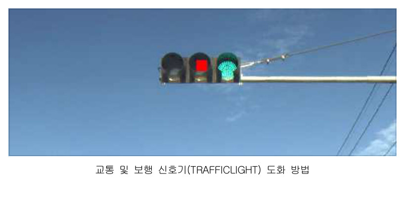

- ① 교통 및 보행 신호기(TRAFFICLIGHT) 중앙에 ‘점형(PointZ)’으로 도화한다.

   - ※ 모든 지시/주의/보조 교통 및 보행 신호기를 대상으로 한다.

   - ※ 형태/유형의 구분을 위하여 사진 데이터를 참고하여 도화한다.

교통 및 보행 신호기(TRAFFICLIGHT) 도화 방법

- ② 1개 지주에 여러 개의 교통 신호기가 설치되어 있는 경우, 각각 도화한다.

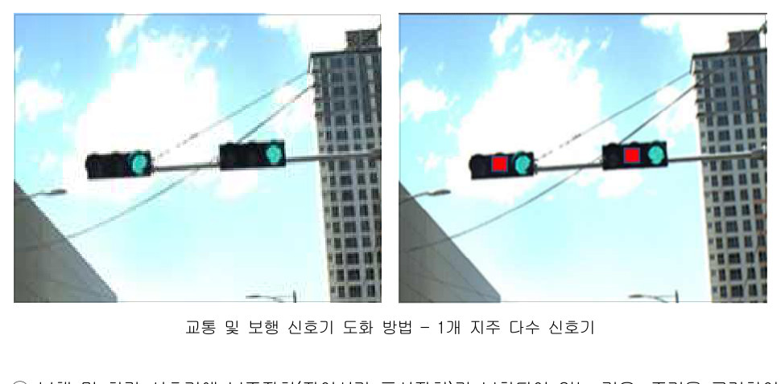

교통 및 보행 신호기 도화 방법 – 1개 지주 다수 신호기

- ③ 보행 및 차량 신호기에 보조장치(잔여시간 표시장치)가 부착되어 있는 경우, 조건을 고려하여 도화한다.

- 1개 교통 및 보행 신호기에서 ‘점멸’ 및 ‘잔여시간 표시’가 동시에 표출되는 경우, 1개의 교통 및 보행 신호기로 도화한다.

- 신호기의 ‘점멸’과 ‘보조장치(잔여시간 표시)’가 분리되어 설치되어 있는 경우, 보조장치는 도화하지 않는다.

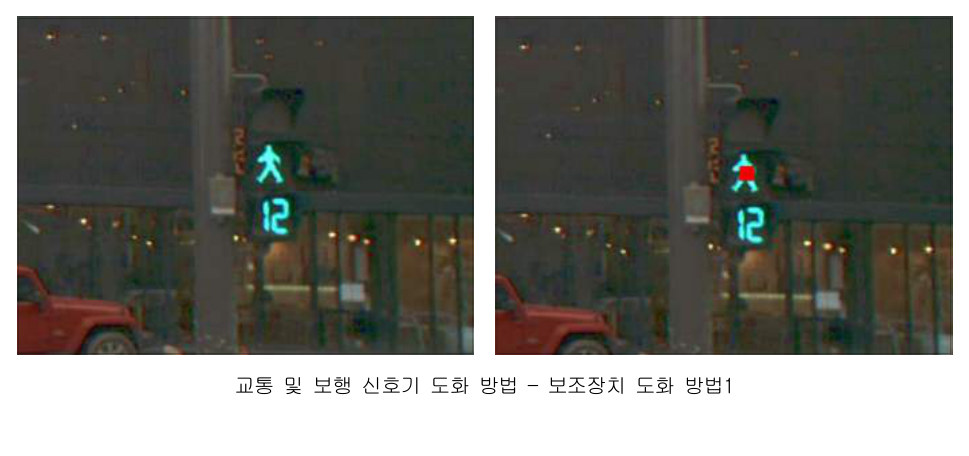

교통 및 보행 신호기 도화 방법 – 보조장치 도화 방법1

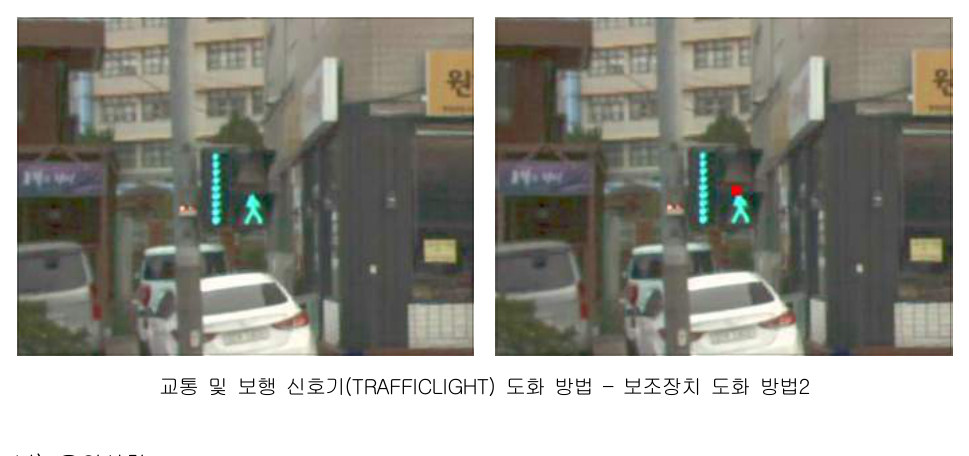

교통 및 보행 신호기(TRAFFICLIGHT) 도화 방법 – 보조장치 도화 방법2

##### 나) 유의사항

###### (1) 제작 유의

- ‘터널 진출입 구간’, ‘터널 내 설치된 가변등’, ‘가변차로에 설치된 가변등’은 다음의 조건을 고려하여 도화한다.

- 교통 신호기의 동일 렌즈에서 ‘진입/진입금지’만 표출되는 경우, ‘교통 신호기(TRAFFICLIGHT)’로 도화한다.

- 교통 신호기의 동일 렌즈에서 ‘진입/진입금지/가변속도’가 표출되는 경우, ‘교통 신호기 (TRAFFICLIGHT)’로 도화한다.

- 교통 신호기의 렌즈가 좌측/우측으로 구분되어 있고, ‘진입/진입금지’와 ‘가변속도’가 분리되어 표출되는 경우, ‘교통 신호기(TRAFFICLIGHT)’과 ‘교통안전표지(TRAFFICSIGN)’로 각각 도화한다.

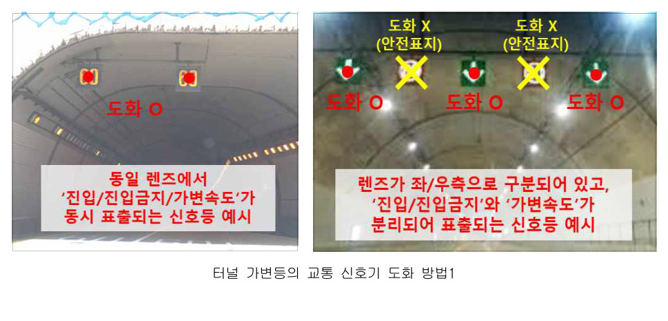

터널 가변등의 교통 신호기 도화 방법1

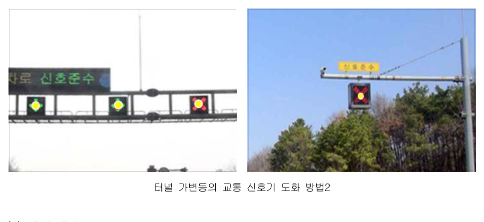

터널 가변등의 교통 신호기 도화 방법2

###### (2) 제작 예외

- 도화 방법(기준) 외 ‘제작 예외’ 없음

#### 4) 속성 구조화

##### 가) 테이블 명세

#### [표 9.69] SF3_TRAFFICLIGHT(보행 및 교통 신호기) 테이블 명세

|SF3_TRAFFICLIGHT|SF3_TRAFFICLIGHT|SF3_TRAFFICLIGHT|SF3_TRAFFICLIGHT|SF3_TRAFFICLIGHT|SF3_TRAFFICLIGHT|SF3_TRAFFICLIGHT|SF3_TRAFFICLIGHT|
|---|---|---|---|---|---|---|---|
||칼럼명|(한글명)|KEY|데이터 타입<br>(길이)|제약조건|기본<br>단위|코드 리스트|
||ID|ID|‘구축 항목(레이어) 공통 테이블 명세’ 참고|||||
|①|LightType|교통 및 보행<br>신호기 유형|-|VARCHAR2(3)|NOT NULL|-|HDM_TrafficLight<br>Type|
|②|PostID|지주ID|FK|VARCHAR2(13)|-|-|-|
||SurveyDate|취득 날짜|‘구축 항목(레이어) 공통 테이블 명세’ 참고|||||
||Version|버전||||||
||Remark|비고||||||
||HistType|갱신이력 유형||||||

##### 나) 칼럼별 상세 유형

- ① LightType (교통신호기 유형)

- 교통신호기의 종류, 형태 및 유형에 따른 유형을 의미한다.

- ※ 교통안전시설 일람표(경찰청/도로교통공단, 최신판)에서 ‘신호등’을 참고한다.

- 제약조건은 ‘NOT NULL’이다.

- 유형은 ‘HDM_TrafficLightType(신호기 유형)’ 코드 리스트에서 정의하고 있는 코드를 입력한다.

#### [표 9.70] ‘HDM_TrafficLightType(신호기 유형)’ 코드 리스트

|코드값|신호기 유형|
|---|---|
|100|차량가로형-삼색등|
|101|차량가로형-사색등A|
|102|차량가로형-사색등B|
|110|차량세로형-삼색등|
|111|차량세로형-우회전삼색등|
|112|차량세로형-사색등|
|120|버스삼색등|
|121|노면전차육구등|
|130|가로형이색등|
|140|차량보조등-세로형삼색등|
|141|차량보조등-세로형사색등|
|200|가변등|
|201|경보형경보등|
|300|보행등|
|400|자전거세로형-삼색등|
|401|자전거세로형-이색등|
|999|기타 신호등 유형|

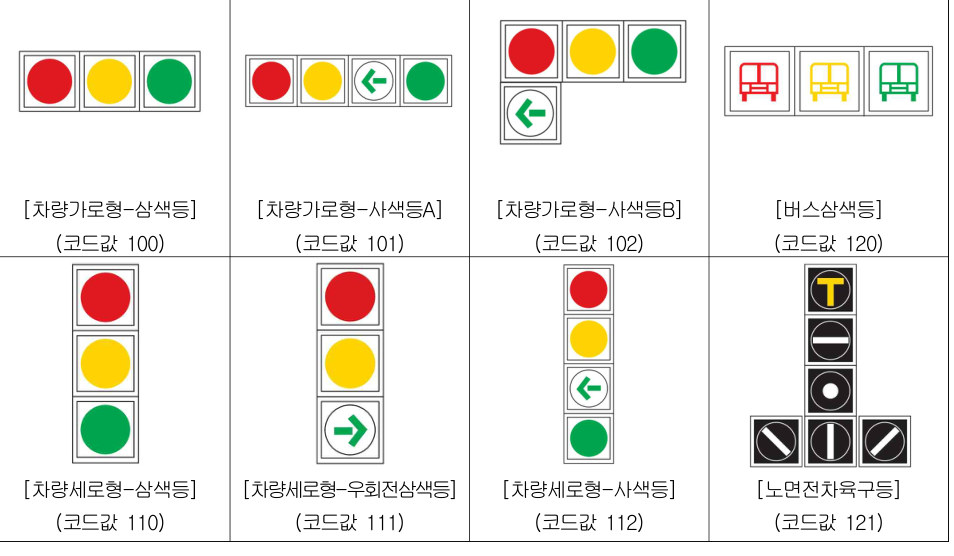

[차량가로형-삼색등] [차량가로형-사색등A] [차량가로형-사색등B] [버스삼색등]
(코드값 100) (코드값 101) (코드값 102) (코드값 120)
[차량세로형-삼색등] [차량세로형-우회전삼색등] [차량세로형-사색등] [노면전차육구등]
(코드값 110) (코드값 111) (코드값 112) (코드값 121)

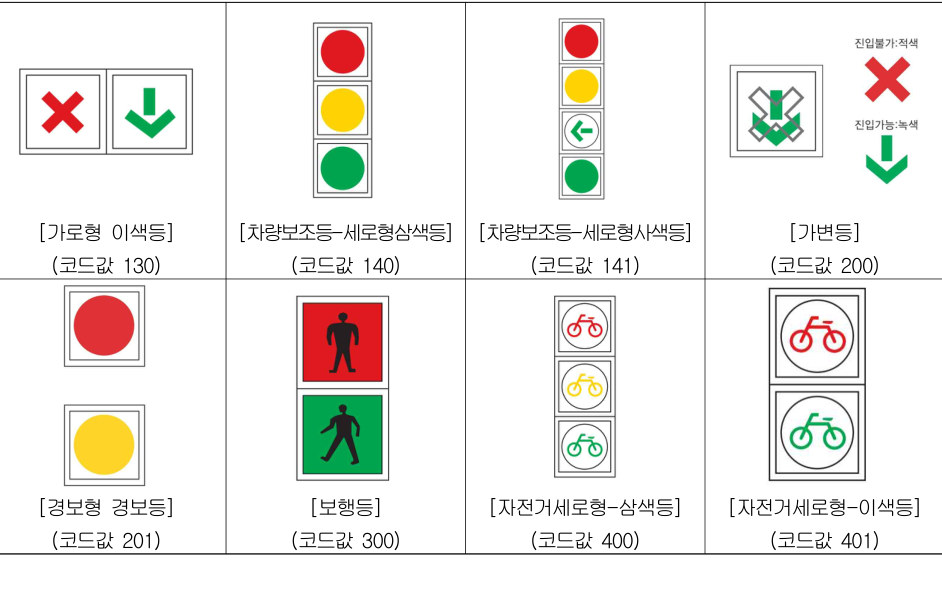

[가로형 이색등] [차량보조등-세로형삼색등] [차량보조등-세로형사색등] [가변등]
(코드값 130) (코드값 140) (코드값 141) (코드값 200)

[경보형 경보등] [보행등] [자전거세로형-삼색등] [자전거세로형-이색등]
(코드값 201) (코드값 300) (코드값 400) (코드값 401)

##### ② PostID (지주ID)

- 차량(일반차량, 버스) 전용 교통신호기, 자전거/보행자 전용 교통신호기가 부착된 지주의 ID를 입력한다.

- ※ 교통 및 보행 신호기가 지주(SUPPORTPOST)에 부착되어 있지 않은 경우, 지주 ID는 입력 하지 않는다.

### 9.4.13. SF4_SUPPORTPOST (지주)

|분류|SafetyFixture (SF)<br>(안전시설)|명칭|SUPPORTPOST<br>(지주)|
|---|---|---|---|
|정의|교통안전표지, 교통 및 보행 신호기의<br>지지를 위한 기둥|기하|PointZ (점형)|

#### 1) 정의

- ① 정밀도로지도 구축 항목 중 ‘교통 및 보행 신호기(TRAFFICLIGHT)’, 교통안전표지(TRAFFICSIGN)의 부착 및 지지를 위해 지면에 설치된 기둥을 의미한다.

- ※ 고가도로/육교/교량/터널 시설 진입 전방에 설치된 ‘통과높이 제한시설, ’방향표지(지명 이정)‘, ’과속단속시설‘, ’가로등‘ 등 정밀도로지도 구축 항목이 아닌 표지/시설에 설치된 기둥(지주)은 구축하지 않는다.

- ② 교통 및 보행 신호기(TRAFFICLIGHT), 교통안전표지(TRAFFICSIGN)의 부착 및 지지를 위한 지주(SUPPORTPOST)는 다음의 조건을 만족하는 경우에만 구축한다.

- 지주가 지면에 설치되어 있어야 한다.

- ※ 부착식 지주는 구축하지 않는다.

- 도로 또는 도로 밖에 설치되어 있는 지주가 온전하게 식별 가능하여야 한다.

- ※ 지주가 설치된 지면이 식별 가능하여야 한다.

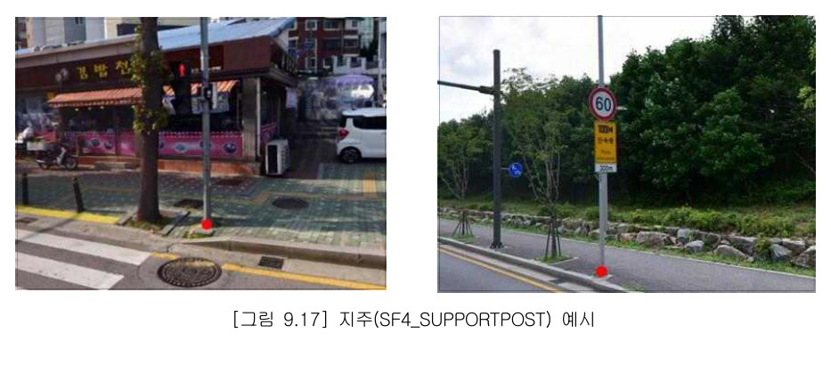

[그림 9.17] 지주(SF4_SUPPORTPOST) 예시

#### 2) 구조

##### 폴더구조

- 세부도화(도형정보) 데이터의 저장형식은 다음과 같다.

#### [표 9.71] SF4_SUPPORTPOST(지주) 데이터의 저장형식

```text
             파일 경로                                                  파일 형식
구축구간             정밀도로지도                                  파일명                확장자      의무
                                                                                     조건
                                                                                          비고
(Section)      (HDM_RoadMap)                           (Filename)           (Ext.)

<노선명>


            HDMap_UTM52N_타원체고          SF4_SUPPORTPOST
SEC<ID>_                                                                                  단일
            HDMap_UTMK_정표고             SF4_SUPPORTPOST                      SHP세트    조건
<구간명>                                                                                     파일
            HDMap_UTMK_타원체고            SF4_SUPPORTPOST


            <노선명>\SEC<ID>_<구간명>\HDMap_UTM52N_타원체고\SF4_SUPPORTPOST.shp/shx/dbf/prj/cpg

            <노선명>\SEC<ID>_<구간명>\HDMap_UTMK_정표고\SF4_SUPPORTPOST.shp/shx/dbf/prj/cpg

            <노선명>\SEC<ID>_<구간명>\HDMap_UTMK_타원체고\SF4_SUPPORTPOST.shp/shx/dbf/prj/cpg

  적용        ◦ <정밀도로지도 폴더>
  규칙         - HDMap_UTM52N_타원체고: UTM 평면직각좌표계, 타원체고
             - HDMap_UTMK_정표고: UTM-K 단일 평면직각좌표계, 정표고
             - HDMap_UTMK_타원체고: UTM-K 단일 평면직각좌표계, 타원체고

            ◦ <확장자명>: SHP세트(*.shp, *.shx, *.dbf, *.prj, *.cpg)
```

##### 자료구조

- ESRI Shape(SHP) 포맷으로 제작한다.

- 도형유형(Shape Type)은 ‘PointZ(점형)’로 한다.

   - ※ 도화SW에 따라 ‘PointZ(+M)’도 혼용하여 사용할 수 있다.

- 속성형식은 다음과 같다.

#### [표 9.72] SF4_SUPPORTPOST(지주) 속성형식

|SF4_SUPPORTPOST|SF4_SUPPORTPOST|SF4_SUPPORTPOST|SF4_SUPPORTPOST|SF4_SUPPORTPOST|
|---|---|---|---|---|
||칼럼명|데이터 타입(길이)|제약조건|코드리스트|
|1|ID|VARCHAR2(13)|UNIQUE/NOT NULL|-|
|2|PostType|VARCHAR2(3)|NOT NULL|HDM_SupportPostType|
|3|SurveyDate|VARCHAR2(8)|NOT NULL|-|
|4|Version|VARCHAR2(4)|NOT NULL|-|
|5|Remark|VARCHAR2(30)|-|-|
|6|HistType|VARCHAR2(3)|-|HDM_HistType|

#### 3) 세부도화

##### 가) 도화방법(기준)

- ① 지면과 지주(SUPPORTPOST)가 맞닿아 있는 지점에서 지주의 중심에 ‘점형(PointZ)’으로 도화한다.

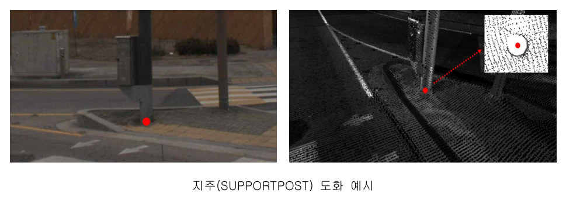

지주(SUPPORTPOST) 도화 예시

- ② 교통 및 보행 신호기(TRAFFICLIGHT), 교통안전표지(TRAFFICSIGN)의 부착 및 지지를 위한 지주만 도화한다.

   - ※ 교통 및 보행 신호기(TRAFFICLIGHT), 교통안전표지(TRAFFICSIGN) 외 다른 표지[1)] 가 함께 부착된 복합지주의 경우, 구축한다.

#### 1) 고가도로/육교/교량/터널 시설 진입 전방에 설치된 ‘통과높이 제한시설’, ‘방향표지(지명 이정)’, ‘과속단속시설’, ‘가로등’ 등 정밀도로지도 구축 항목이 아닌 표지/시설

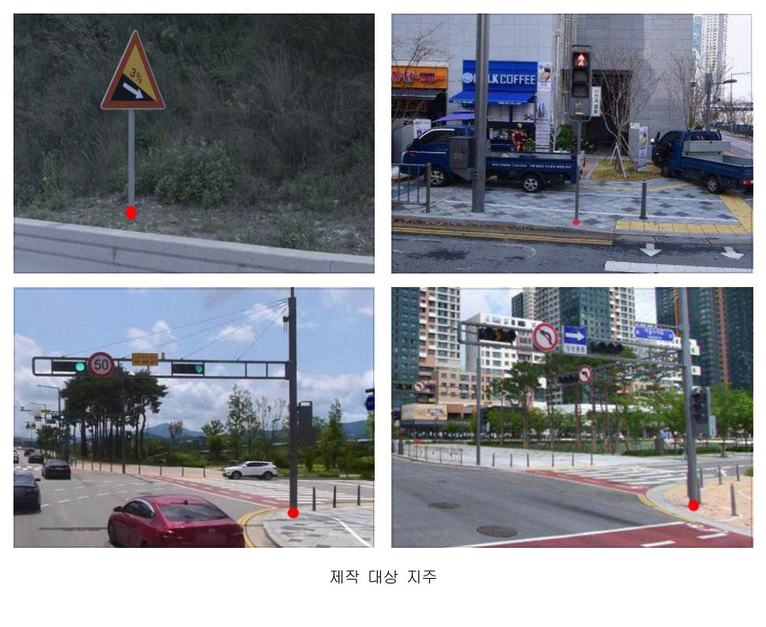

제작 대상 지주

- ③ 지면에 설치된 지주만 도화한다.

   - ※ 부착식 지주는 도화하지 않는다.

   - ㉼ 부착식 지주에 교통 및 보행 신호기(TRAFFICLIGHT), 교통안전표지(TRAFFICSIGN)가 설치되어 있다면, 지주 없이 교통 및 보행 신호기(TRAFFICLIGHT), 교통안전표지 (TRAFFICSIGN)만 구축한다.

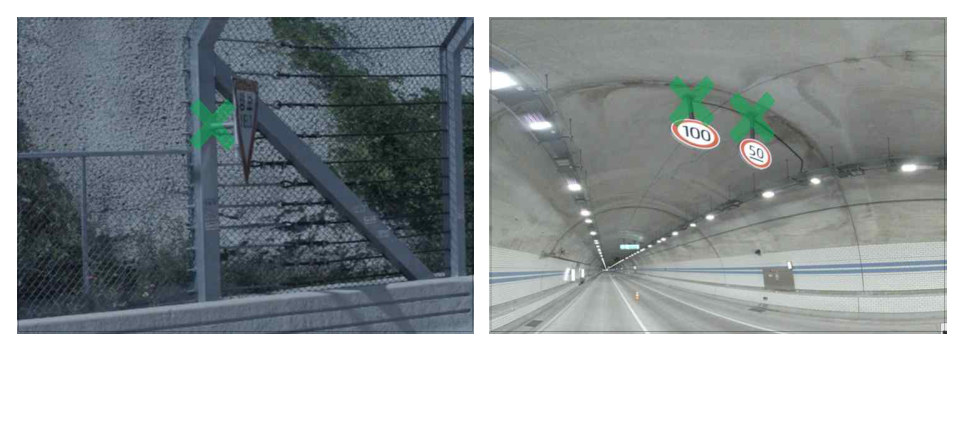

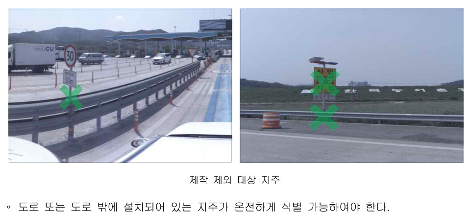

제작 제외 대상 지주

- 도로 또는 도로 밖에 설치되어 있는 지주가 온전하게 식별 가능하여야 한다.

   - ※ 지주가 설치된 지면이 식별 가능하여야 하며, 식별 불가능한 지주는 구축하지 않는다.

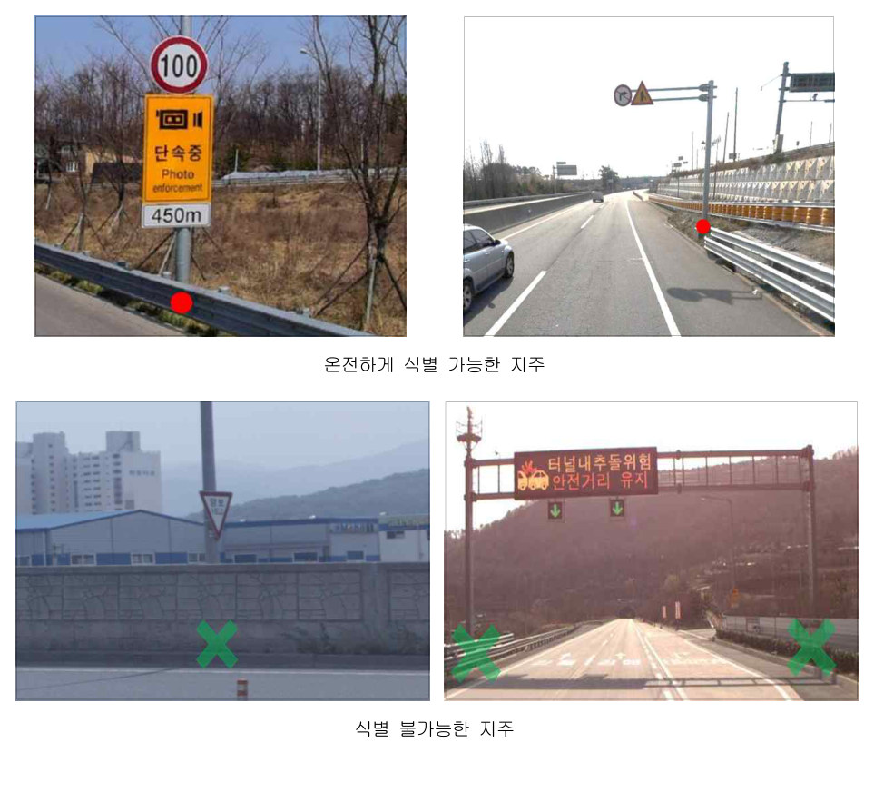

온전하게 식별 가능한 지주

식별 불가능한 지주

- 2개 이상의 지주로 이루어진 경우, 다음의 조건을 고려하여 도화한다.

   - 도로랑 가까운 쪽의 1개 지주만 도화한다.

   - ‘통과높이 제한시설’ 등과 같이, 도로 양쪽 끝에 지주가 있는 경우, 진행방향 오른쪽 지주 1개만 도화한다.

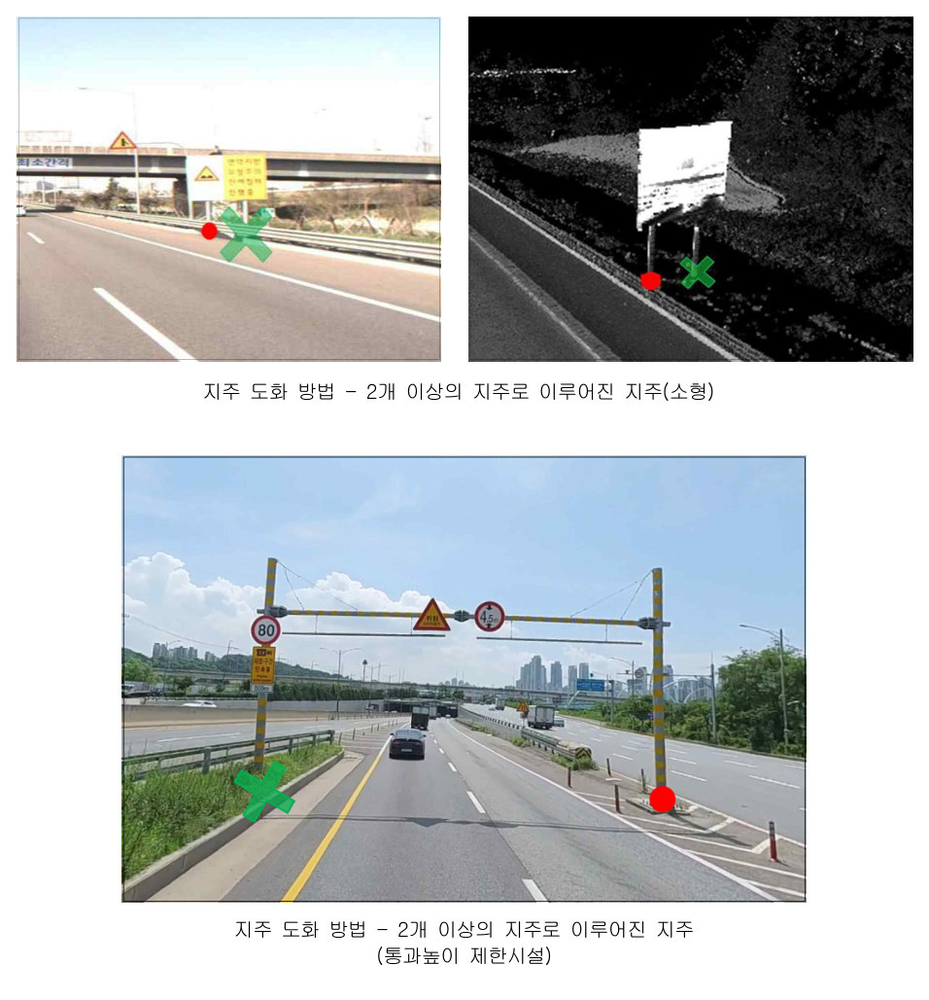

지주 도화 방법 - 2개 이상의 지주로 이루어진 지주(소형)

지주 도화 방법 - 2개 이상의 지주로 이루어진 지주 (통과높이 제한시설)

나) 유의사항

###### (1) 제작 유의

- 도화 방법(기준) 외 ‘제작 유의’ 없음

###### (2) 제작 예외

- 도화 방법(기준) 외 ‘제작 예외’ 없음

#### 4) 속성 구조화

##### 가) 테이블 명세

#### [표 9.73] SF4_SUPPORT(지주) 테이블 명세

|SF4_SUPPORTPOST|SF4_SUPPORTPOST|SF4_SUPPORTPOST|SF4_SUPPORTPOST|SF4_SUPPORTPOST|SF4_SUPPORTPOST|SF4_SUPPORTPOST|SF4_SUPPORTPOST|
|---|---|---|---|---|---|---|---|
||칼럼명|(한글명)|KEY|데이터 타입<br>(길이)|제약조건|기본<br>단위|코드 리스트|
||ID|ID|‘구축 항목(레이어) 공통 테이블 명세’ 참고|||||
|①|PostType|시설 유형|-|VARCHAR2(3)|NOT NULL|-|HDM_SupportPost<br>Type|
||SurveyDate|취득 날짜|‘구축 항목(레이어) 공통 테이블 명세’ 참고|||||
||Version|버전||||||
||Remark|비고||||||
||HistType|갱신이력 유형||||||

##### 나) 칼럼별 상세 유형

① PostType (시설유형)

- 지주에 부착된 시설(교통 및 보행 신호기, 교통안전표지)의 유형을 의미한다.

- 제약조건은 ‘NOT NULL’이다.

- 유형은 ‘HDM_SupportPostType(지주 유형)’ 코드 리스트에서 정의하고 있는 코드를 입력한다.

- 1개의 지주(SUPPORTPOST)에 교통 및 보행 신호기(TRAFFICLIGHT), 교통안전표지 (TRAFFICSIGN)가 함께 부착(복합지주)되어 있는 경우, 지주 유형(SupportPostType)은 ‘교통 및 보행 신호기 지주(코드값 100)’로 입력한다.

- ※ 교통 및 보행 신호기 지주(코드값 100)가 교통안전표지 지주(코드값 200)보다 우선순위를 가진다.

#### [표 9.74] ‘HDM_SupportPostType(지주 유형)’ 코드 리스트

|코드값|지주 유형|설명|
|---|---|---|
|100|교통 및 보행 신호기 지주|교통 및 보행 신호기의 지주|
|200|교통안전표지 지주|교통안전표지의 지주|

### 9.4.14. SF5_SPEEDBUMP (과속방지턱)

|분류|SafetyFixture (SF)<br>(안전시설)|명칭|SPEEDBUMP<br>(과속방지턱)|
|---|---|---|---|
|정의|과속방지턱|기하|PolygonZ (면형)|

#### 1) 정의

- ① 자동차의 주행 속도를 낮추기 위하여 차도 노면에 설치하는 턱을 말한다.

- ② 종류에 따라 설치식(노면과 동일한 재질), 조립식(노면과 다른 재질(예) 플라스틱, 고무 등)의 과속방지턱을 조립하여 고정), 가상식(노면과 동일한 높이, 착시 현상 유도) 과속방지턱을 대상 으로 한다.

   - ※ 과속방지턱임을 인지할 수 있도록 도색(흰색 및 노란색, 노란색 등)되어 있어야 한다.

   - ※ 과속방지턱 및 횡단보도 역할을 모두 수행하기 위하여 설치된 ‘고원식(험프형)’은 ‘노면표시 (ROADMARKING)으로 분류한다.

- ③ 형상에 따라 원호형(상부면의 형상이 원호), 사다리꼴(상부면의 형상이 사다리꼴), 가상형(평면) 과속방지턱을 대상으로 한다.

설치식 가상식

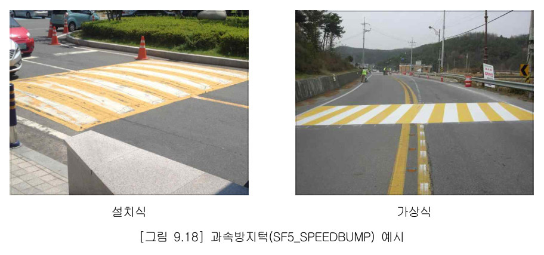

- [그림 9.18] 과속방지턱(SF5_SPEEDBUMP) 예시

#### 2) 구조

##### 폴더구조

- 세부도화(도형정보) 데이터의 저장형식은 다음과 같다.

#### [표 9.75] SF5_SPEEDBUMP(과속방지턱) 데이터의 저장형식

```text
             파일 경로                                                  파일 형식
구축구간             정밀도로지도                                  파일명                확장자      의무
                                                                                     조건
                                                                                          비고
(Section)      (HDM_RoadMap)                           (Filename)           (Ext.)

<노선명>

            HDMap_UTM52N_타원체고          SF5_SPEEDBUMP
SEC<ID>_                                                                                  단일
            HDMap_UTMK_정표고             SF5_SPEEDBUMP                        SHP세트    조건
<구간명>                                                                                     파일
            HDMap_UTMK_타원체고            SF5_SPEEDBUMP

            <노선명>\SEC<ID>_<구간명>\HDMap_UTM52N_타원체고\SF5_SPEEDBUMP.shp/shx/dbf/prj/cpg

            <노선명>\SEC<ID>_<구간명>\HDMap_UTMK_정표고\SF5_SPEEDBUMP.shp/shx/dbf/prj/cpg

            <노선명>\SEC<ID>_<구간명>\HDMap_UTMK_타원체고\SF5_SPEEDBUMP.shp/shx/dbf/prj/cpg
  적용
            ◦ <정밀도로지도 폴더>
  규칙
             - HDMap_UTM52N_타원체고: UTM 평면직각좌표계, 타원체고
             - HDMap_UTMK_정표고: UTM-K 단일 평면직각좌표계, 정표고
             - HDMap_UTMK_타원체고: UTM-K 단일 평면직각좌표계, 타원체고

            ◦ <확장자명>: SHP세트(*.shp, *.shx, *.dbf, *.prj, *.cpg)
```

##### 자료구조

- ESRI Shape(SHP) 포맷으로 제작한다.

- 도형유형(Shape Type)은 ‘PolygonZ(면형)’로 한다.

   - ※ 도화SW에 따라 ‘Polygon(+M)’도 혼용하여 사용할 수 있다.

- 속성형식은 다음과 같다.

#### [표 9.76] SF5_SPEEDBUMP(과속방지턱) 속성형식

|SF5_SPEEDBUMP|SF5_SPEEDBUMP|SF5_SPEEDBUMP|SF5_SPEEDBUMP|SF5_SPEEDBUMP|
|---|---|---|---|---|
||칼럼명|데이터 타입(길이)|제약조건|코드리스트|
|1|ID|VARCHAR2(13)|UNIQUE/NOT NULL|-|
|2|SurveyDate|VARCHAR2(8)|NOT NULL|-|
|3|Version|VARCHAR2(4)|NOT NULL|-|
|4|Remark|VARCHAR2(30)|-|-|
|5|HistType|VARCHAR2(3)|-|HDM_HistType|

#### 3) 세부도화

##### 가) 도화방법(기준)

- ① 과속방지턱의 최외곽을 따라 ‘면형(PolygonZ)’으로 도화한다.

- ※ 과속방지턱임을 인지할 수 있도록 도색(흰색 및 노란색)이 없는 경우, 도화하지 않는다.

- 1개의 과속방지턱이 양방향(기점/종점 방향)에 설치되어 있는 경우, 1개의 객체로 도화한다.

과속방지턱 도화 예시 – 양방향(기점/종점 방향) 설치된 과속방지턱

- ② 높이가 있는 과속방지턱(설치식, 조립식), 높이가 없는 과속방지턱(가상식) 모두 도화한다.

   - ※ 과속방지턱 자체의 높이는 고려하지 않는다.

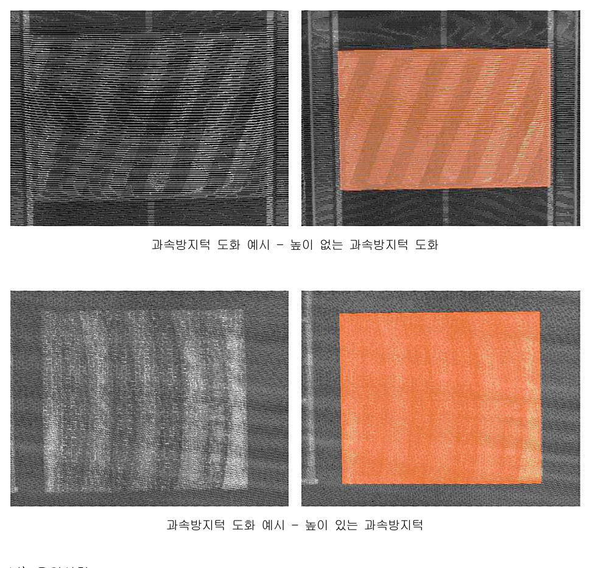

과속방지턱 도화 예시 - 높이 없는 과속방지턱 도화

과속방지턱 도화 예시 - 높이 있는 과속방지턱

##### 나) 유의사항

###### (1) 제작 유의

- 도화 방법(기준) 외 ‘제작 유의’ 없음

###### (2) 제작 예외

- 과속방지턱 및 횡단보도 역할을 모두 수행하기 위하여 설치된 ‘고원식(험프형)’은 ‘노면 표시(ROADMARKING)로 분류한다.

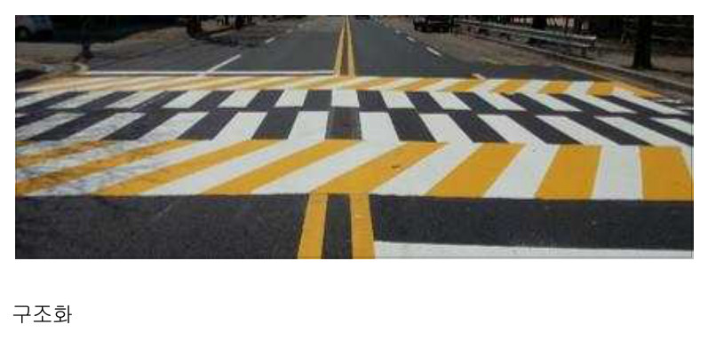

#### 4) 속성 구조화

##### 가) 테이블 명세

#### [표 9.77] SF5_SPEEDBUMP(과속방지턱) 테이블 명세

|SF5_SPEEDBUMP|SF5_SPEEDBUMP|SF5_SPEEDBUMP|SF5_SPEEDBUMP|SF5_SPEEDBUMP|SF5_SPEEDBUMP|SF5_SPEEDBUMP|SF5_SPEEDBUMP|
|---|---|---|---|---|---|---|---|
||칼럼명|(한글명)|KEY|데이터 타입<br>(길이)|제약조건|기본<br>단위|코드 리스트|
||ID|ID|‘구축 항목(레이어) 공통 테이블 명세’ 참고|||||
||SurveyDate|취득 날짜||||||
||Version|버전||||||
||Remark|비고||||||
||HistType|갱신이력 유형||||||

##### 나) 칼럼별 상세 유형

- 공통 칼럼항목 외 ‘상세유형’ 없음
